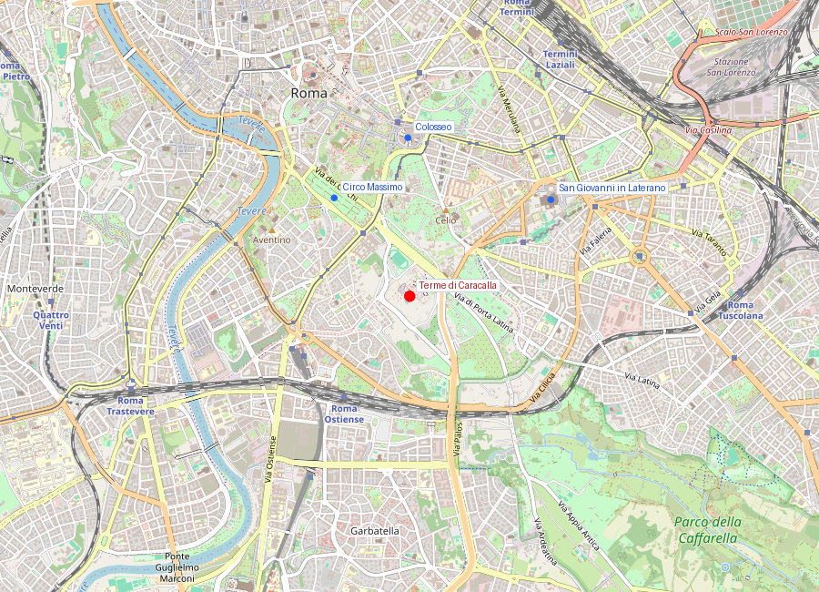
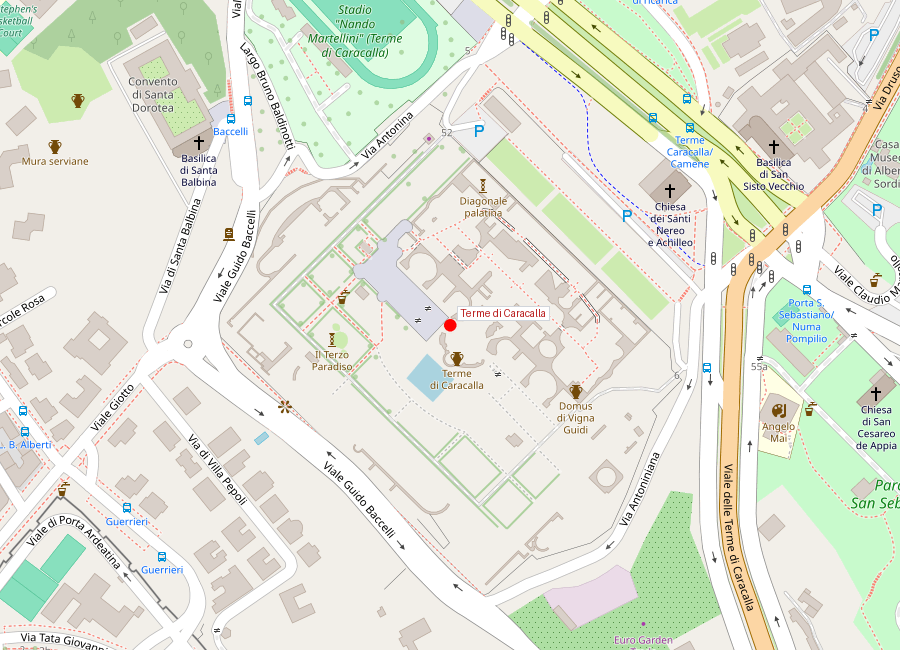
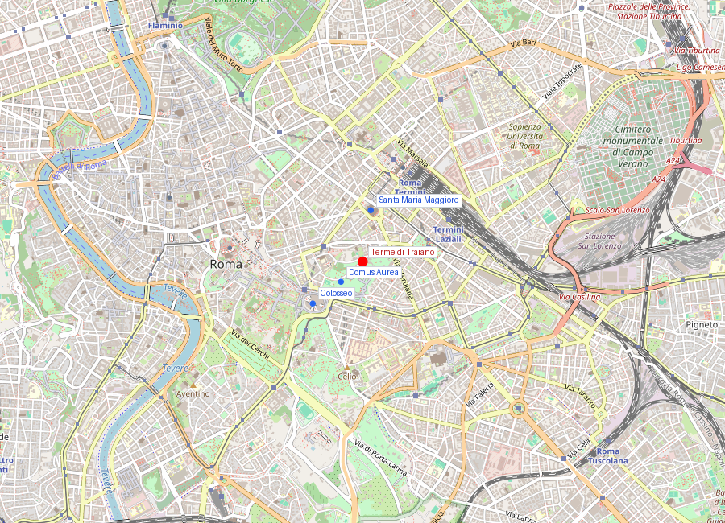
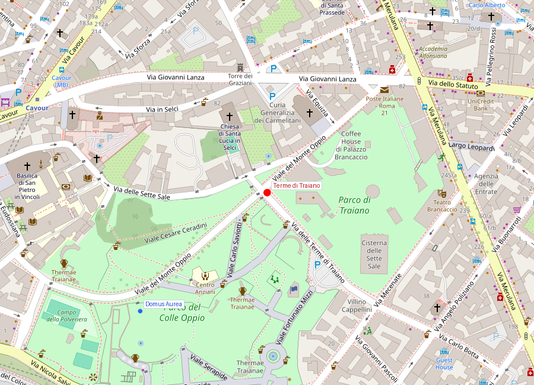

# Terme di Roma

```yaml
lugar:
  nombre_original: "Terme di Roma"
  pais: "Italia"
  fecha_visita: "2026-03-23/2026-03-30"
```

Las termas fueron el gran instrumento social del Imperio Romano. No eran simples baños: eran centros culturales, deportivos y de vida pública donde convivían todas las clases. Roma llegó a tener más de 900 establecimientos termales, desde pequeñas *balnea* de barrio hasta complejos imperiales de dimensiones colosales. Los emperadores las usaban como herramienta de propaganda — el acceso era gratuito o casi gratuito, y cada complejo nuevo superaba al anterior en escala y lujo.

La ingeniería detrás de las termas era sofisticada: el sistema de *hypocaustum* (calefacción por suelo radiante con aire caliente circulando bajo el pavimento) fue una invención romana que no se igualó en Europa hasta el siglo XIX. Los acueductos alimentaban las termas con millones de litros diarios, y el ciclo del agua — *frigidarium* (frío), *tepidarium* (templado), *caldarium* (caliente) — estaba diseñado para optimizar el flujo de usuarios.

---

## Terme di Caracalla

### Mapa


### Mapa en detalle


### Historia

#### Línea de tiempo

| Fecha | Hito |
|---|---|
| 212 d.C. | Caracalla (Marco Aurelio Antonino) inicia la construcción; mismo año de la *Constitutio Antoniniana* que otorgó ciudadanía a todos los habitantes libres del Imperio |
| 216 d.C. | Inauguración del complejo principal |
| 222-235 d.C. | Alejandro Severo completa los jardines y las estructuras perimetrales |
| 537 d.C. | Los godos de Vitiges cortan los acueductos de Roma durante el asedio; las termas dejan de funcionar permanentemente |
| Siglos VI-XII | Abandono progresivo; el complejo se convierte en cantera de materiales |
| 1545-1546 | Excavaciones del papa Paolo III Farnese recuperan esculturas monumentales, incluyendo el Toro Farnese y el Hércules Farnese (hoy en el Museo Archeologico Nazionale di Napoli) |
| 1824 | Excavaciones bajo el suelo revelan los mosaicos de atletas, hoy en los Musei Vaticani |
| 1937 | Comienzan los espectáculos de ópera al aire libre en las ruinas — tradición que continúa hasta hoy con la temporada estival del Teatro dell'Opera di Roma |
| 2012 | Apertura de los subterráneos (túneles de servicio y mitreo) al público |

#### Narrativa

Las Terme di Caracalla fueron el segundo complejo termal más grande de Roma (después de las de Diocleciano, construidas un siglo más tarde) y probablemente el más lujoso. Podían albergar simultáneamente entre 6.000 y 8.000 personas en un recinto de unas 11 hectáreas. Caracalla las inauguró en 216 d.C. — el mismo emperador que un año antes había extendido la ciudadanía romana a todos los habitantes libres del imperio con la *Constitutio Antoniniana*. Ambos gestos obedecían a la misma lógica: ampliar la base de legitimidad del poder.

El complejo era mucho más que baños. Además del circuito termal clásico (*frigidarium*, *tepidarium*, *caldarium*, *natatio*), incluía dos palestras (gimnasios) simétricas, bibliotecas (una griega y una latina), jardines, tiendas y salas de reunión. Los suelos estaban cubiertos de mosaicos polícromos y las paredes revestidas de mármoles importados de todo el Mediterráneo — giallo antico de Túnez, pórfido de Egipto, pavonazzetto de Frigia.

El fin llegó en 537 d.C., cuando los ostrogodos de Vitiges cortaron los acueductos durante el asedio de Roma. Sin agua, las termas se convirtieron en una carcasa vacía.

### Mitología y leyendas

Bajo las Terme di Caracalla se descubrió en el siglo XIX un *mitreo* — santuario dedicado al culto de Mitra, una religión mistérica muy popular entre los soldados romanos. El mitreo, uno de los más grandes de Roma, conserva restos del foso ritual y de la decoración. El culto de Mitra, con su sacrificio del toro cósmico y sus grados de iniciación, fue uno de los principales competidores del cristianismo en los siglos II-IV d.C.

### Qué se puede ver hoy

- **El *frigidarium* central**: la sala más impresionante que queda en pie, con fragmentos de las enormes bóvedas de crucería que alcanzaban unos 30 metros de altura.
- **Las palestras**: los dos patios simétricos flanqueando el cuerpo principal, donde se practicaban ejercicios físicos.
- **Los subterráneos**: los túneles de servicio donde trabajaban los esclavos que mantenían los hornos del *hypocaustum*, más el mitreo.
- **Restos de mosaicos**: fragmentos del pavimento original visibles en varias salas.
- **La *natatio***: la piscina al aire libre en el lado norte, de la que quedan las dimensiones y parte de los muros perimetrales.
- **El escenario de ópera**: durante el verano, el Teatro dell'Opera di Roma monta un escenario entre las ruinas — una de las experiencias culturales más singulares de Roma.

### Datos interesantes

- Las esculturas encontradas aquí en el siglo XVI — el Toro Farnese, el Hércules Farnese, la Flora Farnese — son piezas capitales del Museo Archeologico Nazionale di Napoli. Fueron a parar allí porque los Farnese, que las excavaron, eran también reyes de Nápoles.
- El sistema de *hypocaustum* requería quemar unas 10 toneladas de leña diarias para mantener la temperatura. [⚠ VERIFICAR]
- Los mosaicos de atletas encontrados bajo el suelo (hoy en los Musei Vaticani) muestran luchadores, árbitros y deportistas con un realismo casi periodístico.
- El recinto perimetral incluía tiendas y cisternas de agua con capacidad para unos 80.000 litros. [⚠ VERIFICAR]

---

## Terme di Traiano

### Mapa


### Mapa en detalle


### Historia

#### Línea de tiempo

| Fecha | Hito |
|---|---|
| 64 d.C. | Gran incendio de Roma; Nerón construye la Domus Aurea en la colina del Oppio |
| 104 d.C. | Un incendio destruye parte de las termas de Tito (construidas sobre un ala de la Domus Aurea) |
| 109 d.C. | Trajano inaugura las nuevas termas, diseñadas por Apollodoro di Damasco, sobre los restos de la Domus Aurea |
| Siglos V-VI | Abandono tras el corte de acueductos; las estructuras se deterioran |
| 1506 | Descubrimiento accidental de las pinturas de la Domus Aurea en los subterráneos — artistas como Rafael y Pinturicchio descienden a copiar los frescos, naciendo el estilo "grotesco" |
| Siglo XIX | Excavaciones arqueológicas parciales |
| 2022-presente | Proyecto de restauración y apertura del Parco archeologico del Colle Oppio |

#### Narrativa

Las Terme di Traiano marcaron un punto de inflexión en la arquitectura romana: fueron las primeras "grandes termas imperiales" con el esquema simétrico axial que luego copiarían las de Caracalla y Diocleciano. El arquitecto fue Apollodoro di Damasco, el mismo genio detrás del [Foro di Traiano](foro_di_traiano.md) y la Columna Trajana.

Trajano las construyó deliberadamente sobre los restos de la Domus Aurea de Nerón — otro gesto de la dinastía (en este caso, adoptiva) de "devolver al pueblo" lo que un tirano se había apropiado, el mismo mensaje que Vespasiano había enviado con el [Colosseo](colosseo.md) décadas antes. Las termas cubrieron y sellaron las salas de la Domus Aurea, lo que paradójicamente las preservó: los frescos quedaron protegidos bajo tierra durante siglos.

El complejo ocupaba la cima del Colle Oppio y era enorme — se estima que podía albergar varios miles de bañistas simultáneamente. Incluía el circuito termal completo, bibliotecas, gimnasios y jardines.

### Qué se puede ver hoy

- **La exedra del *frigidarium***: una de las estructuras más reconocibles, visible desde el Parco del Colle Oppio.
- **Los muros perimetrales**: grandes secciones de *opus latericium* (ladrillo romano) que permiten apreciar la escala del complejo.
- **El Parco del Colle Oppio**: el parque público que cubre las ruinas, con vistas hacia el [Colosseo](colosseo.md).
- **Acceso a la Domus Aurea**: bajo las termas se accede a las salas de la Domus Aurea de Nerón, con las pinturas que inspiraron el estilo "grotesco" del Renacimiento (las "grutas" eran en realidad las salas enterradas del palacio).

### Datos interesantes

- El término "grotesco" en arte proviene de estas ruinas: los artistas renacentistas descendían a las "grotte" (las salas enterradas de la Domus Aurea bajo las termas) y copiaban los motivos decorativos fantásticos que encontraban.
- Rafael incorporó estos motivos en las Logge Vaticane, creando un estilo que se difundió por toda Europa.
- Las termas fueron diseñadas por Apollodoro di Damasco, el mismo arquitecto del [Foro di Traiano](foro_di_traiano.md) — probablemente el ingeniero más importante del mundo romano.
- El Colle Oppio, donde se ubican las ruinas, es hoy un parque público algo descuidado, lo que crea un contraste notable entre la importancia histórica del sitio y su estado actual.

---

## Conexiones

- Las Terme di Caracalla y las Terme di Traiano comparten el mismo esquema arquitectónico simétrico axial, perfeccionado por Apollodoro di Damasco en las de Traiano y llevado a su máxima expresión en las de Caracalla un siglo después.
- Las Terme di Traiano están construidas sobre la Domus Aurea de Nerón — la misma residencia cuyo lago artificial rellenó Vespasiano para construir el [Colosseo](colosseo.md). El patrón "borrar a Nerón, devolver al pueblo" se repite.
- Las esculturas de las Terme di Caracalla acabaron en Napoli; los mosaicos de atletas llegaron a los [Musei Vaticani](musei_vaticani.md).
- Ambos complejos dependían de los acueductos: el Acqua Marcia y el Acqua Antoniniana alimentaban a Caracalla; el Acqua Traiana a las de Traiano. El corte de los acueductos en el siglo VI selló el destino de ambas.
- El [Foro di Traiano](foro_di_traiano.md), obra del mismo Apollodoro, complementa la visita a las termas para entender la escala del programa constructivo de Trajano.

## Fotos

### Terme di Caracalla

<!-- Placeholder para fotos de Terme di Caracalla -->
<!--  -->
<!-- *Descripción de la foto* -->

### Terme di Traiano

<!-- Placeholder para fotos de Terme di Traiano -->
<!--  -->
<!-- *Descripción de la foto* -->

fuente: Parco archeologico del Colosseo (parcocolosseo.it); Soprintendenza Speciale di Roma; Sovrintendenza Capitolina; Treccani (treccani.it); UNESCO World Heritage Centre, ref. 91; Janet DeLaine, *The Baths of Caracalla*, Journal of Roman Archaeology
