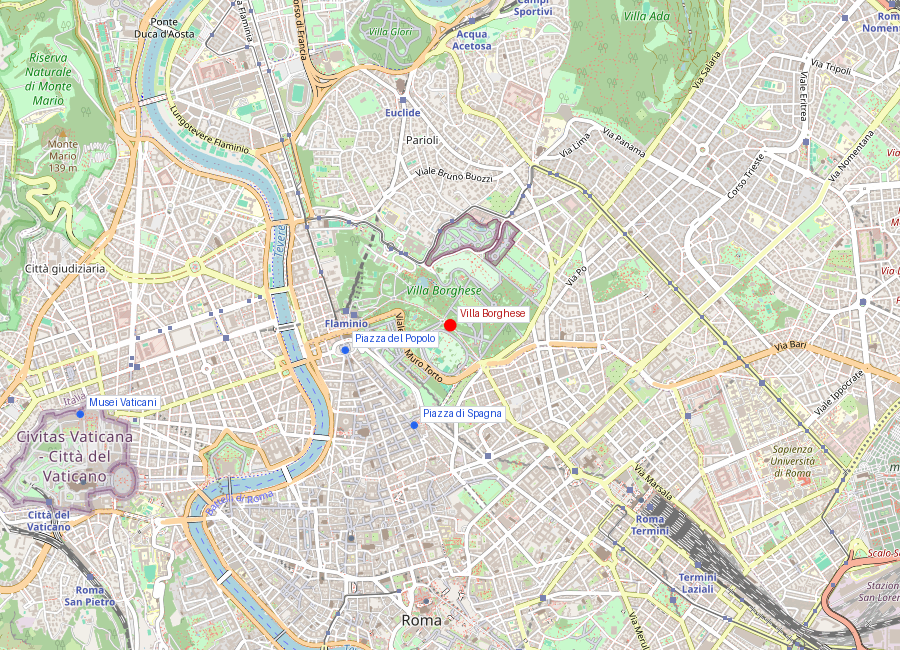
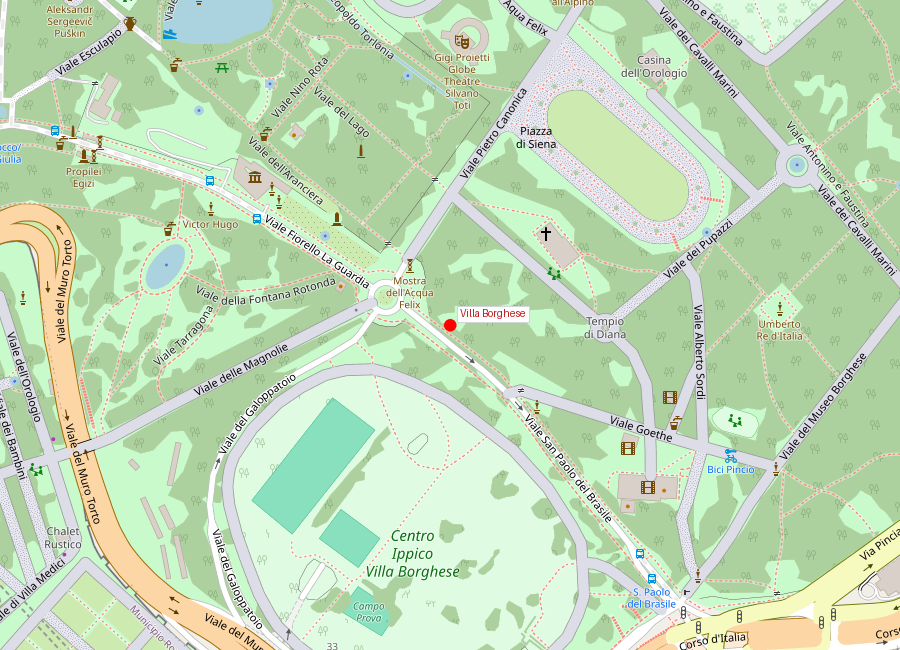

# Villa Borghese

```yaml
lugar:
  nombre_original: "Villa Borghese"
  pais: "Italia"
  fecha_visita: "2026-03-23/2026-03-30"
```

## Mapa


## Mapa en detalle


## Historia
Nacida en el siglo XVII como villa aristocratica de la familia Borghese, paso a convertirse en parque publico en el siglo XX. Ese cambio resume una transformacion urbana europea: de espacio de prestigio privado a infraestructura civica de uso colectivo.

## Por que importa
Es una bisagra entre naturaleza urbana, paseo social y alta cultura. En el mismo ambito conviven jardines, miradores, museos y usos cotidianos.

## Cultura
La Galleria Borghese, con obras clave de Bernini y Caravaggio, es uno de los puntos fuertes del barroco romano y del coleccionismo de elites eclesiasticas.

## Conexiones
- Conecta visualmente con Piazza del Popolo a traves del Pincio.
- Completa la lectura de la Roma monumental con una capa de paisaje y ocio urbano.

## Datos interesantes
- El contraste entre densidad artistica de la galeria y escala abierta del parque hace de Villa Borghese un lugar de doble ritmo: contemplacion y pausa.

fuente: Galleria Borghese (galleriaborghese.beniculturali.it); Comune di Roma (comune.roma.it); Turismo Roma
