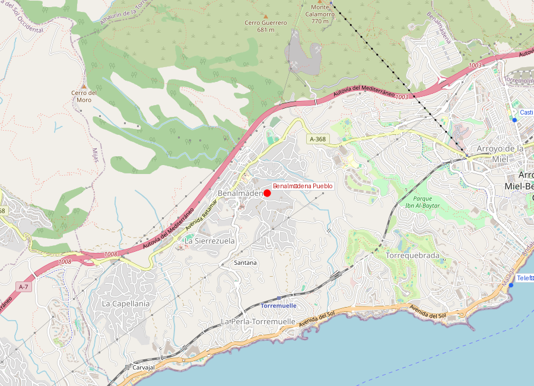
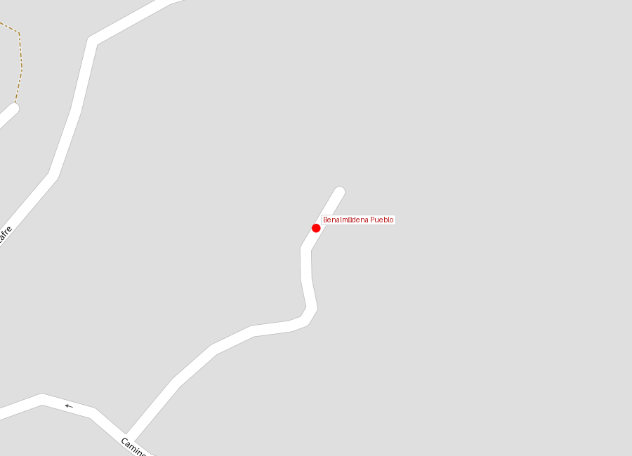
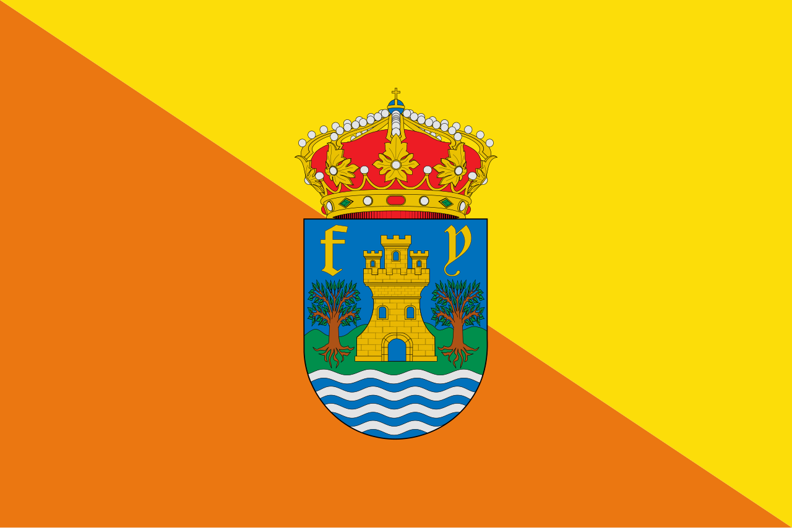

# Benalmádena Pueblo

```yaml
lugar:
  nombre_original: "Benalmádena Pueblo"
  pais: "España"
  region_admin: "Andalucía, Benalmádena"
  coordenadas: "36.5987° N, 4.5169° W"
  altitud_m: 280
  fecha_visita: "[DATO PENDIENTE — confirmar fecha]"
```







---

## Qué es

Benalmádena Pueblo es el casco histórico original del municipio: un pueblo blanco andaluz encaramado en la sierra a 280 metros sobre el nivel del mar, con calles empinadas, casas encaladas, macetas de geranios y vistas panorámicas al Mediterráneo. Mientras la costa y Arroyo de la Miel son desarrollos modernos, el pueblo conserva la escala y el carácter de las alquerías andaluzas tradicionales.

---

## Historia

### De alquería árabe a pueblo blanco

El asentamiento original de **Ibn al-Ma'din** se desarrolló en la sierra, lejos de la costa, por razones defensivas: las incursiones de piratas berberiscos y corsarios hicieron que durante siglos la población costera del sur de España viviera tierra adentro, en altura, donde podía ver venir el peligro.

Tras la conquista cristiana (1485), el pueblo fue repoblado lentamente por colonos castellanos. La estructura urbana conserva el trazado árabe: calles estrechas e irregulares, casas con patio interior, muros gruesos de cal. La **Iglesia de Santo Domingo de Guzmán** (siglo XVII) es el principal edificio religioso, construida sobre el solar de la antigua mezquita.

### El pueblo hoy

Benalmádena Pueblo es hoy un destino de paseo dentro del municipio: los residentes viven mayoritariamente en Arroyo de la Miel o en la costa, pero el pueblo mantiene restaurantes, el museo y un ambiente que contrasta con la urbanización costera. Las calles están profusamente decoradas con flores y azulejos, y varios miradores ofrecen vistas de la costa y del mar.

---

## Qué se puede ver

- **Calles blancas con macetas**: el recorrido es simplemente callejear, subir y bajar cuestas, disfrutar de la estética andaluza
- **Iglesia de Santo Domingo de Guzmán**: edificio del siglo XVII con interior sencillo
- **Museo de Arte Precolombino Felipe Orlando**: pequeña pero interesante colección de arte precolombino (mesoamericano y andino) donada por el artista cubano-español Felipe Orlando [⚠ VERIFICAR si sigue abierto]
- **Jardines del Muro**: mirador con vistas panorámicas al mar y a la costa
- **Plaza de las Tres Culturas**: referencia a la convivencia histórica de musulmanes, cristianos y judíos en Andalucía

---

## Datos interesantes

- Los pueblos blancos andaluces deben su color a la cal viva (*cal de higuera*) con la que se encalan las fachadas. Además de estético, el encalado tiene funciones prácticas: refleja el sol (aislamiento térmico), es antiséptico (previene plagas) y era barato y accesible
- La costumbre de las macetas con geranios en las fachadas no es solo decorativa: los geranios (*Pelargonium*) repelen mosquitos naturalmente
- Desde los miradores del pueblo, en días muy claros, se distingue la silueta de la costa africana

---

## Conexiones

- El contraste entre el pueblo histórico en la sierra y la costa turística moderna es una versión concentrada de lo que ocurre en toda la Costa del Sol: las poblaciones originales estaban tierra adentro, la costa era peligrosa por los piratas
- La misma lógica de pueblos blancos en altura se ve en **Albaicín** (Granada), **Frigiliana** (Nerja) y los pueblos blancos de Cádiz

---

*fuente: Ayuntamiento de Benalmádena, Junta de Andalucía — Patrimonio Cultural, Wikipedia (datos generales verificables)*
