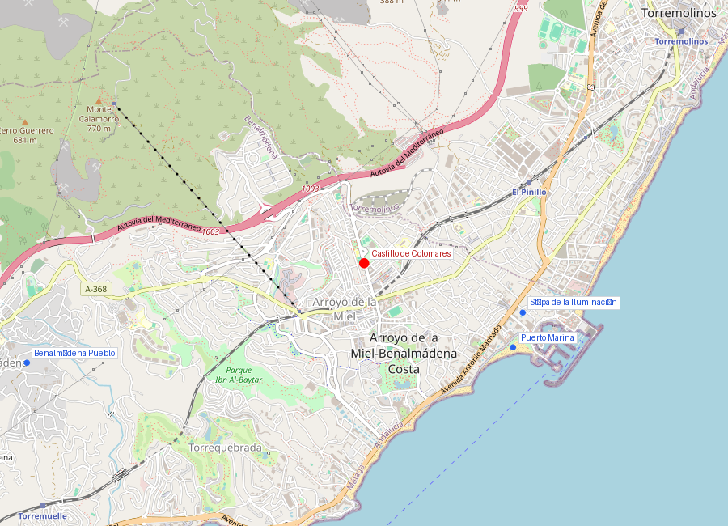
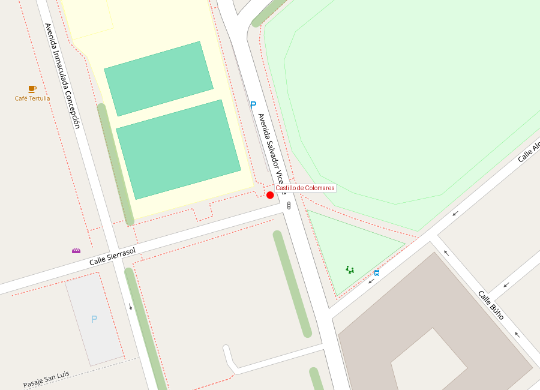
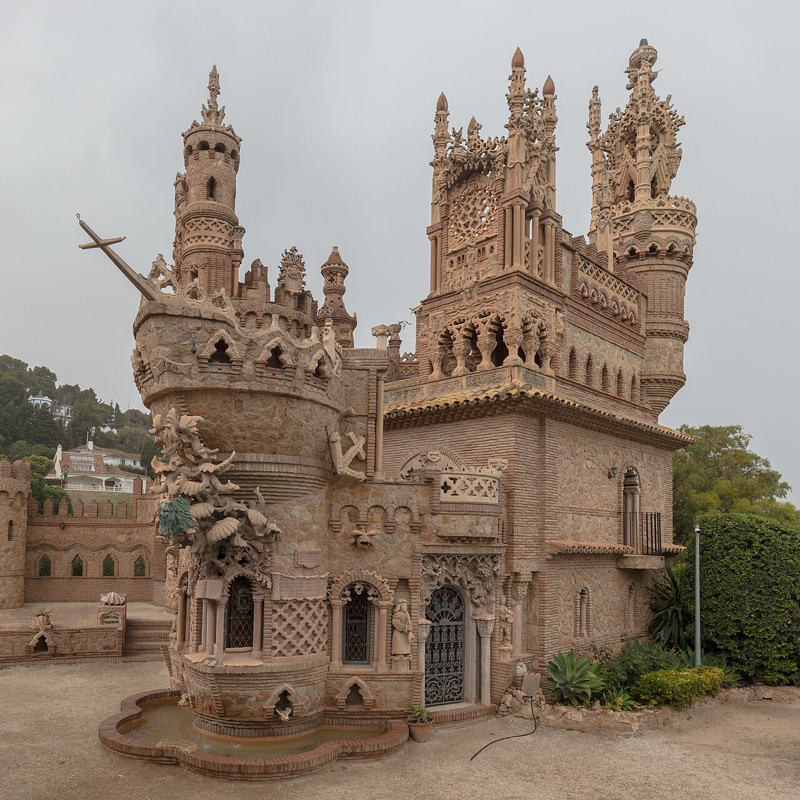

# Castillo de Colomares

```yaml
lugar:
  nombre_original: "Castillo de Colomares"
  pais: "España"
  region_admin: "Andalucía, Benalmádena"
  coordenadas: "36.6120° N, 4.5550° W"
  fecha_visita: "[DATO PENDIENTE — confirmar fecha]"
```







---

## Qué es

El Castillo de Colomares es el **monumento más grande del mundo dedicado al descubrimiento de América** [⚠ VERIFICAR]. No es un castillo medieval sino una construcción contemporánea erigida entre **1987 y 1994** por un solo hombre: el médico y artista **Esteban Martín Martín**, con ayuda de dos albañiles. Lo que comenzó como un homenaje personal se convirtió en una fantasía arquitectónica de 1.500 m² que mezcla estilos neobizantino, neorrománico, neogótico y neomudéjar en una misma estructura.

---

## Historia

El doctor Esteban Martín, natural de Benalmádena, concibió el proyecto como homenaje al viaje de Cristóbal Colón. Trabajó en él durante siete años, financiándolo con su propio salario de médico. La construcción fue artesanal: ladrillo, piedra y hormigón trabajados a mano, sin planos formales de arquitecto.

El resultado es inclasificable: torres almenadas, arcos ojivales, rosetones, mosaicos, esculturas en relieve que narran episodios del viaje de Colón, réplicas de las tres carabelas integradas en la estructura, y una capilla interior que contiene, según el Guinness de los Récords, **la iglesia más pequeña del mundo** (1,96 m²) [⚠ VERIFICAR].

| Hito | Detalle |
|------|---------|
| 1987 | Inicio de la construcción |
| 1994 | Finalización |
| Superficie | ~1.500 m² |
| Altura máxima | ~15 m [⚠ VERIFICAR] |
| Creador | Dr. Esteban Martín Martín |

---

## Arquitectura

La mezcla de estilos es deliberada: Martín quiso representar en piedra las distintas culturas que confluyeron en el descubrimiento de América. Los elementos neobizantinos evocan el origen genovés de Colón; los neogóticos representan la España medieval de los Reyes Católicos; los mudéjares reflejan la herencia islámica andaluza; y los motivos románicos conectan con la tradición religiosa que impulsó la empresa.

Entre los elementos más notables:
- **Réplicas de la Santa María, la Pinta y la Niña** integradas como proas en los muros
- **Rosetón central** con vidriera que representa el viaje
- **Torre del Homenaje** con vistas al Mediterráneo
- **Relieves narrativos** que cuentan cronológicamente el viaje de 1492
- **La capilla más pequeña del mundo** en el interior

---

## Datos interesantes

- El castillo no fue encargado por ninguna institución: es la obra personal de un médico que dedicó sus ahorros y su tiempo libre durante siete años.
- Desde lo alto del castillo se ve el Mediterráneo — el mismo mar que Colón no cruzó (partió del Atlántico), pero que conecta Benalmádena con la historia marinera de la península.
- El Castillo de Colomares está catalogado como **Bien de Interés Cultural** por la Junta de Andalucía [⚠ VERIFICAR].

---

## Conexiones

- La historia de Colón conecta con **Granada**: los Reyes Católicos firmaron las Capitulaciones de Santa Fe en abril de 1492, apenas meses después de la caída de Granada, en el campamento militar a las puertas de la ciudad.

---

*fuente: Ayuntamiento de Benalmádena, Junta de Andalucía — Patrimonio Cultural, Guinness World Records (capilla más pequeña)*
