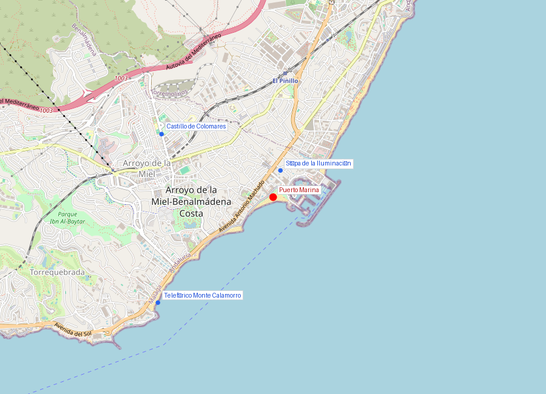
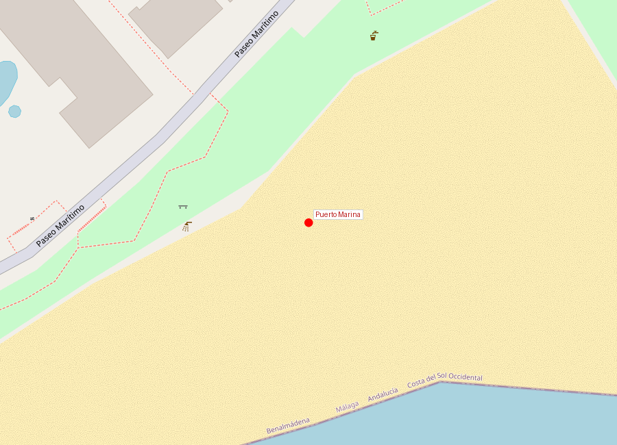

# Puerto Marina

```yaml
lugar:
  nombre_original: "Puerto Marina Benalmádena"
  pais: "España"
  region_admin: "Andalucía, Benalmádena"
  coordenadas: "36.5910° N, 4.5167° W"
  fecha_visita: "[DATO PENDIENTE — confirmar fecha]"
```





---

## Qué es

Puerto Marina es el puerto deportivo de Benalmádena y uno de los más premiados de España. Inaugurado en **1987**, tiene capacidad para más de **1.000 amarres** y su diseño arquitectónico —inspirado en un pueblo pesquero mediterráneo con toques de arquitectura neo-árabe— lo distingue de otros puertos deportivos de la Costa del Sol.

---

## Historia

El puerto fue diseñado por el arquitecto e ingeniero bajo la iniciativa del Ayuntamiento de Benalmádena como pieza central de la transformación turística de la franja costera. La idea era crear no solo un puerto funcional sino un destino en sí mismo: paseo marítimo, restaurantes, comercios, acuario y vida nocturna.

Puerto Marina fue galardonado como **"Mejor Marina del Mundo"** por la asociación internacional **The Yacht Harbour Association (TYHA)** en varias ocasiones [⚠ VERIFICAR], compitiendo con puertos de todo el mundo.

| Hito | Detalle |
|------|---------|
| 1987 | Inauguración |
| Amarres | ~1.100 |
| Premios | "Best Marina" TYHA (múltiples años) [⚠ VERIFICAR] |
| Atracción principal | Sea Life Benalmádena (acuario) |

---

## Qué se puede ver hoy

- **Paseo marítimo** con restaurantes, heladerías y terrazas
- **Sea Life Benalmádena** — acuario con túnel submarino de tiburones
- **Arquitectura neo-mediterránea** — los edificios blancos con arcos y detalles árabes crean una estampa fotogénica, especialmente al atardecer
- **Excursiones en barco** — desde paseos en catamarán hasta avistamiento de delfines (los delfines comunes y listados son habituales en la costa malagueña)
- Vista hacia el mar con la silueta de la costa africana en días claros

---

## Datos interesantes

- Los delfines que se avistan desde las excursiones del puerto son principalmente **delfín común** (*Delphinus delphis*) y **delfín listado** (*Stenella coeruleoalba*), residentes permanentes del Mar de Alborán
- El diseño del puerto imita un pueblo costero tradicional pero es enteramente contemporáneo — ninguno de los "edificios históricos" tiene más de 40 años
- Puerto Marina conecta por paseo marítimo con las playas de Benalmádena Costa hasta el límite con Torremolinos al este

---

*fuente: Ayuntamiento de Benalmádena, The Yacht Harbour Association, Wikipedia (datos generales verificables)*
