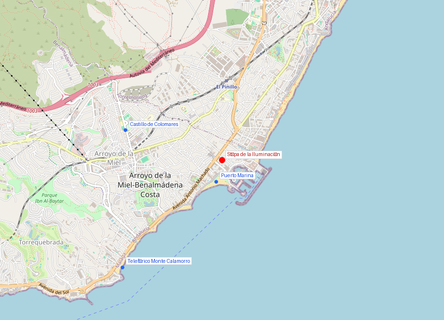
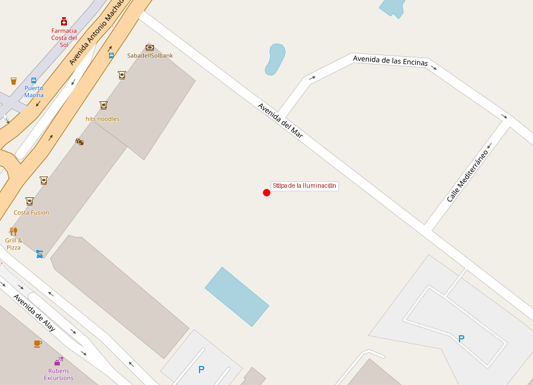
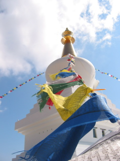

# Stupa de la Iluminación

```yaml
lugar:
  nombre_original: "Stupa de la Iluminación (Benalmádena)"
  pais: "España"
  region_admin: "Andalucía, Benalmádena"
  coordenadas: "36.5952° N, 4.5164° W"
  fecha_visita: "[DATO PENDIENTE — confirmar fecha]"
```







---

## Qué es

La Stupa de la Iluminación de Benalmádena es la **stupa budista más grande de Europa occidental** con sus **33 metros de altura**. Inaugurada en **2003**, fue construida por la comunidad budista **Karma Kagyu** bajo la dirección del maestro tibetano **Lopon Tsechu Rinpoche**, uno de los principales discípulos del 16º Karmapa.

Una stupa (del sánscrito *stūpa*, "montículo") es una estructura arquitectónica budista que funciona como relicario, lugar de meditación y símbolo cósmico. Las stupas no son templos en el sentido occidental: no se entra en ellas a rezar (aunque la de Benalmádena tiene un espacio interior visitable). Su función es representar la mente iluminada del Buda y generar un campo de energía positiva en el entorno.

---

## Historia

### ¿Cómo llegó una stupa a la Costa del Sol?

La historia comienza con **Lopon Tsechu Rinpoche** (1918–2003), un maestro budista nacido en Bután que fue uno de los principales propagadores del budismo tibetano en Occidente. Rinpoche visitó Benalmádena en los años 90 y quedó impresionado por el lugar: vio en la colina sobre el pueblo un sitio ideal para construir una stupa que beneficiara a toda la región.

La tradición budista sostiene que las stupas tienen un efecto pacificador y armonizador en la zona que las rodea — según la leyenda, el propio Buda dio instrucciones sobre cómo construir stupas y qué efectos producen en el entorno.

El proyecto fue apoyado por el **Ayuntamiento de Benalmádena**, que cedió el terreno, y financiado por la comunidad budista internacional. La construcción se realizó siguiendo estrictamente los cánones tibetanos tradicionales.

| Hito | Detalle |
|------|---------|
| Años 90 | Lopon Tsechu Rinpoche identifica el lugar |
| 2003 | Inauguración |
| Altura | 33 metros |
| Estilo | Stupa tibetana de la Iluminación (tipo Changchub) |
| Interior | Sala de meditación con pinturas murales |

### Lopon Tsechu Rinpoche

El maestro falleció en **2003**, poco después de ver completada la stupa. Se dice que fue su último gran proyecto. En el interior de la stupa se conservan reliquias y objetos sagrados depositados según la tradición tibetana durante la construcción: textos sagrados, mantras, estatuillas y relicarios.

---

## Arquitectura y simbolismo

La stupa sigue el modelo tibetano clásico de **stupa de la Iluminación** (una de las ocho formas canónicas):

- **Base escalonada**: representa los cimientos de la práctica espiritual
- **Cuerpo bulboso** (anda): simboliza la mente despierta
- **Harmika** (estructura cuadrada superior): los ojos del Buda que miran en las cuatro direcciones
- **Aguja cónica** (yasti): los trece niveles hacia la iluminación
- **Sombrilla** (chhatra): la protección del dharma

El interior contiene una **sala de meditación** decorada con pinturas murales tibetanas que representan la vida del Buda y los diferentes reinos de existencia según la cosmología budista. Los murales fueron pintados por artistas nepalíes especializados.

---

## Qué se puede ver hoy

- La stupa se puede visitar (entrada gratuita)
- Interior con sala de meditación y murales
- Jardines con vistas al Mediterráneo
- Tienda con artículos budistas
- Sesiones de meditación abiertas al público (consultar horarios)

---

## Datos interesantes

- Es la stupa más grande de Europa occidental — solo superada por algunas en Europa del Este (como la de Kalmykia, Rusia)
- Benalmádena tiene una conexión inesperada con el budismo tibetano: además de la stupa, la comunidad Karma Kagyu mantiene un centro de retiro en la zona
- La stupa está orientada según la tradición tibetana, con la entrada mirando al este

---

*fuente: Fundación Stupa de la Iluminación, Diamond Way Buddhism, Ayuntamiento de Benalmádena, Wikipedia (datos generales verificables)*
