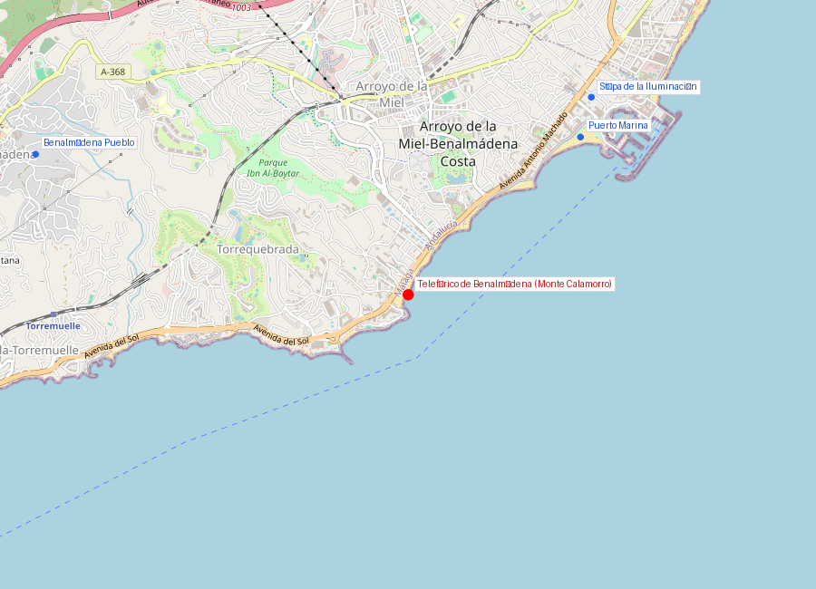
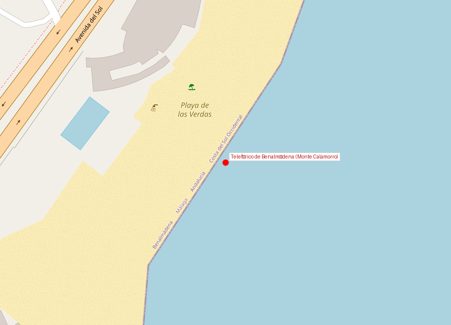
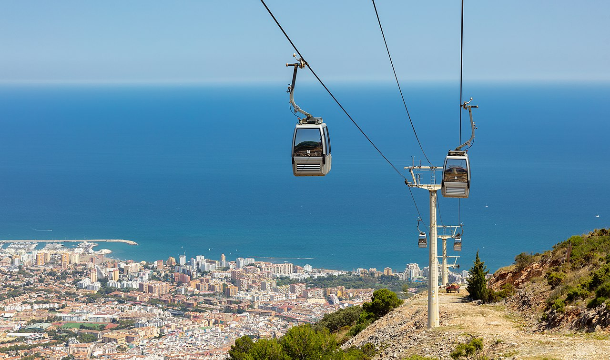

# Teleférico y Monte Calamorro

```yaml
lugar:
  nombre_original: "Teleférico de Benalmádena"
  pais: "España"
  region_admin: "Andalucía, Benalmádena"
  coordenadas: "36.6040° N, 4.5250° W"
  fecha_visita: "[DATO PENDIENTE — confirmar fecha]"
```







---

## Qué es

El Teleférico de Benalmádena conecta **Arroyo de la Miel** (estación base, ~100 m de altitud) con la cumbre del **Monte Calamorro** (769 m) en un trayecto de unos 15 minutos y 2.700 metros de longitud. Es el teleférico de mayor desnivel de la Costa del Sol y ofrece, en días claros, **vistas hasta la costa africana** — la silueta de las montañas del Rif marroquí es visible a simple vista.

---

## Historia

El teleférico fue inaugurado en **2000** como atracción turística complementaria a la oferta de playa de Benalmádena. La infraestructura fue construida por la empresa **Telefèric de Benalmádena S.A.** con cabinas biplaza (posteriormente ampliadas).

El Monte Calamorro en sí tiene un interés natural significativo: forma parte de la **Sierra de Mijas**, un macizo calizo que separa la costa del interior malagueño. La sierra alberga vegetación mediterránea de monte bajo (romero, tomillo, esparto, palmito) y fauna que incluye la **cabra montés ibérica** (*Capra pyrenaica hispanica*), visible frecuentemente en las laderas.

| Dato | Detalle |
|------|---------|
| Longitud | ~2.700 m |
| Desnivel | ~670 m |
| Cima | Monte Calamorro, 769 m |
| Duración | ~15 minutos |
| Inauguración | 2000 |

---

## Qué se puede ver hoy

### La subida
El propio trayecto es la experiencia: las cabinas ascienden sobre laderas de pinos y matorral mediterráneo, con la costa extendiéndose debajo.

### En la cima
- **Mirador de África**: plataforma señalizada desde la que, en días sin calima, se distingue la costa marroquí (estrecho de Gibraltar: ~130 km en línea recta, pero las montañas del Rif son visibles por su altura)
- **Senderos de montaña**: rutas señalizadas por la cumbre y las crestas de la sierra
- **Exhibición de aves rapaces**: espectáculo de cetrería con águilas, halcones y búhos (horarios estacionales) [⚠ VERIFICAR si sigue activo]
- **Vegetación mediterránea**: palmito (*Chamaerops humilis*, la única palmera nativa de Europa continental), romero, acebuche, lentisco

### La vista
Desde la cima se ven en un barrido de 360°:
- Al sur: el **Mediterráneo** y, en días claros, **Marruecos**
- Al oeste: la bahía hacia **Málaga** y el perfil de la sierra
- Al norte: el interior de la provincia, sierras de Mijas y Alhaurín
- Al este: la costa hacia **Fuengirola** y más allá

---

## Datos interesantes

- La distancia en línea recta entre la cima del Calamorro y la costa africana más cercana (Ceuta/Punta Leona) es de unos 130 km, pero las montañas del Rif (hasta 2.400 m) son visibles desde mucho más lejos por su elevación
- La **cabra montés** que vive en la Sierra de Mijas es una subespecie endémica ibérica que estuvo al borde de la extinción y ha sido recuperada — es posible verlas en las laderas durante la subida
- El palmito (*Chamaerops humilis*) que crece en la sierra es la única palmera autóctona de la Europa continental

---

*fuente: Teleférico de Benalmádena, Junta de Andalucía — Espacios Naturales, Wikipedia (datos generales verificables)*
