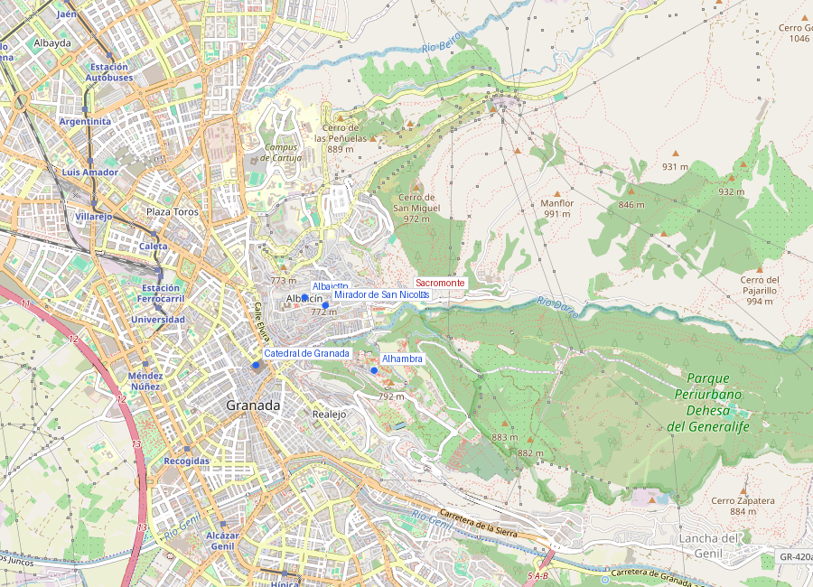
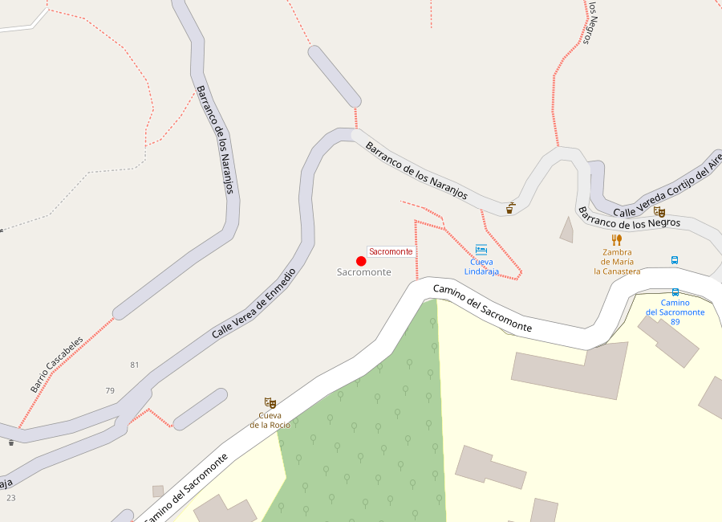
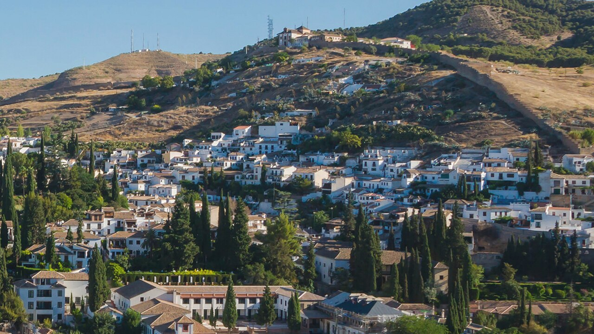

# Sacromonte

```yaml
lugar:
  nombre_original: "Sacromonte"
  nombre_alternativo: "Sacro Monte, Monte Sacro"
  pais: "España"
  region_admin: "Andalucía"
  coordenadas: "37.1819° N, 3.5850° O"
  fecha_visita: "[DATO PENDIENTE — confirmar fecha]"
```







---

## Qué había antes

La colina del Sacromonte, al este del Albaicín, fue un espacio periurbano de huertas, caminos y terreno baldío durante el período nazarí. No formaba parte del núcleo urbano amurallado. Su transformación comienza tras la conquista cristiana, con dos fenómenos superpuestos: el asentamiento de la comunidad gitana y un hallazgo religioso controvertido.

---

## Historia

### El asentamiento gitano (siglos XV–XVI)

Los **Roma** (gitanos) llegaron a la Península Ibérica en el siglo XV. Tras la conquista de Granada, comunidades gitanas se asentaron en las laderas del Sacromonte, donde excavaron **cuevas** en la roca blanda de conglomerado arcilloso. Las cuevas —frescas en verano, templadas en invierno— se convirtieron en viviendas permanentes, pintadas de blanco por dentro, con chimeneas que asoman por la ladera.

El Sacromonte se convirtió a lo largo de los siglos en el **barrio gitano** de Granada y en uno de los centros históricos más importantes del **flamenco**. Las zambras (fiestas de cante y baile flamenco en las cuevas) a las que acudían viajeros, escritores y artistas, contribuyeron a forjar la imagen romántica del flamenco y de la "gitanería" andaluza.

### Los Libros Plúmbeos (1595–1599)

Entre 1595 y 1599, en la colina del Sacromonte se "descubrieron" una serie de planchas de plomo grabadas con textos en árabe y latín —los **Libros Plúmbeos del Sacromonte**— que supuestamente contenían revelaciones de San Cecilio (primer obispo de Granada, martirizado en el siglo I) y de otros santos. Los textos intentaban conciliar el islam y el cristianismo, sugiriendo que los primeros cristianos de Granada habían tenido contacto con la cultura árabe.

El hallazgo fue enormemente controvertido. El arzobispo de Granada, **Pedro de Castro**, creyó fervientemente en su autenticidad y fundó la **Abadía del Sacromonte** (1610) sobre el lugar del hallazgo, con un templo y colegiata que se convirtieron en centro de peregrinación. Sin embargo, el papado los declaró **falsos** en 1682 (bula de Inocencio XI), y hoy la mayoría de los estudiosos los consideran una falsificación morisco-cristiana, probablemente creada por moriscos cultos que buscaban legitimar su presencia en la sociedad granadina. Los Plúmbeos fueron devueltos a Granada en 2000 por el Vaticano y están hoy en la Abadía.

### Las inundaciones de 1963

En **1963**, unas lluvias torrenciales provocaron corrimientos de tierra que destruyeron muchas cuevas del Sacromonte. La catástrofe desplazó a cientos de familias gitanas a bloques de viviendas en las afueras de Granada. El Sacromonte quedó parcialmente despoblado, y aunque ha habido rehabilitaciones, el barrio nunca recuperó la densidad de población anterior.

---

## Arquitectura

### Las cuevas

Las cuevas del Sacromonte son excavaciones en la ladera de conglomerado arcilloso del Monte Valparaíso. Características:

- **Paredes encaladas** de blanco (práctica higiénica y estética)
- **Temperatura estable** todo el año (18–20°C), gracias a la masa térmica de la roca
- Distribución variable: desde una sola estancia hasta complejas viviendas de varias habitaciones
- **Chimeneas** visibles desde el exterior, emergiendo del suelo de la ladera como setas blancas
- Muchas conservan ajuar doméstico tradicional: cobres colgados, cerámicas, azulejos

### La Abadía del Sacromonte

La **Abadía del Sacromonte** (iniciada en 1610) corona la colina. Incluye:
- Iglesia colegial
- Museo con los Libros Plúmbeos (exhibidos como piezas históricas, no como reliquias)
- Catacumbas donde supuestamente se hallaron las reliquias de San Cecilio
- Vistas panorámicas del valle del Darro

---

## Mitología y leyendas

### San Cecilio

Según la tradición, **San Cecilio** (Caecilius) fue uno de los siete varones apostólicos enviados a evangalizar Hispania en el siglo I. Habría sido el primer obispo de Ilíberis (Granada) y habría sido martirizado en las catacumbas del Sacromonte. Los Libros Plúmbeos supuestamente documentaban su martirio. La festividad de San Cecilio (1 de febrero) es la fiesta patronal de Granada, con una romería al Sacromonte.

### Las zambras y el flamenco de cueva

La tradición flamenca del Sacromonte se asocia con la **zambra** (del árabe *zamra*, fiesta con música). Según la tradición, los gitanos del Sacromonte mantuvieron formas de cante y baile que conectan con la danza morisca anterior, fundiendo elementos árabes, gitanos y castellanos. Aunque esta genealogía es discutida por los flamencólogos, la asociación entre el Sacromonte, las cuevas y el flamenco "puro" es parte integral de la identidad cultural granadina.

---

## Qué se puede ver hoy

- **Museo Cuevas del Sacromonte**: un conjunto de cuevas rehabilitadas como museo etnográfico, mostrando la vida tradicional del barrio (oficios, cocina, flamenco)
- **Zambras flamencas**: varias cuevas ofrecen espectáculos de flamenco para visitantes. La calidad varía; los más respetados son los que emplean artistas locales
- **Abadía del Sacromonte**: iglesia, museo de los Plúmbeos, catacumbas, miradores
- **Camino del Sacromonte**: la calle principal que sube por la ladera, flanqueada de cuevas con chimeneas y chumberas
- **Vistas**: desde las partes altas del Sacromonte se ve la Alhambra, el Albaicín y Sierra Nevada en una panorámica más amplia que desde San Nicolás

---

## Conexiones

- El Sacromonte conecta directamente con el [Albaicín](albaicin.md) por el oeste, sin frontera clara entre ambos barrios
- Las vistas desde el Sacromonte complementan las del [Mirador de San Nicolás](mirador_san_nicolas.md), con una perspectiva más lateral y abierta
- La [Alhambra](alhambra.md) es visible desde todo el barrio, al otro lado del barranco del Darro
- La tradición de San Cecilio conecta con los orígenes del cristianismo en la zona, antes de la [Catedral](catedral_capilla_real.md)

---

## Datos interesantes

- Las cuevas del Sacromonte mantienen temperatura entre **18 y 20°C** todo el año, sin climatización artificial
- Los Libros Plúmbeos, aunque falsos, son uno de los casos más fascinantes de falsificación religiosa de la Europa moderna, y hoy se estudian como documento de la psicología colectiva de los moriscos
- **Enrique Morente**, uno de los cantaores flamencos más revolucionarios del siglo XX, era granadino y reivindicaba la herencia flamenca del Sacromonte
- La romería de San Cecilio (1 de febrero) sube al Sacromonte con habas y bacalao — es la fiesta popular más genuina de Granada, fuera del circuito turístico
- Lorca ambientó varias de sus obras en el mundo gitano granadino, incluyendo el *Romancero Gitano* (1928)

---

*fuente: Manuel Barrios, "Los Libros Plúmbeos del Sacromonte" (Universidad de Granada); Museo Cuevas del Sacromonte (sacromontegranada.com); Wikipedia (artículos verificados); Patronato de Turismo de Granada.*
