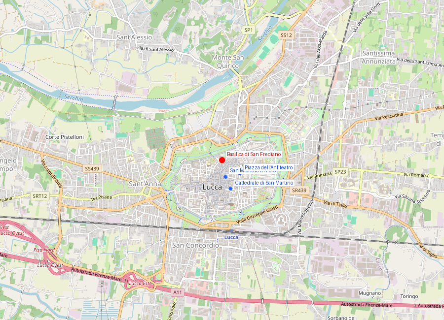
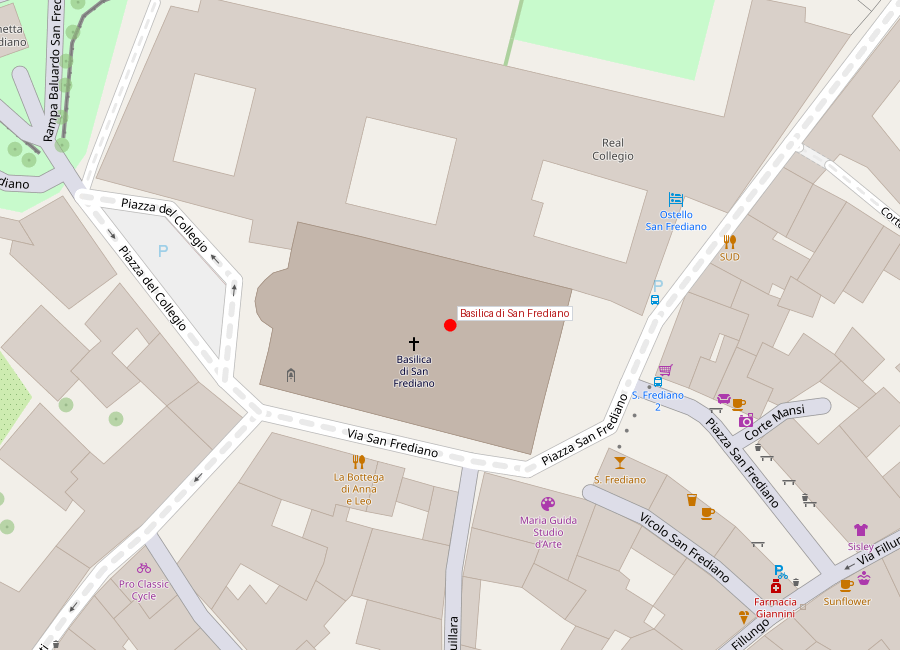
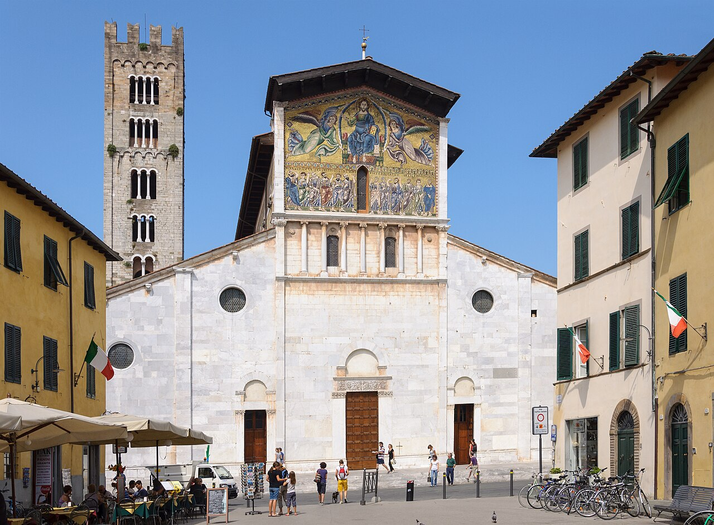

# Basilica di San Frediano

```yaml
lugar:
  nombre_original: "Basilica di San Frediano"
  pais: "Italia"
  region_admin: "Toscana"
  coordenadas: "43.8462° N, 10.5046° E"
  altitud_m: 19
  fecha_visita: "[DATO PENDIENTE — confirmar fecha]"
```







---

<!-- 📷 FOTO: fachada con el gran mosaico dorado / detalle del Cristo en Majestad con apóstoles -->

## Por qué esta basílica es única

La **Basilica di San Frediano** hace algo que ninguna otra iglesia románica de la Toscana hace: tiene sobre su **fachada** un **gran mosaico de fondo dorado**, de estilo claramente bizantino, que representa a Cristo en Majestad rodeado por los Apóstoles. La mayor parte de los grandes mosaicos de fondo dorado del arte medieval italiano están en interiores: ábsides, cúpulas. En la fachada, al exterior, expuesto al tiempo, el de San Frediano es una rareza extraordinaria.

La combinación del mosaico dorado y las logias románicas de la fachada crea un efecto casi irreal, especialmente a media mañana cuando el sol ilumina el oro.

---

## Historia

### San Frediano: el obispo irlandés de Lucca

La basílica lleva el nombre de **San Frediano** (Frigidianus en latín, Finnian en irlandés), un monje y obispo de origen irlandés que llegó a Lucca en el **siglo VI** —durante el período de las grandes peregrinaciones de los monjes celtas que recorrieron Europa fundando iglesias y monasterios.

La tradición luchese le atribuye un milagro: ante el riesgo de que el río Serchio inundara los campos de la ciudad, Frediano desvió el curso del río usando solo un rastrillo (*rastrello*), haciendo que las aguas siguieran sus pasos. El episodio está representado en uno de los compartimentos del gran mosaico de la fachada.

Frediano fue obispo de Lucca durante décadas y murió hacia el **588 d.C.** (la fecha exacta es debatida). Su culto fue inmediato y persistente: la basílica que se construyó sobre su tumba se convirtió en una de las más importantes de la ciudad.

### La basílica actual (siglo XII)

La iglesia que se conoce hoy es una reconstrucción del **siglo XII** sobre fundaciones más antiguas. El estilo es el **románico luchese**: planta basilical de tres naves, con uso de materiales bicolor (mármol blanco y pietra serena verde) y logias de columnas en la fachada. La construcción fue promovida y financiada por la República de Lucca y por donaciones de familias de mercaderes durante el período de mayor prosperidad de la seda luchese.

La orientación de la basílica es inversa a la convencional: el ábside (el altar) está al norte, no al este. Esto se debe a la preexistencia de la tumba de San Frediano, que ya tenía una posición fija en el territorio cuando se planificó la nueva basílica.

### El mosaico de la fachada (siglo XIII)

El gran mosaico que ocupa el nicho central de la fachada, de fondo dorado, es de los **siglos XII–XIII** y es una obra de artistas *romani* (mosaicistas de tradición romana y bizantina) trabajando en el norte de la Toscana. *[⚠ VERIFICAR autoría exacta]*

**Programa iconográfico:**
- En el centro: Cristo en Majestad en una mandorla (*Maiestas Domini*), con el libro de los Evangelios y el gesto de bendición.
- A los lados: los doce Apóstoles, seis a cada lado, de tamaño menor.
- En el borde inferior: escenas de la vida de San Frediano, incluyendo el milagro del Serchio.

Los **tessere** (pequeñas piezas de vidrio y piedra) del fondo dorado reflejan la luz variable del día de manera diferente según el ángulo del sol: al amanecer, cuando el sol está bajo en el este y la fachada norte de San Frediano recibe la luz lateral, el mosaico flamea con un amarillo anaranjado difícil de describir.

---

## El interior

### La Fonte Battesimale (fuente bautismal)

<!-- 📷 FOTO: la fonte bautismal cilíndrica con relieves / detalle de los relieves -->

El objeto más importante del interior de la basílica es la **fonte battesimale** (fuente bautismal), considerada una de las **mayores obras del románico lombardo** en la Toscana.

Se trata de una **gran taza cilíndrica** de mármol, sostenida por cuencos sucesivos con decoración escultórica en relieve, del **siglo XII**. Los relieves representan escenas del Antiguo y Nuevo Testamento, trabajados por maestros lombardos con un estilo característico: figuras planas y expresivas, con una energía narrativa que contrasta con la rigidez del arte románico más formalista.

Hay tres elementos decorativos distintos: la **taza superior** con escenas del baptismo de Cristo y figuras de profetas; el friso intermedio con figuras apostólicas; y la parte inferior con decoración vegetal y animal.

El tamaño de la fuente sugiere que era una **fuente de inmersión**: el neófito entraba en la pila de agua y era sumergido, no simplemente rociado. Este rito del baptismo por inmersión total fue el común en la iglesia paleocristiana y medieval temprana.

### La Cappella Trenta y el retablo de Della Quercia

En el lado izquierdo de la nave, la **Cappella Trenta** contiene un retablo escultórico de **Jacopo della Quercia** y su discípulo **Giovanni da Imola** (1422): un políptico de mármol con figuras de santos en hornacinas, de una elegancia y una calidad escultórica notables. Es una obra menor del maestro sienés en comparación con el monumento de Ilaria del Carretto del Duomo, pero muestra el mismo dominio del volumen y el drapeado.

El pavimento de la capilla tiene también losas sepulcrales de los miembros de la familia Trenta, con inscripciones del siglo XV.

### La mummia di Santa Zita

<!-- 📷 FOTO: urna con la mummia di Santa Zita (si se puede fotografiar) -->

En una capilla lateral se conserva el cuerpo momificado de **Santa Zita** (c. 1218–1278), la patrona de Lucca y de los criados — una figura notable porque fue una **sierva** que alcanzó la santidad sin ser noble ni religiosa.

Zita era una criada de la familia Fatinelli de Lucca, donde trabajó desde los 12 años hasta su muerte. Según la tradición, era conocida por dar comida de la despensa de sus amos a los pobres; cuando fue sorprendida llevando pan bajo el mandil, el pan se habría transformado en flores (el milagro de las flores es un motivo hagiográfico recurrente, también atribuido a San Casiano de Ímola y a otras figuras).

Fue canonizada en **1696**. Su cuerpo, momificado de manera natural, está expuesto en una urna de cristal en la basílica. Cada año, el 27 de abril (día de su festividad), la basílica organiza una feria de flores —la **Fiera dei Fiori**— en su honor delante de la iglesia, en recuerdo del milagro del pan transformado en flores.

---

## Conexiones

- La fuente bautismal lombarda de San Frediano es comparable en calidad y en origen a las fuentes que los *Maestri Campionesi* ejecutaron en Módena, Parma y otras ciudades del norte de Italia. Es un testimonio de los intercambios entre Lucca y el Lombard belt artístico.
- **Jacopo della Quercia** trabajó en ambos sitios principales de Lucca: el monumento de Ilaria en la Cattedrale di San Martino y el retablo de la Cappella Trenta en San Frediano. La búsqueda de sus obras en la ciudad es en sí misma un recorrido.
- El culto a **San Frediano** como obispo irlandés de Lucca es un testimonio del papel que los monjes celtas (irlandeses, escoceses) jugaron en la evangelización del norte de Italia en los siglos VI–VII — una historia menos conocida que la evangelización carolingia posterior.

---

## Datos interesantes

- El mosaico dorado de la fachada es uno de los únicos **mosaicos de fondo dorado en el exterior** de una iglesia románica de la Toscana —un tipo iconográfico que normalmente solo aparece en interiores de basílicas paleocristianas y byzantinas.
- La inversión de orientación de la basílica (ábside al norte) es visible en el plano de la ciudad: si uno sale por la puerta principal hacia el sur, la fachada mosaicada queda a sus espaldas, brillando hacia las calles del centro a lo largo de todo el día.
- **Santa Zita** se convirtió en la patrona de los empleados del hogar y sirvientes en Italia y también en otros países (en particular en muchas partes de Gran Bretaña catholica medieval, donde fue venerada como "Saint Sythe"). Hay una iglesia dedicada a ella en la ciudad de Nottingham.
- El nombre "Frigidianus" (San Frediano) en latín medieval podría derivar del latín *frigidus* (frío), quizás referencia a las aguas frías del Serchio; o podría ser simplemente una transliteración latina del nombre irlandés Finnian. La etimología está debatida.

---

*fuente: Renzo Manetti, "Le chiese di Lucca" (ed. Pacini Fazzi); Touring Club Italiano, Toscana; sitio web del comune di Lucca; Lexicon der christlichen Ikonographie (voz San Frediano); Wikipedia (verificado).*
