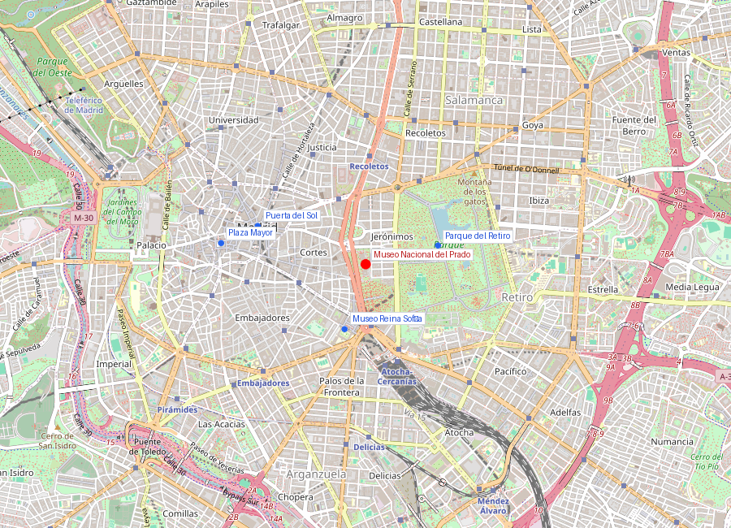
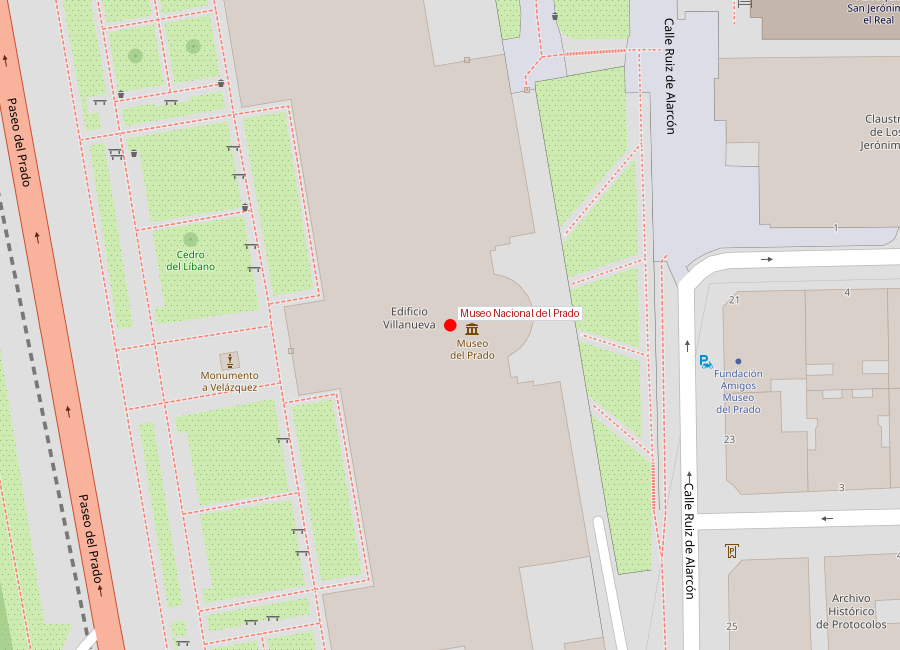
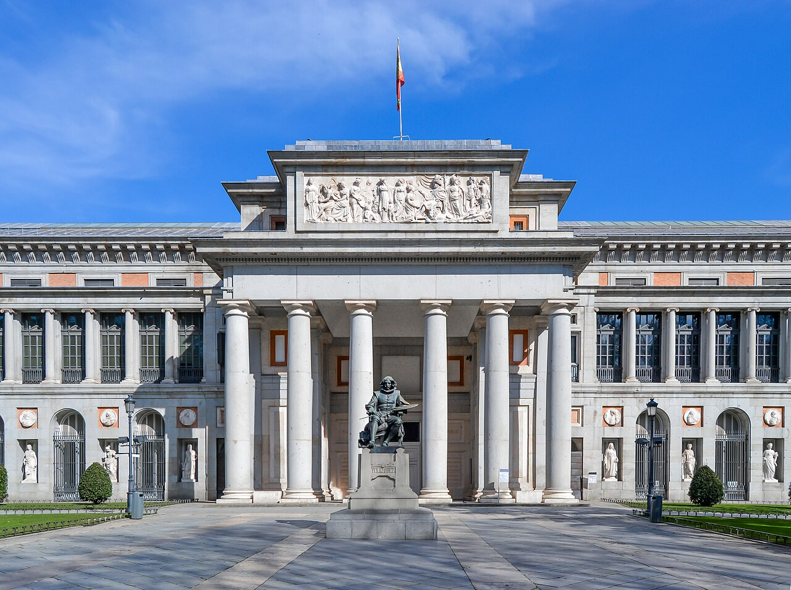

```yaml
lugar:
  nombre_original: "Museo Nacional del Prado"
  pais: "España"
  region_admin: "Comunidad de Madrid"
  coordenadas: "40.4138, -3.6921"
  fecha_visita: "[DATO PENDIENTE — confirmar fecha]"
```







# Museo Nacional del Prado

## Qué había antes

El edificio que alberga el Prado no fue concebido como museo. Carlos III encargó al arquitecto neoclásico **Juan de Villanueva** en 1785 un **Gabinete de Ciencias Naturales** que formaría parte de un ambicioso plan ilustrado para el Paseo del Prado: un eje de ciencia y cultura que incluiría también el Jardín Botánico y el Observatorio Astronómico.

Las guerras napoleónicas interrumpieron el proyecto. Las tropas francesas usaron el edificio como cuartel de caballería y arrancaron el plomo del tejado para fabricar balas. El edificio quedó semiderruido.

## Historia

| Fecha | Hito |
|---|---|
| 1785 | Carlos III encarga el edificio a Juan de Villanueva |
| 1808-1814 | Daños graves durante la Guerra de la Independencia |
| 19 nov 1819 | Apertura como Real Museo de Pinturas, con 311 cuadros expuestos |
| 1868 | Nacionalización: de "Real Museo" a "Museo Nacional" |
| 1936-1939 | Evacuación de obras a Valencia y Ginebra durante la Guerra Civil |
| 1981 | Llega el *Guernica* de Picasso (luego trasladado al Reina Sofía en 1992) |
| 2007 | Ampliación de Rafael Moneo (cubo de ladrillo trasero) |
| 2019 | Bicentenario: 3,2 millones de visitantes anuales [⚠ VERIFICAR] |

## La colección — por qué es especial

El Prado no es un museo enciclopédico como el Louvre o el British Museum. Es una **colección real**: el resultado de siglos de mecenazgo y gusto personal de los reyes de España. Esto le da un carácter único:

- **Velázquez**: la mayor colección del mundo. *Las Meninas* (1656) es la obra más célebre — un cuadro que cuestiona quién mira a quién, considerado por muchos críticos la pintura más importante de la historia del arte occidental.
- **Goya**: colección exhaustiva que cubre toda su evolución, desde los cartones para tapices alegres hasta las **Pinturas Negras** de la Quinta del Sordo — *Saturno devorando a su hijo*, *El aquelarre*, *Perro semihundido*. Estas obras no fueron pintadas para exhibirse; Goya las pintó directamente sobre las paredes de su casa en un estado de desencanto y sordera.
- **El Bosco** (*Hieronymus Bosch*): Felipe II fue el mayor coleccionista de El Bosco del mundo. El Prado tiene *El jardín de las delicias*, *El carro de heno* y *La mesa de los pecados capitales*. Felipe II tenía *El jardín de las delicias* en sus aposentos privados de El Escorial.
- **Tiziano**: pintor favorito de Carlos V y Felipe II. El Prado posee más Tizianos que cualquier otro museo.
- **Rubens**: por la conexión diplomática con Flandes. Carlos V, Felipe IV y Rubens tenían una relación personal que generó encargos masivos.

## La evacuación de 1936 — una odisea

Cuando la Guerra Civil llegó a Madrid, el gobierno republicano organizó una de las mayores operaciones de salvamento artístico de la historia. Más de 500 obras maestras —incluyendo *Las Meninas*, *Las Tres Gracias* de Rubens y *El jardín de las delicias*— fueron embaladas en camiones y trasladadas a Valencia, y luego a través de los Pirineos bajo bombardeos hasta Ginebra, donde la Sociedad de Naciones las custodió. Todas regresaron intactas en 1939.

## Arquitectura

El edificio de Villanueva es una obra maestra del **neoclasicismo español**: planta rectangular alargada, columnatas dóricas y jónicas, materiales nobles (granito y ladrillo). La ampliación de **Rafael Moneo** (2007) añadió el claustro de los Jerónimos, integrado con respeto pero en lenguaje contemporáneo con un cubo de ladrillo rojo.

## Qué se puede ver hoy

Imprescindibles (selección mínima para una visita de 2-3 horas):

- **Sala 12** — *Las Meninas* de Velázquez
- **Salas 64-67** — Pinturas Negras de Goya
- **Sala 56A** — *El jardín de las delicias* de El Bosco
- **Sala 29** — *Las Tres Gracias* de Rubens
- **Sala 9B** — *El Descendimiento* de Rogier van der Weyden
- **Sala 2** — *La Anunciación* de Fra Angelico
- **Sala 25** — *El caballero de la mano en el pecho* de El Greco

## Conexiones

- El Prado forma con el **Museo Reina Sofía** y el **Museo Thyssen-Bornemisza** el llamado Triángulo del Arte, en menos de 1 km de distancia.
- La colección flamenca del Prado conecta directamente con la historia de los Países Bajos españoles — las mismas razones políticas que llevaron a Rubens a Madrid como diplomático produjeron los encargos que hoy cuelgan en estas salas.
- El *Guernica* estuvo temporalmente en el Prado (1981-1992) antes de trasladarse al Reina Sofía.

## Datos interesantes

- El Prado posee más de **8.000 pinturas**, pero solo expone unas 1.300 simultáneamente. El resto está en almacenes o cedido a otros museos españoles.
- *Las Meninas* nunca ha salido del museo desde que llegó. Es demasiado grande y frágil para viajar.
- La entrada es **gratuita las últimas dos horas** de cada día — una tradición que genera colas considerables pero democratiza el acceso.
- Goya fue director temporal del Prado en sus primeros años. Personalmente seleccionó y colgó cuadros de Velázquez.

---

*fuente: Museo Nacional del Prado (www.museodelprado.es); Jonathan Brown, "Velázquez: Painter and Courtier"; Arturo Colorado, "Éxodo y exilio del arte: la odisea del Museo del Prado durante la Guerra Civil"; Wikipedia (artículos verificados)*
