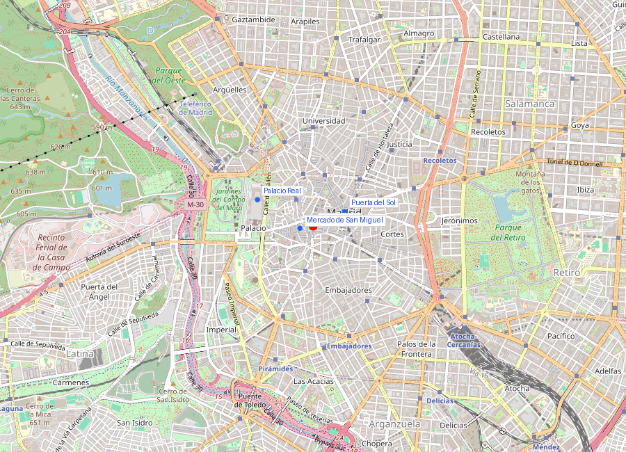
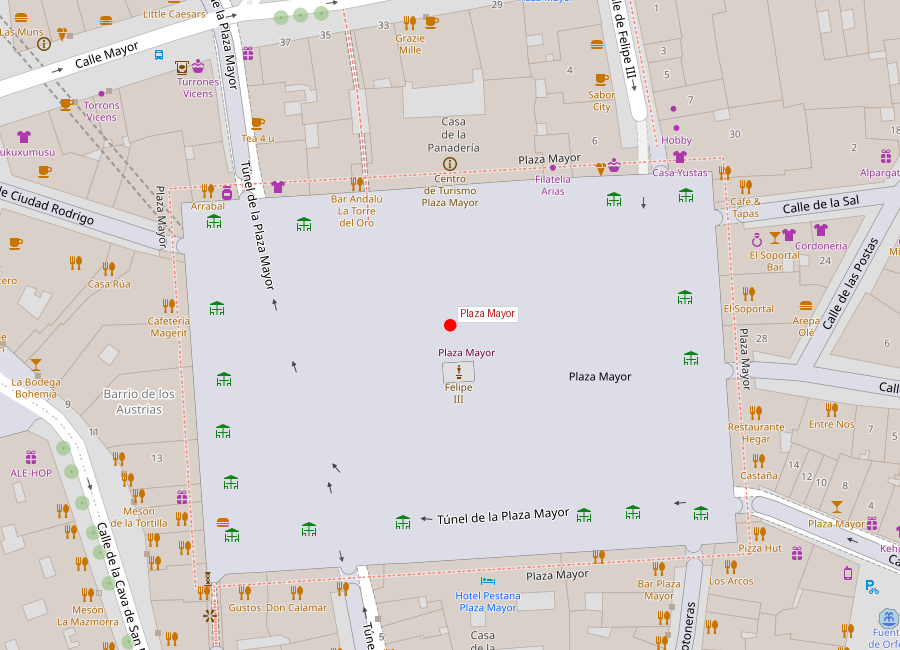
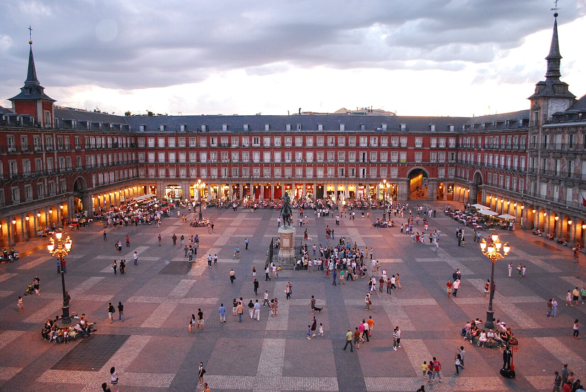

```yaml
lugar:
  nombre_original: "Plaza Mayor de Madrid"
  pais: "España"
  region_admin: "Comunidad de Madrid"
  coordenadas: "40.4155, -3.7074"
  fecha_visita: "[DATO PENDIENTE — confirmar fecha]"
```







# Plaza Mayor de Madrid

## Qué había antes

Antes de ser plaza, este espacio era el **arrabal de la villa** — una zona extramuros donde se celebraba el mercado semanal desde el siglo XV. Se llamaba "Plaza del Arrabal" y era un espacio irregular rodeado de soportales de madera donde confluían mercaderes, artesanos y viajeros.

## Historia

| Fecha | Hito |
|---|---|
| Siglo XV | Plaza del Arrabal, mercado semanal |
| 1580 | Felipe II encarga a Juan de Herrera el diseño de una plaza regular |
| 1619 | Inauguración bajo Felipe III (arquitecto Juan Gómez de Mora) |
| 1631 | Primer gran incendio; reconstrucción |
| 1672 | Segundo gran incendio |
| 1790 | Tercer y último gran incendio; reconstrucción definitiva por Juan de Villanueva |
| 1847 | Se coloca la estatua ecuestre de Felipe III en el centro |
| 1880 | Cierre de los arcos perimetrales: la plaza toma su forma actual cerrada |

## Arquitectura

La Plaza Mayor es un rectángulo casi perfecto de **129 × 94 metros**, completamente cerrado y accesible por 9 arcos de entrada. El diseño de Juan Gómez de Mora (1619) seguía el modelo de plaza regular que los Austrias promovieron en todo su imperio — versiones similares se construyeron en Salamanca, Lima, México y Manila.

Tras el devastador incendio de 1790, **Juan de Villanueva** (el mismo arquitecto del Museo del Prado) reconstruyó la plaza:
- Redujo la altura de los edificios de 5 a 3 plantas
- Cerró los accesos con arcos para crear un espacio más contenido
- Unificó las fachadas con un estilo neoclásico sobrio

El edificio más destacado es la **Casa de la Panadería** (fachada norte), originalmente sede del gremio de panaderos y reguladora del precio del pan en Madrid. Sus frescos actuales (1992, de Carlos Franco) representan figuras mitológicas —Cibeles, Proserpina, Baco— y reemplazaron versiones anteriores deterioradas.

## Lo que sucedía en la plaza

La Plaza Mayor fue durante siglos el escenario de la vida pública madrileña:

- **Autos de fe** de la Inquisición: juicios públicos y ejecuciones. El auto de fe más grande se celebró en 1680 ante Carlos II, con más de 100 condenados.
- **Corridas de toros**: la plaza se llenaba de arena y los balcones se convertían en palcos. Felipe IV era un torero aficionado y según la tradición mató un toro con una lanza desde el balcón real.
- **Ejecuciones públicas**: incluyendo la de Rodrigo Calderón (1621), favorito de Felipe III, cuya serenidad ante el verdugo originó la expresión castellana "tener más orgullo que don Rodrigo en la horca".
- **Proclamaciones reales** y celebraciones: bodas, victorias militares, canonizaciones.
- **Mercado diario**: función que mantuvo hasta bien entrado el siglo XIX.

## Mitología y leyendas

La estatua ecuestre de Felipe III, obra de Juan de Bolonia y Pietro Tacca (1616), tiene una historia macabra. Según la leyenda, durante una restauración en el siglo XIX se descubrieron dentro de la boca del caballo huesos de decenas de gorriones que habían entrado por la abertura y no habían podido salir. La historia ha sido confirmada por restauradores, aunque el número exacto de aves varía según la fuente.

## Qué se puede ver hoy

- **Casa de la Panadería**: fachada con frescos mitológicos, oficina de turismo en planta baja
- **Arco de Cuchilleros**: la entrada más atmosférica, por escaleras empinadas que bajan a la Cava de San Miguel
- **Estatua de Felipe III**: centro de la plaza
- **Soportales**: hoy ocupados por cafés, tiendas de souvenirs y restaurantes tradicionales (las terrazas son caras pero el espacio es único)
- **Mercado navideño**: cada diciembre se instala un mercado de belenes y adornos, tradición desde el siglo XVIII

## Conexiones

- La Plaza Mayor es el corazón del **Madrid de los Austrias**, el casco histórico que incluye la **Puerta del Sol** (3 minutos al este), el **Mercado de San Miguel** (inmediatamente al oeste) y el **Palacio Real** (10 minutos al oeste).
- La tradición de plazas mayores regulares que representa este espacio se exportó a toda Hispanoamérica — la Plaza de Armas de Lima (1535) y el Zócalo de México siguen el mismo principio urbanístico.
- El Arco de Cuchilleros conecta directamente con la zona de La Latina, corazón del tapeo madrileño.

## Datos interesantes

- Los tres incendios (1631, 1672, 1790) destruyeron progresivamente las estructuras de madera originales. La reconstrucción de Villanueva en piedra y ladrillo fue la definitiva.
- La expresión "tener más orgullo que don Rodrigo en la horca" nació aquí en 1621 y sigue usándose en español.
- La numeración de las casas de la plaza va del 1 al 73, siguiendo un sistema continuo que recorre todo el perímetro.
- Bajo la plaza hay aparcamientos y restos arqueológicos no visitables de las estructuras anteriores al siglo XVII.

---

*fuente: Pedro de Répide, "Las calles de Madrid"; Ayuntamiento de Madrid; María Isabel Gea, "Guía del plano de Texeira"; Wikipedia (artículos verificados sobre Plaza Mayor de Madrid)*
