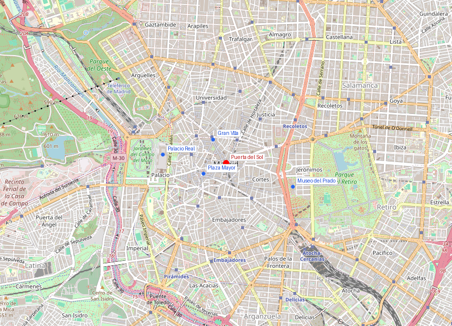
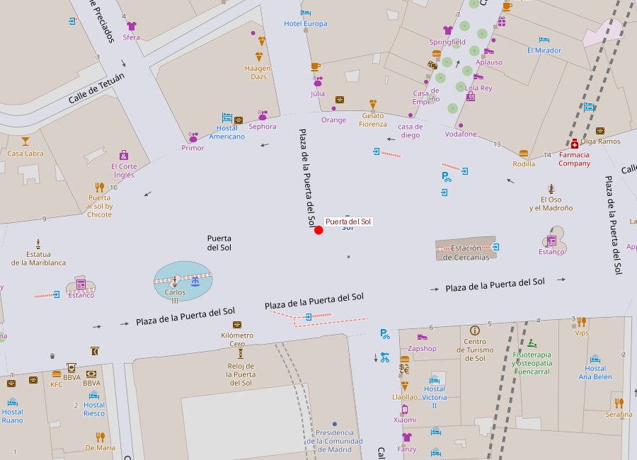
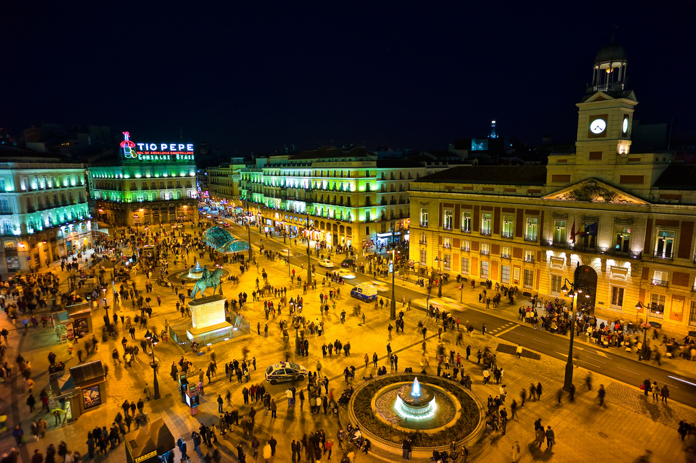

```yaml
lugar:
  nombre_original: "Puerta del Sol"
  pais: "España"
  region_admin: "Comunidad de Madrid"
  coordenadas: "40.4169, -3.7035"
  fecha_visita: "[DATO PENDIENTE — confirmar fecha]"
```







# Puerta del Sol

## Qué había antes

El nombre proviene de una **puerta de la muralla medieval** que existió aquí, orientada al este y decorada con un sol — probablemente porque era la puerta por donde entraban los viajeros que venían del levante, viendo salir el sol. La muralla fue demolida en el siglo XV y la puerta desapareció, pero el nombre pervivió.

## Historia

| Fecha | Hito |
|---|---|
| Siglo XV | Existencia documentada de la puerta en la muralla |
| Siglo XVI | Se convierte en plaza irregular tras la demolición de la muralla |
| 2 mayo 1808 | Epicentro del levantamiento contra Napoleón |
| 1857 | Reforma completa: se demuelen manzanas para crear la plaza semicircular actual |
| 1950 | Instalación del famoso cartel de Tío Pepe |
| 1962 | Se coloca la placa del Kilómetro Cero |
| 2023 | Peatonalización completa tras obras de remodelación |

## El Kilómetro Cero

En la acera frente a la **Real Casa de Correos** (hoy sede de la Presidencia de la Comunidad de Madrid) hay una placa en el suelo que marca el **Kilómetro Cero** de las carreteras radiales de España. Desde este punto se miden todas las distancias por carretera del país. Es una tradición que los visitantes pisen la placa y se fotografíen sobre ella.

La Real Casa de Correos (1768), diseñada por el francés Jaime Marquet, es el edificio más antiguo de la plaza. Su reloj de torre, instalado en 1866 por el relojero Losada, es el que marca las **campanadas de Nochevieja**: cada 31 de diciembre, millones de españoles comen doce uvas al ritmo de las doce campanadas — una tradición que se televisó por primera vez en 1962 y hoy es el evento más visto de la televisión española.

## El 2 de mayo de 1808

La Puerta del Sol fue el escenario principal del levantamiento popular contra las tropas de Murat. La mañana del 2 de mayo, una multitud se congregó frente al Palacio Real para impedir que los franceses se llevaran a los infantes reales. La violencia se extendió a Sol, donde los madrileños atacaron a los mamelucos (soldados egipcios al servicio de Napoleón) con navajas, cuchillos y lo que tenían a mano. La represalia fue brutal: los fusilamientos del 3 de mayo, inmortalizados por Goya.

## La estatua del Oso y el Madroño

En la esquina con la calle Alcalá se encuentra la estatua del **Oso y el Madroño** (1967, escultor Antonio Navarro Santafé), símbolo heráldico de Madrid. El origen del escudo es debatido:

- Según una teoría, el oso representa la abundancia de fauna en los montes cercanos a Mayrit.
- El madroño (un arbusto) podría ser una reinterpretación posterior — algunos historiadores creen que originalmente era un moral o un espino.
- La tradición cuenta que el escudo surgió de un pacto medieval entre el Concejo de Madrid y el Cabildo eclesiástico: el oso para la villa, el árbol para la Iglesia.

## Qué se puede ver hoy

- **Placa del Kilómetro Cero**: frente a la Real Casa de Correos
- **Estatua del Oso y el Madroño**: esquina con calle Alcalá
- **Real Casa de Correos**: fachada neoclásica con el reloj de las campanadas
- **Cartel de Tío Pepe**: icono luminoso reinstalado tras la remodelación
- **Estatua ecuestre de Carlos III**: centro de la plaza (instalada en 1994)

La plaza es el nudo de conexión del metro (líneas 1, 2 y 3) y punto de partida natural para explorar el Madrid de los Austrias hacia el oeste o el paseo del Prado hacia el este.

## Conexiones

- Desde Sol, la calle Mayor lleva directamente a la **Plaza Mayor** (5 minutos a pie) y de ahí al **Palacio Real**.
- La calle Alcalá conecta Sol con Cibeles y el **Parque del Retiro**.
- La calle Preciados y la **Gran Vía** arrancan del extremo norte de la plaza.
- El levantamiento del 2 de mayo conecta Sol con toda la narrativa de la Guerra de la Independencia, que marcó España y sus colonias americanas.

## Datos interesantes

- La tradición de las doce uvas de Nochevieja nació en 1909 como estrategia comercial de los viticultores alicantinos para dar salida a un excedente de uva [⚠ VERIFICAR].
- Sol ha sido escenario de todos los grandes movimientos sociales de Madrid: el 2 de mayo, la proclamación de la República (1931), las protestas del 15-M (2011).
- El nombre "Puerta del Sol" es curioso porque la plaza no tiene forma de puerta ni la tuvo desde hace más de 500 años — es un nombre fantasma que sobrevive a lo que designaba.

---

*fuente: Pedro de Répide, "Las calles de Madrid"; Ayuntamiento de Madrid, archivo histórico; Wikipedia (artículos verificados sobre Puerta del Sol y Levantamiento del 2 de mayo)*
