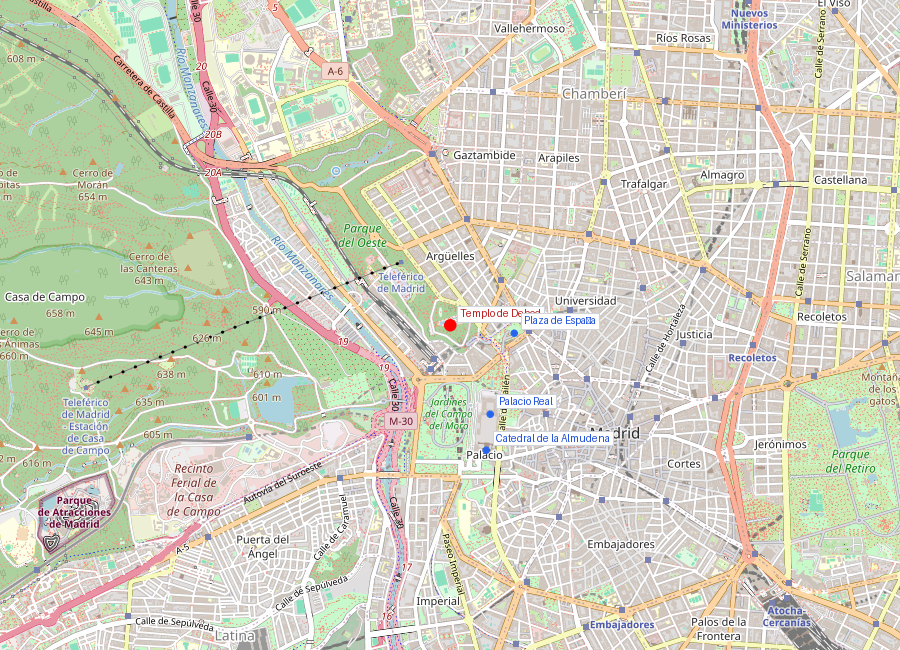
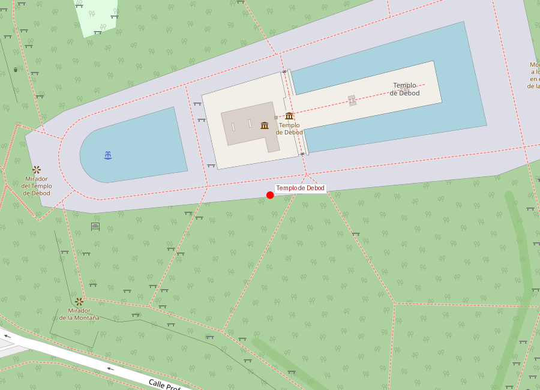
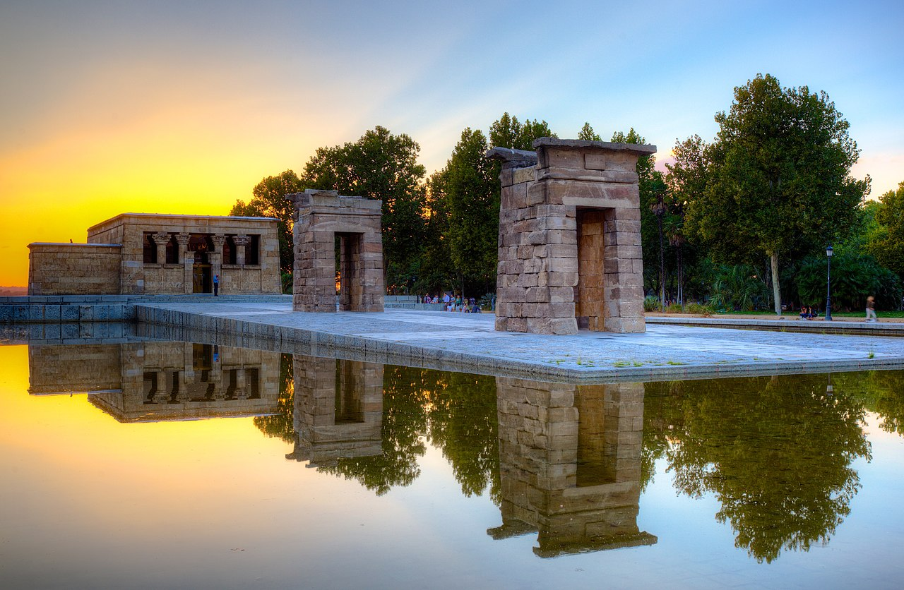

```yaml
lugar:
  nombre_original: "Templo de Debod"
  pais: "España"
  region_admin: "Comunidad de Madrid"
  coordenadas: "40.4238, -3.7177"
  fecha_visita: "[DATO PENDIENTE — confirmar fecha]"
```







# Templo de Debod

## Qué había antes — en Egipto

El Templo de Debod no es una réplica: es un **auténtico templo egipcio del siglo II a.C.**, desmontado piedra a piedra en Egipto y reconstruido en Madrid. Es uno de los pocos templos egipcios completos fuera de Egipto, junto con el Templo de Dendur (Metropolitan Museum de Nueva York) y el Templo de Taffa (Rijksmuseum van Oudheden, Leiden).

El templo fue construido originalmente en la región de **Nubia**, en la orilla oeste del Nilo, a unos 15 km al sur de Philae (actual Asuán). Fue erigido por el rey meroítico **Adijalamani de Meroe** hacia el 200 a.C., dedicado al dios Amón de Debod. Posteriormente, los faraones ptolemaicos y los emperadores romanos Augusto, Tiberio y Adriano lo ampliaron y añadieron capillas y decoraciones.

## Historia

| Fecha | Hito |
|---|---|
| ca. 200 a.C. | Construcción por Adijalamani de Meroe, dedicado a Amón |
| Siglo II a.C. - II d.C. | Ampliaciones ptolemaicas y romanas |
| 1960 | Amenaza de inundación por la construcción de la presa de Asuán |
| 1960-1968 | Campaña internacional de la UNESCO para salvar los templos de Nubia |
| 1968 | Egipto dona el templo a España en agradecimiento por su colaboración |
| 1970 | Llegada de las piedras a Madrid |
| 1972 | Inauguración en su ubicación actual en el Parque del Oeste |

## La campaña de salvamento de Nubia

La construcción de la **Gran Presa de Asuán** (financiada por la Unión Soviética) iba a inundar toda la Baja Nubia, sumergiendo decenas de templos milenarios. La UNESCO lanzó en 1960 una campaña internacional sin precedentes para rescatar estos monumentos. El caso más famoso fue el traslado del templo de Abu Simbel, cortado en bloques y reubicado 65 metros más arriba.

España colaboró activamente en la campaña con equipos arqueológicos. En agradecimiento, Egipto donó el Templo de Debod a España (y otros templos a países colaboradores: Dendur a EE.UU., Taffa a Países Bajos, Ellesiya a Italia).

## Arquitectura

El templo consta de:
- **Tres pórticos de acceso** (pilonos) alineados en eje este-oeste, orientados como en su ubicación original
- **Capilla de Adijalamani**: el núcleo original, con relieves del rey ofreciendo sacrificios a dioses egipcios (Amón, Mut, Isis)
- **Capilla de los relieves**: decoración ptolemaica en bajorrelieve
- **Mammisi** (capilla del nacimiento divino): añadido ptolemaico
- **Terraza superior**: accesible, con vistas al Palacio Real y la Casa de Campo

El templo fue reconstruido respetando la orientación original este-oeste, y rodeado de una lámina de agua que evoca el Nilo y su reflejo en el paisaje nubio original.

## Qué se puede ver hoy

- **Interior del templo**: visitable gratuitamente (horario limitado), con relieves egipcios originales, maqueta de la ubicación original, y exposición sobre la campaña de Nubia
- **Entorno**: los jardines del Parque del Oeste, con la lámina de agua que refleja el templo
- **Atardecer**: el Templo de Debod es uno de los mejores puntos de Madrid para ver la puesta de sol, con vista panorámica hacia el Palacio Real, la Catedral de la Almudena y la Casa de Campo
- **Parque del Oeste**: se extiende al norte con la Rosaleda (premio internacional) y el Teleférico hacia la Casa de Campo

## Mitología y leyendas

El templo estaba dedicado a **Amón de Debod**, forma local del gran dios Amón-Ra. Los relieves muestran a Adijalamani en actitud de adoración, presentando ofrendas: pan, cerveza, incienso y flores de loto. La relación entre el rey meroítico de Meroe (actual Sudán) y los dioses egipcios refleja la profunda influencia cultural de Egipto sobre los reinos nubios.

La tradición local madrileña, con humor, señala que el Templo de Debod ha sobrevivido más tiempo en Madrid (50+ años) que lo que habría durado bajo las aguas de la presa de Asuán.

## Conexiones

- El Templo de Debod está a 10 minutos a pie del **Palacio Real** y de la **Catedral de la Almudena**, formando un triángulo de visitas natural.
- Forma parte de la red internacional de templos nubios reubicados: Dendur en Nueva York, Taffa en Leiden, Ellesiya en Turín — cada uno testimonio de la cooperación cultural de los años 60.
- La conexión con Egipto antiguo es un recordatorio de que Madrid, ciudad relativamente joven, puede albergar patrimonio de 2.200 años de antigüedad.

## Datos interesantes

- Es el monumento más antiguo de Madrid — con diferencia. Tiene más de 2.200 años.
- El traslado requirió numerar cada bloque de piedra y crear planos detallados para su reconstrucción exacta.
- La orientación este-oeste del templo fue respetada: el sol sale alineado con el eje del templo, como en Nubia.
- Algunos bloques muestran grafitis históricos de viajeros del siglo XIX que visitaron las ruinas en Egipto antes del rescate.

---

*fuente: Museo de San Isidro / Ayuntamiento de Madrid, ficha del Templo de Debod; UNESCO, "The Salvage of the Nubian Monuments"; Martín Almagro Basch, "El Templo de Debod"; Wikipedia (artículos verificados)*
