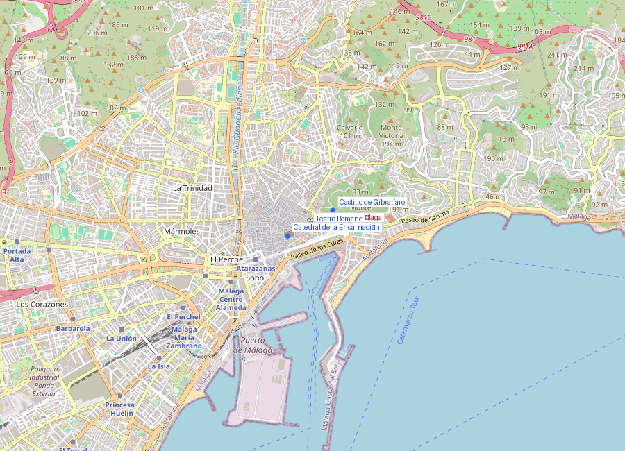
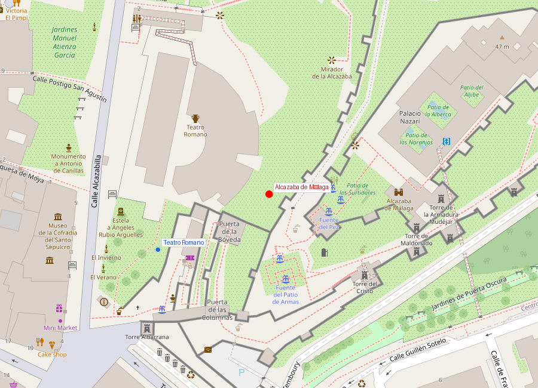
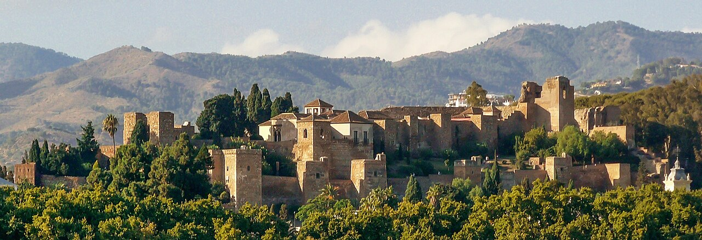

# Alcazaba de Málaga

```yaml
lugar:
  nombre_original: "Alcazaba de Málaga"
  pais: "España"
  region_admin: "Andalucía, Málaga"
  coordenadas: "36.7210° N, 4.4165° W"
  fecha_visita: "[DATO PENDIENTE — confirmar fecha]"
```







---

## Qué había antes

Antes de la Alcazaba islámica, el cerro ya estaba ocupado. Se han encontrado restos de muros fenicios y romanos bajo los cimientos árabes. El **teatro romano** que yace a sus pies (siglo I a.C.) fue literalmente saqueado durante la construcción de la Alcazaba: columnas, capiteles y fustes romanos fueron reutilizados como material de construcción, y hoy son visibles integrados en los muros árabes — una superposición de civilizaciones en estado puro.

---

## Historia

La Alcazaba fue construida en el **siglo XI** por orden del rey taifa **Badis ibn Habús** de la dinastía Zirí, que gobernaba la Taifa de Granada (de la cual Málaga era parte). El propósito era doble: residencia palatina y fortaleza defensiva que controlara el puerto.

La construcción reutilizó masivamente materiales romanos del teatro adyacente y de otros edificios. Esto era práctica común en Al-Ándalus (y en todo el Mediterráneo medieval): construir con el material disponible, que frecuentemente era romano.

| Hito | Fecha |
|------|-------|
| Construcción principal | Siglo XI (taifas ziríes) |
| Ampliaciones | Siglos XI–XIV (nazaríes) |
| Conquista cristiana | 1487 (Reyes Católicos) |
| Restauración moderna | Siglo XX (desde 1933) |

### Período nazarí

Cuando la Taifa de Granada fue absorbida por la dinastía **nazarí** (siglo XIII), la Alcazaba fue ampliada y embellecida. Los nazaríes añadieron jardines, fuentes y elementos decorativos similares a los de la **Alhambra** de Granada, aunque a menor escala. La conexión entre ambas fortalezas no es casual: la Alcazaba malagueña fue diseñada por los mismos gobernantes que construyeron la Alhambra.

### Caída y abandono

Tras la conquista de Málaga en **1487**, la Alcazaba fue utilizada como residencia militar pero fue perdiendo importancia. Durante siglos, el recinto se deterioró y fue invadido por construcciones informales: casas se adosaron a los muros y las salas palatinas se convirtieron en viviendas.

La restauración comenzó en **1933** y continuó durante décadas, devolviendo a la Alcazaba su aspecto actual.

---

## Arquitectura

La Alcazaba tiene **tres recintos amurallados concéntricos** que ascienden por la ladera:

- **Recinto inferior**: murallas exteriores con torres defensivas y la puerta principal (Puerta de la Bóveda), diseñada en recodo para dificultar el asalto
- **Recinto intermedio**: zona residencial con patios ajardinados
- **Recinto superior (Palacio Nazarí)**: la zona palatina, con patios con albercas, arquerías de yeso tallado y vistas sobre el puerto y la ciudad

Los jardines con naranjos, arrayanes y fuentes recrean el modelo del jardín islámico: el **riad** (jardín cerrado) como representación del paraíso.

---

## Qué se puede ver hoy

- Recorrido ascendente por los tres recintos amurallados
- Palacio nazarí con patios, arquerías y vistas
- Columnas romanas reutilizadas visibles en los muros
- Vistas panorámicas del puerto, la ciudad y el Castillo de Gibralfaro arriba
- Museo arqueológico con piezas fenicias, romanas y árabes

---

## Conexiones

- La Alcazaba está conectada con el **Castillo de Gibralfaro** por un pasillo amurallado (la **coracha**) que asciende por la ladera — se puede subir a pie
- Los mismos nazaríes que ampliaron esta Alcazaba construyeron la **Alhambra** de Granada — las técnicas decorativas (ataurique, mocárabes, azulejo) son las mismas
- El **teatro romano** a sus pies fue saqueado para construirla — los materiales romanos integrados en muros árabes son el ejemplo más visible de la superposición de civilizaciones en Málaga

---

*fuente: Junta de Andalucía — Patrimonio Cultural, Ayuntamiento de Málaga, Wikipedia (datos generales verificables)*
