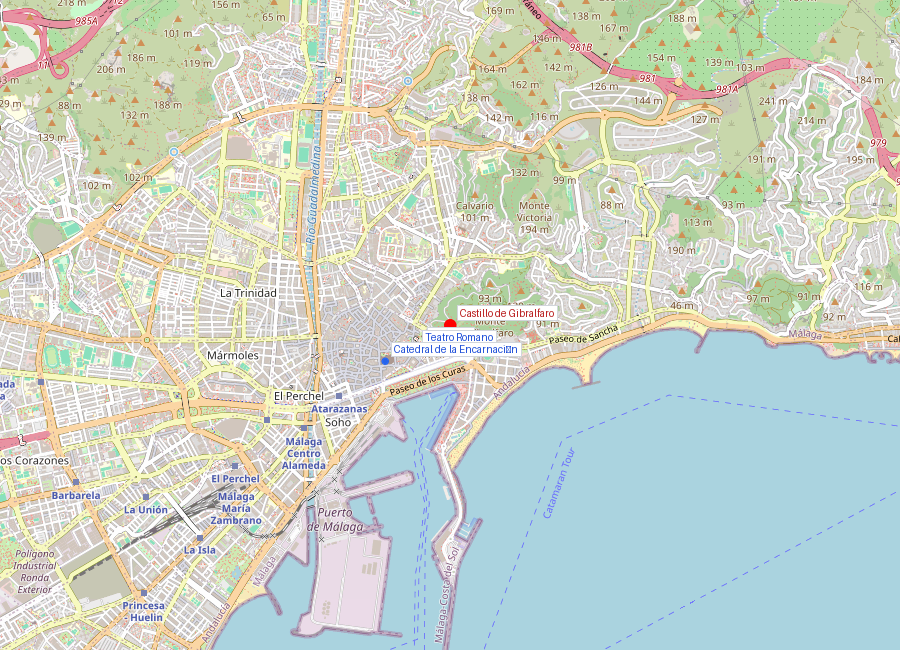
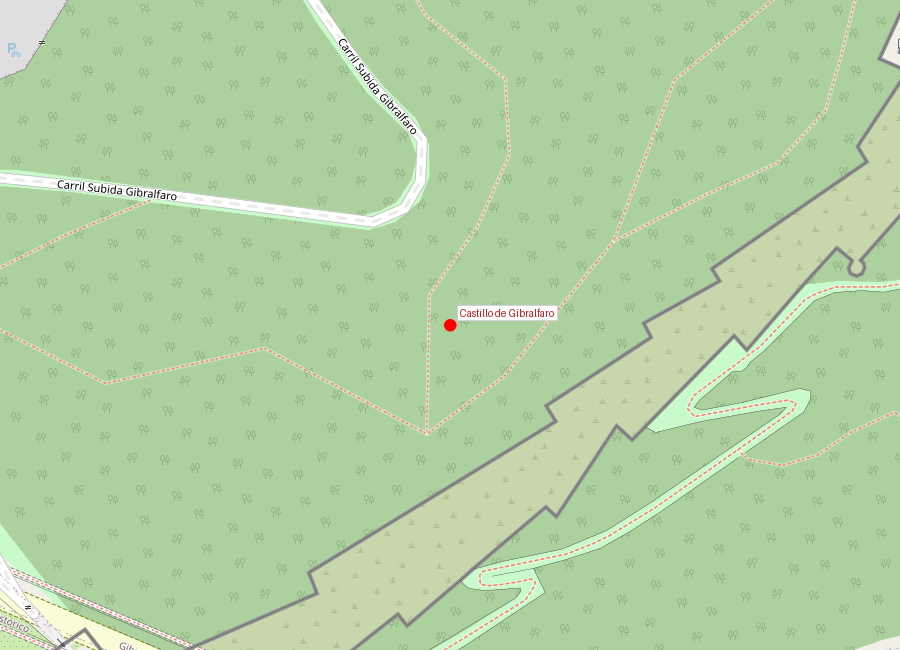
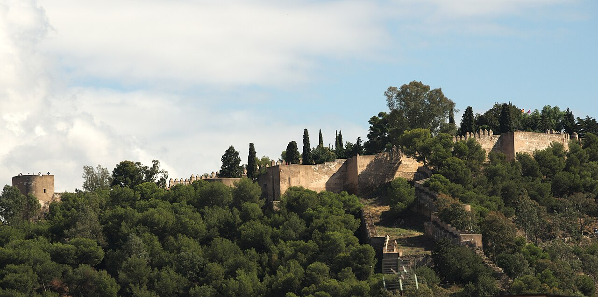

# Castillo de Gibralfaro

```yaml
lugar:
  nombre_original: "Castillo de Gibralfaro"
  pais: "España"
  region_admin: "Andalucía, Málaga"
  coordenadas: "36.7225° N, 4.4140° W"
  fecha_visita: "[DATO PENDIENTE — confirmar fecha]"
```







---

## Qué había antes

El monte Gibralfaro (del árabe *Yabal al-Faruh*, "monte del faro") tuvo un faro fenicio en la cima que guiaba a los barcos hacia el puerto de Malaka. Los restos más antiguos encontrados en el cerro son fenicios (siglos VII–VI a.C.). El nombre conserva la memoria de ese faro original.

---

## Historia

El castillo actual fue construido por el sultán nazarí **Yusuf I** en el **siglo XIV** (primer tercio del 1300) como fortaleza militar que complementara la Alcazaba residencial más abajo. Mientras la Alcazaba era palacio y fortaleza urbana, Gibralfaro era puramente militar: cuartel, almacén de municiones y última línea de defensa.

Yusuf I es el mismo sultán que construyó la **Torre de Comares** en la Alhambra de Granada y la **Puerta de la Justicia** — uno de los grandes constructores nazaríes.

### El asedio de 1487

Gibralfaro fue el último punto de resistencia durante la conquista de Málaga por los Reyes Católicos. El comandante **Hamet el Zegrí** se refugió en el castillo con sus tropas y resistió durante más de tres meses, mucho después de que la ciudad baja hubiera caído. Fernando el Católico tuvo que establecer un cerco específico para el castillo.

La resistencia de Gibralfaro fue una de las razones de la durísima represalia de Fernando: la esclavización de toda la población de Málaga. El castillo quedó tan marcado en la memoria de los Reyes Católicos que **incorporaron la imagen de Gibralfaro al escudo de la ciudad** de Málaga, donde permanece hasta hoy.

| Hito | Fecha |
|------|-------|
| Faro fenicio | Siglos VII–VI a.C. |
| Construcción del castillo | Siglo XIV (Yusuf I) |
| Asedio y caída | 1487 |
| Escudo de Málaga | Gibralfaro aparece en el escudo desde la Reconquista |

---

## Arquitectura

El castillo tiene un doble recinto amurallado con **ocho torres** y un perímetro de unos 830 metros [⚠ VERIFICAR]. Los elementos más notables:

- **Murallas almenadas** con torres semicirculares
- **Coracha**: pasillo amurallado que conecta con la Alcazaba abajo — permitía mover tropas y suministros entre ambas fortalezas sin exponerse
- **Aljibe**: cisterna subterránea que permitía resistir asedios largos
- **Torre del Homenaje**: punto más alto, con vistas de 360°
- **Pozo fenicio**: resto del asentamiento original en la cima

---

## Qué se puede ver hoy

- Subida a pie desde la Alcazaba por la coracha (recomendado) o en coche/bus
- Recorrido por las murallas y torres
- **Mirador**: una de las mejores vistas de Málaga — se ven la ciudad, el puerto, la plaza de toros, la Catedral (La Manquita) y, en días claros, la costa africana
- Centro de interpretación con historia del castillo
- Jardines con vegetación mediterránea en las laderas

---

## Datos interesantes

- El castillo de Gibralfaro aparece en el **escudo oficial de la ciudad de Málaga** y en la bandera municipal
- La subida a pie desde la Alcazaba por la coracha es una de las caminatas más recompensantes de Málaga: unos 20 minutos entre pinos con vistas cada vez más amplias
- Gibralfaro significa literalmente "monte del faro" — el faro fenicio original guiaba barcos hacia el puerto hace casi 3.000 años

---

## Conexiones

- Conectado físicamente con la **Alcazaba** por la coracha
- Construido por **Yusuf I**, el mismo sultán que levantó la Torre de Comares en la **Alhambra** de Granada
- La resistencia de Gibralfaro en 1487 provocó la esclavización de toda Málaga — uno de los episodios más brutales de la Reconquista

---

*fuente: Ayuntamiento de Málaga, Junta de Andalucía — Patrimonio Cultural, Wikipedia (datos generales verificables)*
