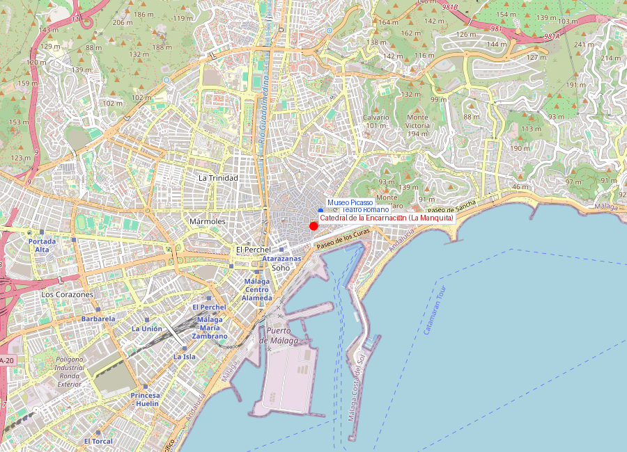
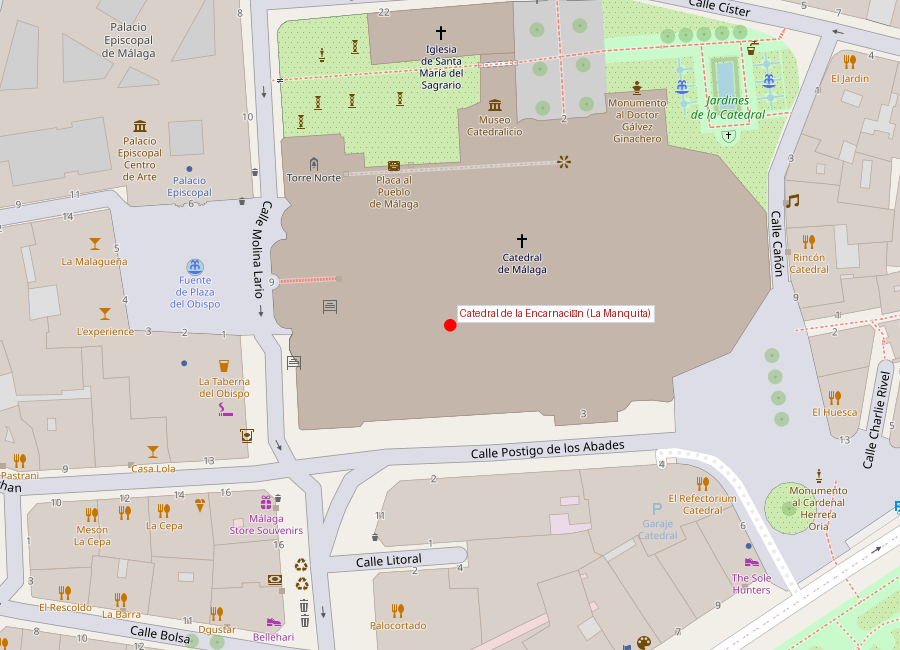

# Catedral de la Encarnación (La Manquita)

```yaml
lugar:
  nombre_original: "Catedral de la Encarnación de Málaga"
  nombre_alternativo: "La Manquita"
  pais: "España"
  region_admin: "Andalucía, Málaga"
  coordenadas: "36.7200° N, 4.4196° W"
  fecha_visita: "[DATO PENDIENTE — confirmar fecha]"
```





---

## Qué había antes

La catedral se levanta sobre el solar de la **mezquita mayor de Mālaqah**, consagrada como iglesia inmediatamente después de la conquista cristiana en 1487. La mezquita fue demolida para construir el nuevo templo, siguiendo el patrón habitual en las ciudades reconquistadas: la catedral cristiana ocupa el lugar exacto de la mezquita, que a su vez solía ocupar el lugar de la iglesia visigoda, que a veces ocupaba el del templo romano.

---

## Historia

La construcción comenzó en **1528** y se prolongó durante más de **250 años**, hasta 1782, cuando se abandonaron las obras sin terminar la torre sur. Esta torre inconclusa le valió el apodo popular de **"La Manquita"** (la manca), nombre con el que los malagueños la conocen hasta hoy.

| Hito | Fecha |
|------|-------|
| Conquista y consagración de la mezquita | 1487 |
| Inicio de la catedral actual | 1528 |
| Fin de las obras (incompletas) | 1782 |
| Estilo | Renacentista / Barroco |
| Altura torre norte | 84 metros [⚠ VERIFICAR] |

### ¿Por qué no se terminó?

La razón oficial más documentada es que los fondos destinados a completar la torre sur fueron **desviados para financiar la independencia de las colonias americanas** — específicamente, según la tradición, para ayudar a la causa independentista norteamericana contra Gran Bretaña durante la Guerra de Independencia de los Estados Unidos [⚠ VERIFICAR]. Otra versión, más prosaica, señala simplemente agotamiento presupuestario tras 250 años de obras.

Sea cual sea la razón, el resultado es una catedral con una asimetría única: una torre norte majestuosa de 84 metros y un muñón sur que nunca pasó del primer cuerpo. Periódicamente surgen propuestas para completarla, pero ninguna ha prosperado — La Manquita ya es un símbolo.

---

## Arquitectura

La catedral es de estilo **renacentista** en su concepción original (planta, estructura) con abundantes elementos **barrocos** añadidos durante los siglos XVII y XVIII (fachada, decoración interior, coro).

Elementos destacados:
- **Nave central** de gran altura (41 metros [⚠ VERIFICAR]) con bóvedas de crucería
- **Coro**: tallado en madera de caoba y cedro por **Pedro de Mena** y otros maestros, con 42 sitiales que representan santos. Es una de las obras maestras de la escultura barroca española
- **Fachada principal**: barroca, con columnas corintias y esculturas
- **Capillas laterales**: múltiples, con obras de arte de distintas épocas
- **Órgano**: uno de los más grandes de España, con más de 4.000 tubos [⚠ VERIFICAR]

---

## Qué se puede ver hoy

- Visita al interior (entrada de pago)
- El coro de Pedro de Mena
- Subida a las cubiertas (visita guiada con horarios limitados) — vistas espectaculares de la ciudad
- La torre inconclusa visible desde fuera
- Museo catedralicio con arte sacro

---

## Datos interesantes

- Los malagueños tienen un dicho: "Málaga es La Manquita y todos sus hijos" — la catedral incompleta es un símbolo de identidad, no un defecto
- **Pedro de Mena** (1628–1688), el escultor del coro, es uno de los grandes imagineros del Barroco español y está enterrado en la propia catedral
- Existe una plataforma ciudadana que periódicamente promueve terminar la torre sur, pero la opinión mayoritaria en Málaga parece preferir mantenerla como está

---

*fuente: Diócesis de Málaga, Junta de Andalucía — Patrimonio Cultural, Wikipedia (datos generales verificables)*
