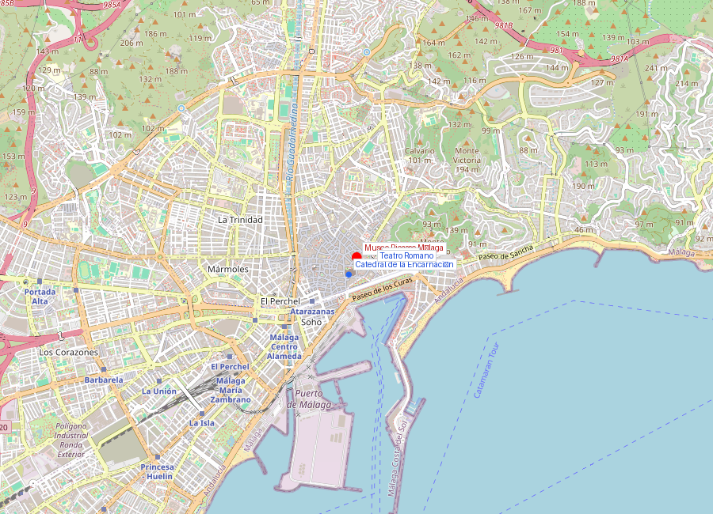
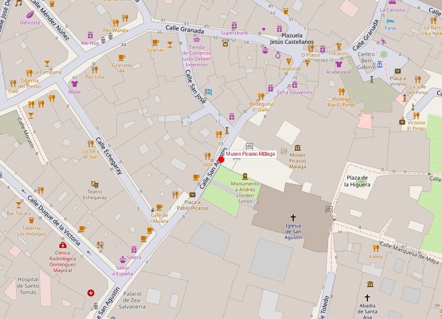
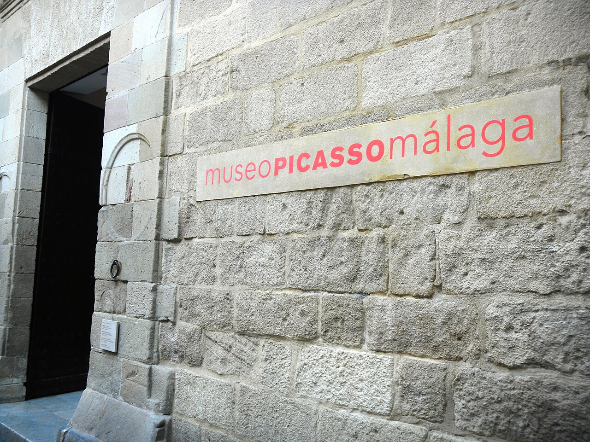

# Museo Picasso Málaga

```yaml
lugar:
  nombre_original: "Museo Picasso Málaga"
  pais: "España"
  region_admin: "Andalucía, Málaga"
  coordenadas: "36.7215° N, 4.4187° W"
  fecha_visita: "[DATO PENDIENTE — confirmar fecha]"
```







---

## Qué había antes

El museo ocupa el **Palacio de Buenavista**, un palacete renacentista del **siglo XVI** que fue residencia nobiliaria, sede del Museo de Bellas Artes de Málaga durante el siglo XX, y finalmente reformado para albergar la colección Picasso. Durante las obras de reforma (1997–2003) se descubrieron restos arqueológicos **fenicios** en los sótanos, que hoy son visitables como parte del recorrido del museo.

---

## Historia

### Picasso y Málaga

**Pablo Ruiz Picasso** nació en Málaga el **25 de octubre de 1881** en el número 15 de la **Plaza de la Merced** (hoy Casa Natal de Picasso, museo separado). Su padre, José Ruiz Blasco, era profesor de dibujo en la Escuela de Bellas Artes de Málaga y conservador del museo municipal.

Picasso vivió en Málaga hasta los **10 años** (1891), cuando la familia se trasladó primero a A Coruña y luego a Barcelona. Aunque nunca volvió a vivir en su ciudad natal, Málaga reclamó su legado con un proyecto que tardó décadas en concretarse.

### La creación del museo

La idea de un museo Picasso en Málaga surgió del deseo del propio artista, expresado ya en los años 50, pero las circunstancias políticas (el franquismo, al que Picasso se opuso abiertamente) lo hicieron imposible en vida. Fue **Christine Ruiz-Picasso** (nuera del artista) y su hijo **Bernard Ruiz-Picasso** quienes donaron la colección fundacional al estado español para crear el museo.

| Hito | Fecha |
|------|-------|
| Nacimiento de Picasso en Málaga | 25 octubre 1881 |
| Muerte de Picasso | 8 abril 1973 |
| Donación de la familia | 1997 |
| Inauguración del museo | 27 octubre 2003 |
| Sede | Palacio de Buenavista (siglo XVI) |
| Colección permanente | ~230 obras [⚠ VERIFICAR] |

### Impacto en la ciudad

La inauguración del Museo Picasso en 2003 fue el detonante de la transformación cultural de Málaga. En los años siguientes abrieron el **Centre Pompidou Málaga** (2015), el **Museo Carmen Thyssen** (2011), el **CAC Málaga** (2003) y el **Museo de Málaga** (2016). La ciudad pasó de ser conocida solo por su costa y aeropuerto a ser un destino cultural de primer nivel.

---

## La colección

El museo posee unas **230 obras** [⚠ VERIFICAR] que abarcan toda la trayectoria de Picasso:

- **Periodo azul y rosa** (1901–1906)
- **Cubismo** (1907–1920s)
- **Clasicismo y surrealismo** (1920s–1930s)
- **Obra tardía** (1950s–1970s)

Incluye pinturas, esculturas, cerámicas, dibujos y grabados. La colección se complementa con exposiciones temporales.

---

## Qué se puede ver hoy

- **Colección permanente** de Picasso distribuida en las salas del palacio renacentista
- **Exposiciones temporales** (dos o tres al año, de alto nivel)
- **Restos arqueológicos fenicios** en los sótanos del palacio (incluidos en la visita)
- **Palacio de Buenavista**: el propio edificio renacentista con patio andaluz, arquerías y artesonados
- **Tienda del museo** con reproducciones y libros de arte

---

## Datos interesantes

- Picasso es el artista más prolífico de la historia según el Guinness World Records: se le atribuyen unas **50.000 obras** entre pinturas, grabados, cerámicas, esculturas y dibujos [⚠ VERIFICAR]
- El museo se inauguró dos días después del aniversario 122 del nacimiento de Picasso
- Los sótanos del Palacio de Buenavista contienen restos fenicios del siglo VII a.C. — hay literalmente 2.700 años de historia bajo un museo de arte del siglo XX
- La Plaza de la Merced (donde nació) está a solo 300 metros del museo — se puede hacer el recorrido "Picasso en Málaga" a pie

---

## Conexiones

- La Casa Natal de Picasso en la **Plaza de la Merced** complementa la visita (300 m al norte)
- El **Museo Reina Sofía** de Madrid alberga el *Guernica*, la obra más famosa de Picasso
- El Palacio de Buenavista donde está el museo es contemporáneo de otros palacios renacentistas andaluces, como el **Palacio de Carlos V** en la Alhambra de Granada

---

*fuente: Museo Picasso Málaga (web oficial), Fundación Picasso — Museo Casa Natal, Wikipedia (datos generales verificables)*
