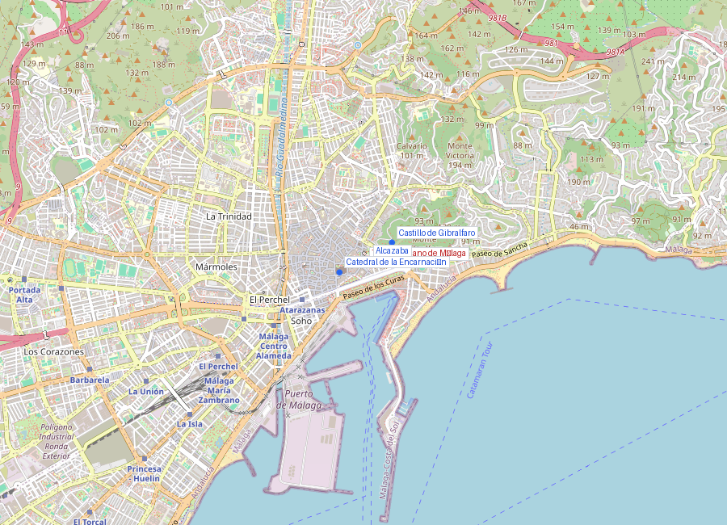
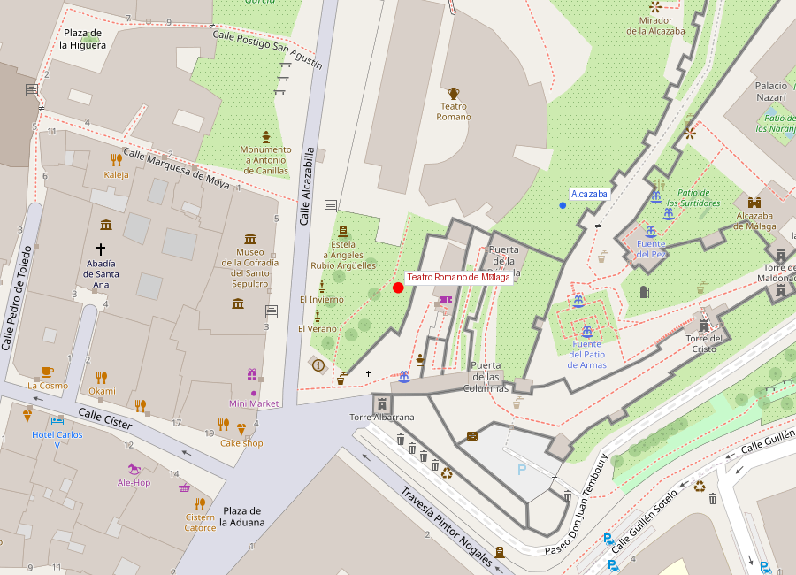

# Teatro Romano de Málaga

```yaml
lugar:
  nombre_original: "Teatro Romano de Málaga"
  pais: "España"
  region_admin: "Andalucía, Málaga"
  coordenadas: "36.7208° N, 4.4170° W"
  fecha_visita: "[DATO PENDIENTE — confirmar fecha]"
```





---

## Qué había antes

El teatro se construyó sobre terreno virgen a los pies del cerro que luego ocuparía la Alcazaba. Fue parte de un programa de monumentalización de la ciudad romana de **Malaca** durante el principado de Augusto (finales del siglo I a.C.).

---

## Historia

El teatro fue construido en el **siglo I a.C.**, probablemente bajo el reinado de **Augusto**, como parte de la dotación de equipamientos públicos que Roma otorgaba a los municipios importantes. Malaca había recibido el estatus de **municipium** y su ley municipal (la Lex Flavia Malacitana) es uno de los documentos jurídicos romanos más importantes que se conservan.

El teatro estuvo en uso hasta el **siglo III d.C.**, cuando dejó de funcionar como espacio de espectáculos. A partir de entonces fue reutilizado como cantera de materiales: primero por los propios romanos tardíos, luego por los visigodos, y finalmente y de forma masiva por los constructores de la **Alcazaba** en el siglo XI, que incorporaron columnas, capiteles y sillares del teatro a los muros de la fortaleza.

| Hito | Fecha |
|------|-------|
| Construcción | Siglo I a.C. (Augusto) |
| Uso activo | Siglo I a.C. – siglo III d.C. |
| Expolio para la Alcazaba | Siglo XI |
| Redescubrimiento | 1951 |
| Excavación y restauración | 1995–2010 |

### Redescubrimiento (1951)

El teatro estuvo **completamente enterrado durante siglos** bajo construcciones medievales y modernas. Fue descubierto en **1951** durante las obras de construcción de la **Casa de la Cultura**, un edificio que se construyó parcialmente encima del teatro sin que nadie supiera que estaba debajo.

Las excavaciones se retomaron en serio en los años 90, y la Casa de la Cultura fue finalmente demolida en **1995** para dejar al descubierto el teatro completo. Es uno de los ejemplos más dramáticos de arqueología urbana en España: un edificio romano de 2.000 años apareció literalmente debajo de un edificio moderno.

---

## Arquitectura

El teatro sigue la tipología romana clásica:

- **Cavea** (graderío): semicircular, excavado parcialmente en la ladera del cerro y parcialmente construido sobre estructura artificial. Capacidad estimada de unos 220 espectadores [⚠ VERIFICAR]
- **Orchestra**: semicírculo frente al escenario, reservado para los magistrados y notables
- **Scaena** (escenario): parcialmente conservada
- **Vomitoria**: pasillos de acceso al graderío

Las dimensiones son modestas comparadas con teatros como los de Mérida o Cartagena, pero el estado de conservación es notable para un teatro que fue saqueado sistemáticamente durante un milenio.

---

## Qué se puede ver hoy

- El teatro es de **acceso libre** y está al aire libre, a los pies de la Alcazaba
- Centro de interpretación (pequeño museo) con piezas encontradas en las excavaciones
- La superposición visual es impactante: el teatro romano abajo, la Alcazaba árabe arriba, con las columnas romanas visibles en los muros árabes
- Ocasionalmente se celebran representaciones teatrales en el espacio (consultar programación)

---

## Datos interesantes

- Las columnas del teatro romano son visibles **dentro de los muros de la Alcazaba** arriba — literalmente, el material romano fue reciclado para construir la fortaleza árabe
- El teatro estuvo enterrado bajo un edificio moderno durante décadas sin que nadie lo supiera — es un recordatorio de cuánta historia puede haber bajo nuestros pies en una ciudad de 2.800 años
- La **Lex Flavia Malacitana**, la ley municipal de Malaca, fue encontrada en 1851 en unas tablas de bronce y hoy se conserva en el Museo Arqueológico Nacional de Madrid

---

## Conexiones

- Directamente relacionado con la **Alcazaba**: el teatro fue la cantera de la fortaleza
- La Lex Flavia Malacitana conecta Málaga con el **derecho romano** y puede verse en el **Museo Arqueológico Nacional** de Madrid

---

*fuente: Junta de Andalucía — Patrimonio Cultural, Ayuntamiento de Málaga, Wikipedia (datos generales verificables)*
