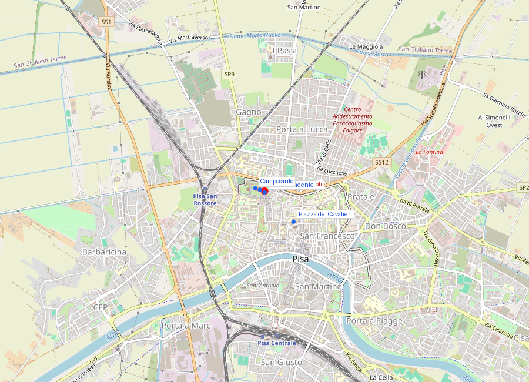
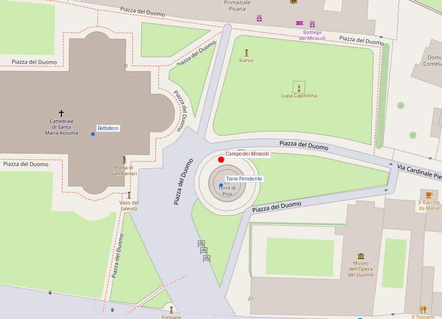
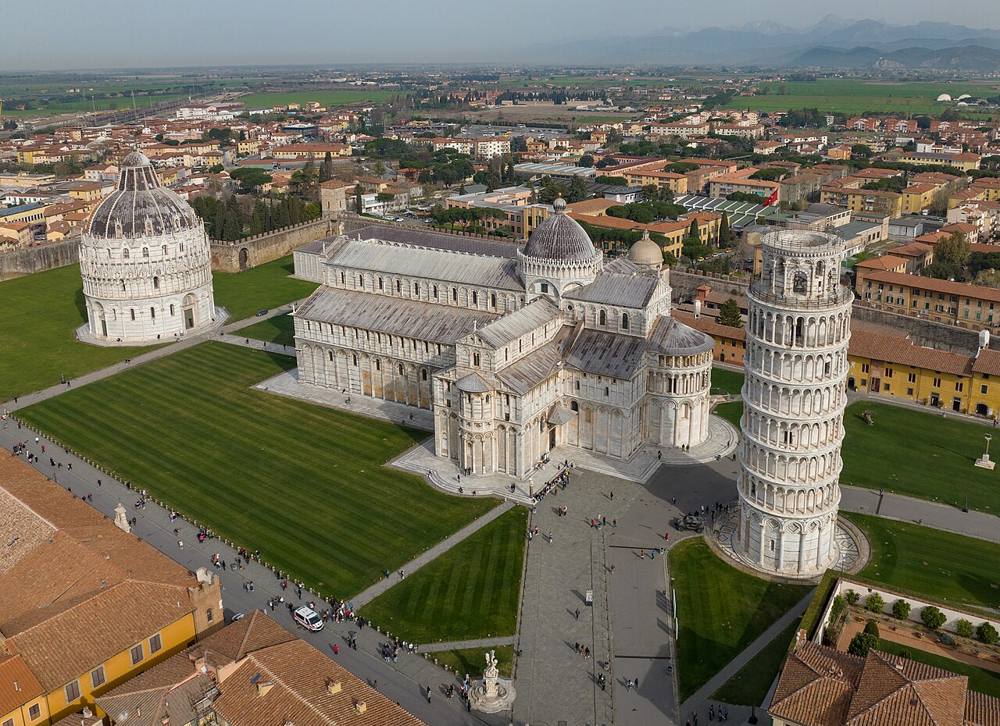

# Campo dei Miracoli — Conjunto monumental

```yaml
lugar:
  nombre_original: "Campo dei Miracoli"
  nombre_alternativo: "Piazza dei Miracoli, Piazza del Duomo"
  pais: "Italia"
  region_admin: "Toscana"
  coordenadas: "43.7231° N, 10.3966° E"
  altitud_m: 4
  fecha_visita: "[DATO PENDIENTE — confirmar fecha]"
```







---

<!-- 📷 FOTO: vista panorámica del conjunto desde la entrada principal / los cuatro monumentos sobre el prado verde -->

## Visión de conjunto

El **Campo dei Miracoli** es uno de los conjuntos arquitectónicos medievales más extraordinarios del mundo. Sobre una extensión de hierba verde perfectamente recortada, cuatro monumentos de mármol blanco de Carrara componen un programa arquitectónico y religioso cuya ejecución se extendió durante **cinco siglos** (siglo XI al XVI) pero que mantiene una coherencia visual y conceptual asombrosa.

Los cuatro monumentos son:
1. **Cattedrale di Santa Maria Assunta** (el Duomo) — la madre de todos
2. **Torre Pendente** — el campanario que empezó a inclinarse durante su propia construcción
3. **Battistero di San Giovanni** — el mayor baptisterio de Italia
4. **Camposanto Monumentale** — el cementerio sagrado con tierra de Tierra Santa

El campo en sí —el prado verde que los rodea y que contrasta de manera deliberada con el blanco del mármol— es parte del diseño. Aunque el terreno no fue ajardinado de esta manera desde el principio, la ausencia de construcciones adyacentes dentro del campo fue intencional: los monumentos debían verse libres.

---

## El nombre: ¿quién llamó esto "Campo dei Miracoli"?

El nombre **Campo dei Miracoli** ("Campo de los Milagros") es de uso común pero **no es medieval**: fue popularizado por el escritor **Gabriele D'Annunzio** en el siglo XX [⚠ VERIFICAR atribución exacta]. El nombre oficial del espacio es **Piazza del Duomo**, que también se usa formalmente. "Campo dei Miracoli" es la denominación lírica que acabó imponiéndose en el habla cotidiana y en la promoción turística.

La ironía es que el apelativo de "milagro" se aplica a un conjunto donde la obra más famosa —la Torre Pendente— existe precisamente por un **error de cimentación** que fue un desastre de ingeniería. La Torre es un "milagro accidental".

---

## Historia y contexto: por qué aquí, por qué ahora

### El cuadro político: la República Marinara en su apogeo

La construcción del Campo dei Miracoli es directamente inseparable del poder y la riqueza de la **República de Pisa** en el período de su máximo esplendor (siglos XI–XII).

En **1063**, la flota pisana saqueó la ciudad árabe de **Palermo** (entonces emirato islámico) y capturó un botín inmenso. Con una parte de ese botín, la República encargó la construcción de la nueva Cattedrale como símbolo de poderío y de devoción. El decreto de inicio de la obra es de **1064**, un año después de la victoria sobre Palermo. La catedral fue explícitamente concebida como un acto de *triumphus* y de *pietas* simultáneos.

El resto del conjunto siguió en los décadas y siglos siguientes, financiado con los ingresos continuos del comercio mediterráneo.

### Ubicación: ¿por qué en la periferia de la ciudad?

Una de las características más notables del Campo dei Miracoli es que NO está en el centro histórico de Pisa. Está en la **periferia norte** del casco histórico, fuera de la trama urbana compacta, en un espacio que en la Edad Media era un terreno extramuros o semiextramuros.

Las razones de esta ubicación son parte prácticas, parte simbólicas:
- **Espacio disponible**: un conjunto monumental de esta escala requería espacio que el interior urbano denso no ofrecía.
- **Distancia sagrada**: en la tradición cristiana medieval, los cementerios y baptisterios frecuentemente estaban en las afueras de las ciudades, en posición liminal entre el mundo de los vivos y el de los muertos, entre el espacio profano (la ciudad) y el sagrado (el templo).
- **Autonomía visual**: al estar separado de la trama urbana, el conjunto podía verse entero, desde lejos, como una unidad.

---

## Los cuatro monumentos — resumen orientativo

*(Cada monumento tiene su propio archivo con información detallada.)*

### Cattedrale di Santa Maria Assunta (Duomo)
Iniciada en **1064** por el arquitecto **Buscheto** tras el botín de Palermo. Primer y más importante modelo del **románico pisano**: fachada de arcos ciegos y gallerías de columnas en mármol blanco; interior de cinco naves con columnas de granito; ábside semicircular en el extremo este. La obra emblemática del interior es el **pulpito de Giovanni Pisano** (1302-1311).

→ Documentado en: [Duomo di Pisa](duomo_di_pisa.md)

### Torre Pendente (Campanile)
Comenzada en **1173**, la torre es el campanario de la Cattedrale. Empezó a inclinarse durante la construcción del tercer piso, en torno a **1178**, debido a un suelo inapropiado (arcilla compresible bajo una capa superficial de arena). Las obras se interrumpieron durante décadas por guerras; la inclinación se estabilizó parcialmente en cada pausa; la torre se completó en el siglo XIV. La inclinación actual, después de la intervención de corrección 1990–2001, es de aproximadamente **3,97 grados**.

→ Documentado en: [Torre Pendente](torre_pendente.md)

### Battistero di San Giovanni
Iniciado en **1152** por el arquitecto **Diotisalvi**, es el mayor baptisterio de Italia. Su forma es circular, con exterior en románico pisano en los niveles inferiores y añadidos en gótico pisano en los superiores. Contiene el **pulpito de Nicola Pisano** (1260), considerado la obra que anticipó el Renacimiento escultórico un siglo antes de que el Renacimiento existiera.

→ Documentado en: [Battistero di San Giovanni](battistero_san_giovanni_pisa.md)

### Camposanto Monumentale
Un cementerio amurallado, de planta rectangular, con claustro porticado. Iniciado en **1278**. Según la leyenda, su terreno está hecho de tierra traída de Tierra Santa —de la colina del Gólgota— en 53 barcos durante las Cruzadas. Fue el cementerio de honor de la República. Sus **frescos medievales** (siglos XIV-XV), incluyendo el célebre *Trionfo della Morte* (c. 1336-1341), sufrieron daños gravísimos en un bombardeo de 1944. La restauración de los fragmentos conservados sigue en curso.

→ Documentado en: [Camposanto Monumentale](camposanto_monumentale.md)

---

## UNESCO y protección patrimonial

El conjunto del Campo dei Miracoli fue inscrito en la **Lista del Patrimonio Mundial de la UNESCO** en **1987** como *"Piazza del Duomo, Pisa"*. El criterio de inscripción reconoce el conjunto como ejemplo excepcional del **románico pisano** y por su influencia sobre la arquitectura medieval del Mediterráneo occidental, en particular sobre las iglesias de Cerdeña y del sur de Italia. [⚠ VERIFICAR criterios exactos de inscripción UNESCO]

---

## La experiencia de la visita

### La llegada

La entrada más usada al campo es a través de la **Porta Santa Maria** (al sur/suroeste del recinto), junto a los puestos de souvenirs y controles de acceso. Esta entrada ofrece la primera vista del conjunto: la torre inclinada emerge primero, luego el Battistero, luego la fachada del Duomo.

La primera impresión es de una **escala inesperadamente grande**: los monumentos son mayores de lo que las fotografías sugieren.

### El prado

El campo de hierba entre los monumentos no es un espacio pasivo: las familias picniquean, los turistas se fotografían, los estudiantes leen. El prado tiene una función viva de espacio de encuentro además de ser el fondo visual del conjunto.

En los meses de verano, el calor puede ser intenso: los monumentos de mármol blanco reflejan una cantidad considerable de luz solar.

### Orden de visita recomendado

Para aprovechar bien el tiempo y los tickets (que tienen horarios específicos para la Torre):

1. **Comprar tickets con anticipación** (especialmente para la Torre, que tiene cupos limitados y estrictos). El acceso a la Torre se hace en grupos reducidos. Online en: opapisa.it.
2. **Visitar el Battistero** (no hay cola larga, interior extraordinario con Nicola Pisano).
3. **Visitar el Duomo** (interior libre o ticket incluido en el paquete).
4. **Subir la Torre** (al horario asignado en el ticket).
5. **Visitar el Camposanto** (el menos concurrido y el más emocionalmente impactante de todos).
6. Opcionalmente: **Museo dell'Opera del Duomo** y **Museo delle Sinopie** (adyacentes al campo).

---

## Conexiones

- El **románico pisano** que define el conjunto es una invención local del siglo XI que influyó directamente en el arte de **Cerdeña** (las innumerables chiese románicas sardas son derivaciones directas del vocabulario pisano), del **sur de Italia** (bajo la dominación normanda que compartía vínculos con Pisa), y de algunas zonas de la **Toscana** interna.
- La **Cattedrale di San Martino** en Lucca y la **Basilica di San Michele in Foro** comparten con el Campo dei Miracoli el mismo vocabulario decorativo: columnas policromas, logias arcadas, mármol bicolor. Son derivaciones locales (luchesi) del mismo estilo pisano.
- El **pulpito de Nicola Pisano** en el Battistero (1260) influyó directamente en su hijo **Giovanni Pisano**, cuyo pulpito en el Duomo (1302-1311) lleva esa tradición a su culminación gótica. Y ambos Pisano influyeron sobre los primeros escultores del Renacimiento florentino del siglo XIV.

---

## Datos interesantes

- El blanco resplandeciente del mármol es ligeramente engañoso: el mármol de Carrara tiene una pequeña cantidad de impurezas que lo hacen **cremar levemente con la edad**. Los monumentos más antiguos (el Duomo) tienen un tono cálido levemente distinto de las partes más modernas.
- El prado del Campo dei Miracoli es mantenido con riego y corte frecuente. En invierno y en épocas de lluvia, el verde saturado contrasta incluso más dramáticamente con el blanco de los mármoles.
- En el interior del recinto del Camposanto hay **sarcófagos romanos** usados durante la Edad Media como tumbas de honor: los pisanos de la Edad Media veneraban los sarcófagos romanos como objetos preciados y los disponibilidad para los ciudadanos más importantes.

---

*fuente: UNESCO World Heritage documentation "Piazza del Duomo, Pisa" (1987); Emilio Tolaini, "Forma Pisarum"; TCI Toscana; sitio oficial Opera della Primaziale Pisana (opapisa.it); Encyclopædia Britannica.*
