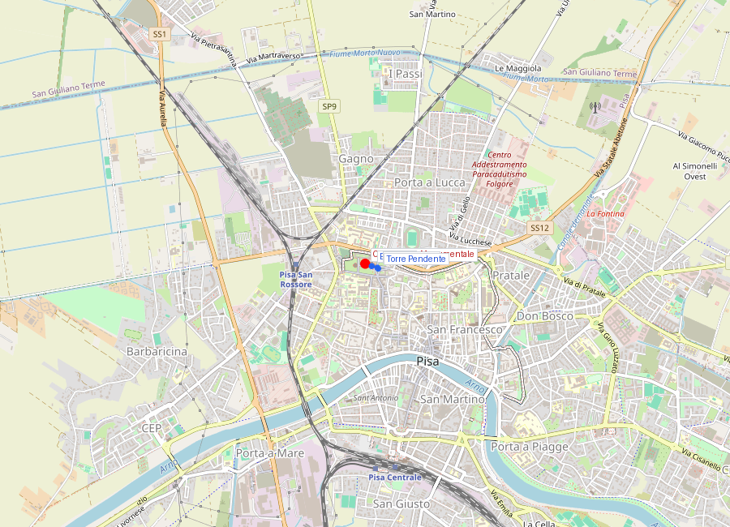
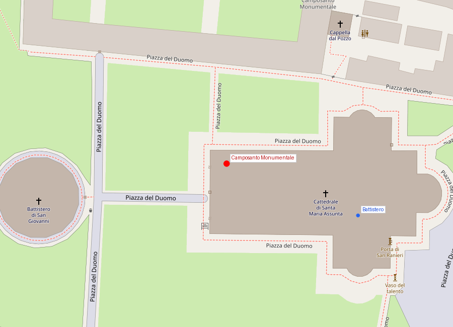
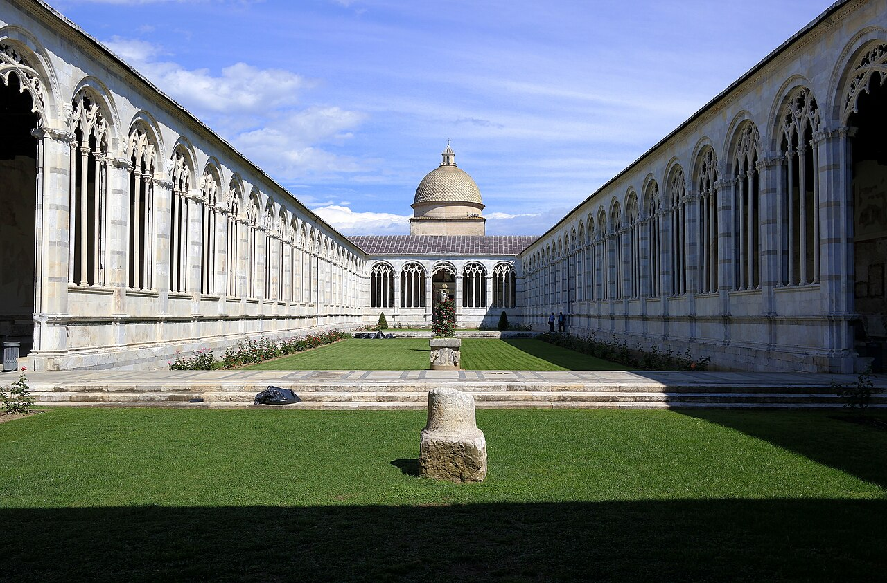

# Camposanto Monumentale

```yaml
lugar:
  nombre_original: "Camposanto Monumentale"
  pais: "Italia"
  region_admin: "Toscana"
  coordenadas: "43.7234° N, 10.3952° E"
  altitud_m: 4
  fecha_visita: "[DATO PENDIENTE — confirmar fecha]"
```







---

<!-- 📷 FOTO: fachada del Camposanto / claustro interior / sarcófagos romanos alineados / fragmentos de frescos -->

## Introducción

El **Camposanto Monumentale** es el menos visitado de los cuatro monumentos del Campo dei Miracoli y posiblemente el más impactante. Es un cementerio amurallado medieval de planta rectangular, con un claustro porticado que rodea un jardín central, en cuyas paredes se acumularon durante siglos los **frescos medievales** más importantes de la Toscana y una colección de **sarcófagos romanos** que los escultores pisanos del Duecento —incluyendo al propio Nicola Pisano— usaron como modelo directo.

Y es también el monumento que sufrió la mayor tragedia del Campo dei Miracoli: el **27 de julio de 1944**, un bombardeo aliado incendió el techo de plomo del claustro, derritió el metal sobre los frescos y destruyó o dañó gravemente la mayor parte de la pintura medieval que cubría los muros. Lo que quedó —y lo que se restaura todavía— es una fracción de lo que fue.

---

## Historia

### La tierra de Tierra Santa: la leyenda fundacional

Según la tradición medieval —recogida en las fuentes del siglo XIII— la tierra del camposanto fue traída de la **colina del Gólgota** en Jerusalén, el lugar de la Crucifixión, en **53 barcos** durante las Cruzadas, por encargo del arzobispo **Ubaldo Lanfranchi** de Pisa. La terra santa tenía el poder, según la creencia medieval, de **descomponer los cuerpos en 24 horas** — lo que la hacía el lugar ideal para los enterramientos.

La leyenda no puede verificarse arqueológicamente (el suelo del camposanto no se distingue químicamente del de los alrededores) pero fue el founding myth que justificó la existencia del cementerio y el honor de ser enterrado en él. Ser sepultado en tierra del Gólgota era lo más cercano a una garantía celestial que el dinero medieval podía comprar.

La construcción del edificio se inició en **1278** por el arquitecto **Giovanni di Simone** (el mismo que reanudó la construcción de la Torre Pendente ese mismo año) y se prolongó hasta bien entrado el siglo XIV.

### El camposanto como panteón de honor

El Camposanto fue desde su origen el lugar de enterramiento de **las familias más importantes de la República pisana**: magistrados, almirantes, obispos, mercaderes enriquecidos. Los que no podían permitirse un sarcófago propio eran enterrados en el suelo del claustro, cuyo pavimento es literalmente una **alfombra de lápidas** con escudos heráldicos, epitafios y fechas desde el siglo XIV hasta el XIX.

Los sarcófagos romanos alineados a lo largo del claustro no son enterramientos originalmente romanos: son sarcófagos de mármol del siglo II–IV d.C. que los pisanos encontraron en sus territorios mediterráneos y trajeron a Pisa como **objetos de lujo y prestigio**. En la Edad Media, un sarcófago romano era símbolo de riqueza y cultura: las familias más ricas los reutilizaban como tumbas propias, insertando los restos del difunto en un contenedor de mármol antiguo.

Esta concentración de sarcófagos romanos en el Camposanto tuvo una consecuencia artística fundamental: los escultores que trabajaban en Pisa tenían a pocos metros un repertorio de figura clasica antigua —relieves mitológicos, batallas, temas dionisíacos— que podían estudiar directamente. **Nicola Pisano**, cuyo pulpito del Battistero (1260) es el punto de quiebre hacia el realismo figurativo medieval, vivía y trabajaba a pocos metros de estos sarcófagos, y los estudió de manera sistemática.

### El programa de frescos (siglos XIV–XV)

A lo largo del siglo XIV y parte del XV, las paredes interiores del claustro fueron cubiertas con un ciclo de **frescos monumentales** encargados a los pintores más importantes de la Toscana. El programa era uno de los más ambiciosos del arte medieval italiano:

- **Storie dell'Antico Testamento** (Historias del Antiguo Testamento): ciclo atribuido a **Buonamico Buffalmacco** (también conocido como "il Buffalmacco"), pintor florentino del siglo XIV y amigo de Boccaccio, que aparece como personaje cómico en el *Decameron*.
- **Il Trionfo della Morte** (El Triunfo de la Muerte): el fresco más famoso del Camposanto, de autor debatido (atribuido durante mucho tiempo a Francesco Traini; atribución actualmente discutida). Representa la muerte como figura alada que siega a los vivos indiscriminadamente; un grupo de nobles a caballo se encuentra una hilera de tumbas abiertas con cadáveres en distintos estados de descomposición; los bienaventurados ascienden al cielo sostenidos por ángeles; los condenados son arrastrados al infierno por demonios.

El **Trionfo della Morte** fue pintado en el contexto inmediatamente posterior a la **Peste Negra** (1348), que en Pisa fue devastadora: se estima que la ciudad perdió entre un tercio y la mitad de su población en cuestión de meses. La representación de la muerte omnipresente, inevitable e igualadora —que no distingue entre noble y plebeyo— refleja directamente la experiencia traumática generacional de la epidemia. Es uno de los testimonios visuales más impactantes de cómo la Peste transformó la cultura y la psicología del siglo XIV europeo.

---

## El bombardeo de 1944 y la catástrofe artística

<!-- 📷 FOTO: fotografías del incendio de 1944 (si están disponibles en dominio público) / estado actual de los fragmentos restaurados -->

El **27 de julio de 1944**, durante la campaña de liberación de Italia en la Segunda Guerra Mundial, un bombardeo aliado impactó el Campo dei Miracoli. Un proyectil incendió el **techo de plomo** del claustro del Camposanto.

El plomo fundido a temperatura extrema —alrededor de 327°C— cayó como lluvia sobre los muros y los frescos. El calor vaporizó parcialmente los pigmentos y, cuando el metal fundido se solidificó al contacto con la superficie pintada, se adhirió al *intonaco* (la capa de arena y cal sobre la que estaban pintados los frescos) y lo desprendió del muro en grandes fragmentos.

El resultado fue la destrucción o daño grave de la **mayoría de los frescos medievales** que cubrían el claustro. Solo algunos fragmentos sobrevivieron con cierta integridad; la mayor parte quedó en escombros fundidos y cascotes de yeso con restos de pigmento.

### La restauración y las sinopie

Paradójicamente, la catástrofe reveló algo que había estado oculto: cuando los frescos se arrancaron, quedaron a la vista los **dibujos preparatorios** que los pintores medievales habían hecho sobre el *arriccio* (la capa de cal inferior), usando un pigmento rojo oscuro llamado **sinopia** (un tipo de tierra roja proveniente de Sinope, en el Mar Negro).

Esas sinopie —los bocetos originales a escala real de los frescos, a veces con variantes respecto a la versión pintada final— son hoy la colección más importante de dibujos preparatorios medievales de Europa. Se han separado de los muros y conservan en el **Museo delle Sinopie**, en el edificio frente al Battistero.

Los fragmentos de fresco recuperados —algunos intactos, otros en pequeños trozos— pasaron décadas siendo restaurados fragmento por fragmento, siendo recompuestos en paneles sobre soportes rígidos como un rompecabezas de miles de piezas. Los resultados de esta restauración son lo que hoy se puede ver en el claustro.

---

## El claustro hoy

<!-- 📷 FOTO: vista del claustro con el céspede central / arcos del claustro / lápidas en el suelo -->

### Arquitectura

El claustro es de una elegancia sobria: **arcadas de arcos a sesto acuto** (apuntados, góticos) sobre columnas de mármol blanco, recorriendo los cuatro lados del rectángulo. El interior del claustro —el jardín— tiene un espacio de céspede verde. El silencio dentro es casi total, en contraste con el ruido de los grupos turísticos fuera.

### El suelo: las lápidas

El pavimento del claustro es literalmente el **registro histórico** de Pisa desde el siglo XIV: miles de lápidas sepulcrales en mármol, apretadas unas contra otras, con inscripciones en latín y en italiano volgare, escudos de armas, fechas de muerte, cargos y títulos. Es posible pasar horas recorriendo el suelo y leyendo los nombres y fechas: almirantes de la República muertos en batalla, obispos y arzobispos del siglo XV, mercaderes del siglo XVII, profesores de la Universidad de Pisa del XVIII.

### Los sarcófagos romanos

Los sarcófagos romanos siguen alineados a lo largo de las paredes: unas setenta piezas de distintos períodos (siglos I–IV d.C.) con relieves mitológicos —dionisíacos, con erotes y guirnaldas, con escenas de batallas, con *strigilio* (las acanaladuras verticales típicas de los sarcófagos tardorromanos). Son visibles y están a la altura de los ojos, accesibles directamente sin separación de cristal ni distancia de seguridad.

---

## Conexiones

- Los sarcófagos romanos del Camposanto son el eslabón directo entre la **escultura romana clásica** y el **pulpito de Nicola Pisano** (1260) en el Battistero adyacente: Nicola los estudió aquí, a pocos metros de donde ejecutó su obra.
- El **Trionfo della Morte** tiene conexiones iconográficas directas con ilustraciones del *Inferno* de Dante (de cronología similar) y con el género de las **Danzas de la Muerte** (Totentanz) que se extendieron por toda Europa después de la Peste Negra del 1348.
- El **Museo delle Sinopie** (frente al Battistero, no en el claustro) guarda los dibujos preparatorios medievales recuperados del incendio: es visitable por separado y es fundamental para entender el proceso creativo de los pintores medievales.

---

## Datos interesantes

- La restauración de los fragmentos de fresco recuperados en 1944 es una de las operaciones de conservación más complejas de la historia del arte: los fragmentos fueron reagrupados consultando fotografías en blanco y negro realizadas antes del bombardeo (en algunos casos las únicas referencias de cómo eran los frescos originales).
- El **Trionfo della Morte** fue una influencia directamente documentada sobre la **Danza Macabra** de la tradición germánica y flamenca del siglo XV, que a su vez influyó en la obra de pintores como Hans Holbein el Joven.
- Dentro del Camposanto hay una pequeña capilla —la **Cappella Ammannati**— que contiene algunas obras de arte más preservadas de las destruidas por el incendio.
- El Camposanto es el que tiene el ticket de **menor demanda** del Campo dei Miracoli: muchos turistas lo omiten. Es también el que tiene la mayor carga histórica por metro cuadrado.

---

*fuente: Pierluigi Leone de Castris, "Il Trionfo della Morte e gli affreschi del Camposanto di Pisa" (ed. Pacini); TCI Toscana; Emilio Tolaini, "Forma Pisarum"; Encyclopædia Britannica; opapisa.it.*
