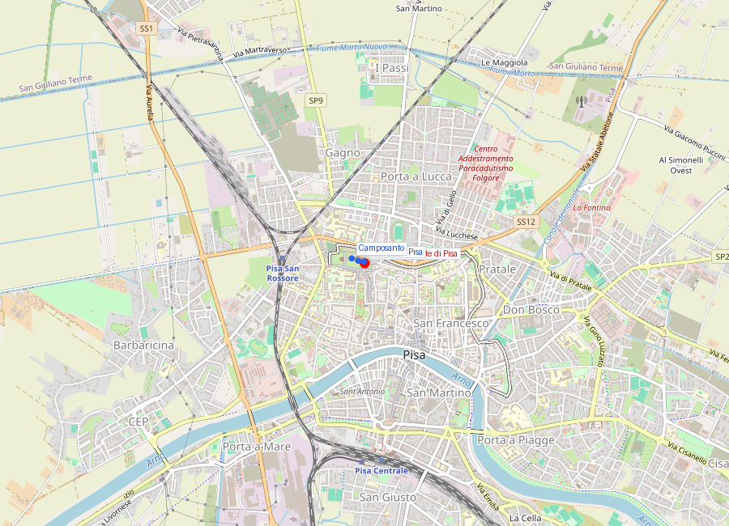
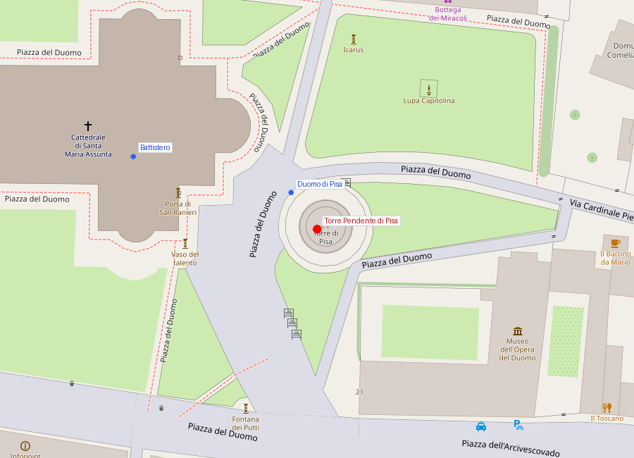
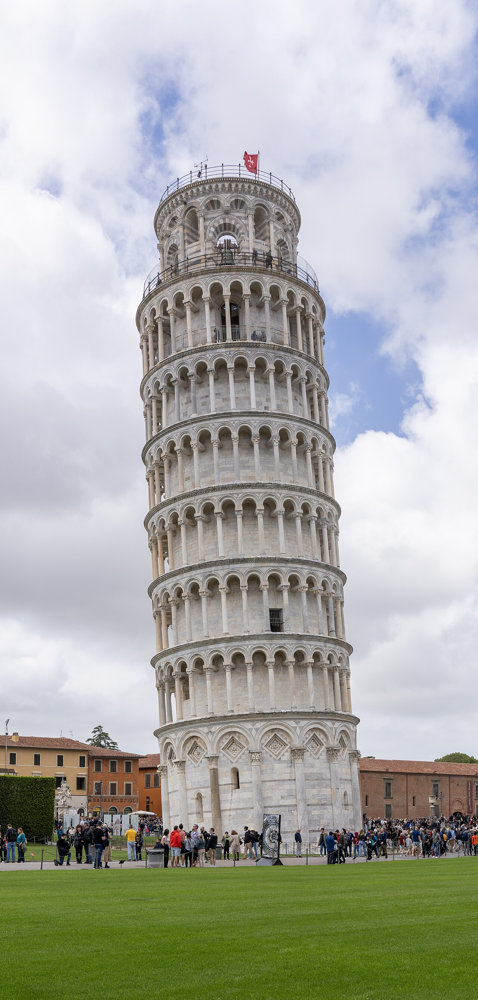

# Torre Pendente di Pisa

```yaml
lugar:
  nombre_original: "Torre Pendente di Pisa"
  nombre_alternativo: "Campanile della Cattedrale di Pisa"
  pais: "Italia"
  region_admin: "Toscana"
  coordenadas: "43.7230° N, 10.3966° E"
  altitud_m: 4
  fecha_visita: "[DATO PENDIENTE — confirmar fecha]"
```







---

<!-- 📷 FOTO: vista de la torre desde el prado / detalle de la inclinación medida con plomada / vista desde la plataforma de la cima -->

## Lo que hace única a esta torre

En el mundo hay muchas torres. Hay torres altas, torres antiguas, torres bellísimas. La Torre Pendente di Pisa es única porque es todas esas cosas y, además, está claramente, visiblemente **inclinada hacia un lado** a causa de un error de ingeniería cometido 850 años atrás.

La inclinación actual —después de la intervención de corrección entre 1990 y 2001— es de aproximadamente **3,97 grados** respecto a la vertical. En el punto más inclinado (la cima), la torre sobresale unos **3,9 metros** de su base. Antes de la corrección, llegó a superar los **5,5 grados** de inclinación y se acercaba peligrosamente al punto de no retorno estructural. 

La pregunta más importante sobre la torre no es *por qué se inclinó* —es un suelo blando y una cimentación insuficiente— sino *por qué siguieron construyéndola y terminándola a pesar de la inclinación*. La respuesta está en las guerras y la política.

---

## Historia

### Línea de tiempo

| Fecha | Hito |
|---|---|
| 1173 | Inicio de la construcción. Arquitecto: probablemente **Bonanno Pisano** (atribución debatida). Se terminan los tres primeros pisos |
| c. 1178 | La construcción se detiene: el suelo sur ha cedido y la torre ya se inclina. Se interrumpe por las **guerras entre Pisa y Genova/Lucca/Florencia** |
| c. 1178–1272 | **Pausa de ~94 años**: las obras están paralizadas. Durante este tiempo, el suelo tiene oportunidad de consolidarse bajo el peso de los tres pisos construidos |
| 1272 | Reanudación de las obras bajo **Giovanni di Simone**. Los arquitectos intentan compensar la inclinación construyendo los pisos superiores con la vertical corregida (lo que da a la torre su ligera curvatura en la base) |
| c. 1278 | Nueva interrupción por la **Batalla de Meloria** (derrota ante Génova) |
| c. 1319–1350 | Tercera fase de construcción: se añaden los últimos pisos y el campanario (la cella campanaria cónica en la cima) |
| 1372 | Se instalan las campanas. La construcción concluye |
| Siglos XIV–XIX | La inclinación aumenta gradualmente, ~1 mm por año hacia el sur |
| 1838 | Se excava la *catino* (un foso circular alrededor de la base) para exponer el basamento y los adornos. El agua subterránea acelera el asentamiento |
| 1990 | La inclinación alcanza ~5,5 grados. Se declara emergencia: la torre es cerrada al público. Se inicia el proyecto de estabilización |
| 1990–2001 | Proyecto de estabilización internacional: extracción de suelo por el lado norte, contrapesos de plomo temporal, consolidación de fundaciones. La inclinación se reduce de ~5,5° a ~3,97° |
| 2001 | La torre vuelve a abrir al público |
| 2023 | Estudios confirman que la torre sigue estabilizándose levemente (está "enderezándose" unos mm por año) |

### La pausa que salvó la torre

El detalle más paradójico de la historia de la Torre es que la **guerra** le salvó la vida. La pausa de ~94 años entre la primera y segunda fase de construcción (c. 1178–1272) resultó ser accidentalmente beneficiosa: durante esas décadas, el suelo blando bajo la torre tuvo tiempo de **consolidarse y compactarse** bajo el peso de los tres pisos ya construidos. Sin esa consolidación, la torre habría probablemente colapsado durante la reanudación de las obras. La guerra que paralizó Pisa fue, paradójicamente, lo que permitió que su torre más famosa sobreviviera.

Este fenómeno fue identificado por los ingenieros que trabajaron en la estabilización del siglo XX como uno de los factores que explican por qué la torre siguió en pie durante 800 años pese a la inclinación.

---

## Por qué se inclinó: la geología

El suelo del Campo dei Miracoli es una **capa superficial de arena** (de unos 10 metros de profundidad) sobre una capa más profunda de **arcilla compresible y sedimento aluvial** húmedo. En condiciones normales de construcción, ese suelo habría requerido cimentaciones más profundas y macizas. La cimentación de la Torre alcanza apenas unos 3 metros de profundidad [⚠ VERIFICAR dato exacto], totalmente insuficiente para el peso de la estructura.

La inclinación hacia el sur se explica por una ligera **heterogeneidad del suelo**: el lado sur tiene una capa de arcilla levemente más compresible que el norte, y bajo el peso paulatino de la torre, fue cediendo más. Una vez iniciado el proceso, la inclinación generó un momento torsor adicional (el peso descentrado ejerce más presión sobre el lado sur) que aceleró el proceso.

El resto del Campo dei Miracoli comparte el mismo suelo problemático, lo que explica por qué el **Battistero** también tiene una inclinación leve (aunque mucho menos dramática) y por qué el **Duomo** tiene algunos problemas estructurales en su cimentación.

---

## La intervención de estabilización (1990–2001)

A finales del siglo XX, la torre era un problema de ingeniería de urgencia. La inclinación alcanzaba 5,5 grados —algunos estudios estimaban que quedarían décadas antes de que el riesgo de colapso fuera crítico— y los propios turistas que subían añadían vibraciones y carga variables. Se cerró en 1990.

El proyecto de estabilización fue internacional e interdisciplinar:
1. **Contrapesos de plomo temporales**: se colocaron barras de plomo en el lado norte de la base para frenar el avance del asentamiento.
2. **Cables de acero**: se anclaron cables al lado norte para retener la torre mientras se trabajaba.
3. **Extracción de suelo (*sottoescavazione*)**: la técnica clave fue extraer pequeñas cantidades de suelo del lado norte, debajo de la cimentación, usando sondas acanaladas. Al retirar suelo del lado donde la presión era menor, se inducía un leve asentamiento del lado norte, lo que reducía la inclinación hacia el sur. El proceso fue lento, controlado, milímetro a milímetro.
4. **Consolidación del suelo**: inyecciones de resinas y morteros para estabilizar el suelo bajo la cimentación.

Al final del proceso (2001), la inclinación se había reducido de ~5,5° a ~3,97°: equivalente a llevar la torre al estado de inclinación que tenía a principios del siglo XIX. Las estimaciones de los ingenieros son que la torre está ahora estabilizada para, al menos, los próximos **200–300 años**.

---

## Arquitectura

La torre tiene **8 niveles** (planta baja + 6 pisos de galerías + la cella campanaria cónica en la cima). El exterior es **mármol blanco de Carrara** con decoración en logias de columnas geminadas —el mismo vocabulario arquitectónico que la fachada del Duomo y el Battistero.

La planta es **circular** (exterior e interior), con un cilindro hueco en el centro. La escalera de caracol que lleva a la cima tiene **294 peldaños** y corre en el grosor de las paredes del cilindro exterior.

La circunferencia del cilindro exterior es de unos **15,5 metros de diámetro**. La altura en el lado más bajo (el sur, el que se inclinó) es de unos **55,86 metros**; en el lado más alto (el norte) de **56,70 metros**. La diferencia de casi 1 metro entre los dos lados es la medida visible de la inclinación.

### La curvatura del fuste

Si se mira la torre desde una posición perpendicular y cerca del suelo, se nota que el fuste no es perfectamente recto: hay una ligera **curvatura** en los pisos medios. Esta curvatura se introdujo deliberadamente durante la segunda fase de construcción (1272) cuando los arquitectos intentaron compensar la inclinación construyendo los pisos superiores "en vertical" respecto al terreno en lugar de paralelos a los inferiores. El resultado es una torre que está tanto *inclinada* como ligeramente *curva*.

---

## Las campanas

La cella campanaria (el último piso, con forma de campana invertida) aloja **7 campanas**, de distintas épocas y tonos:
- La mayor, llamada *Assunta*, es de **1655** y pesa unos 3.620 kg.
- Las campanas forman una escala musical: las notas son Do (con), Re, Mi, Fa, Sol, La, Si — una ocatava completa.

Las campanas no se tocan por control manual sino mecánicamente, y no a toda fuerza para no añadir vibraciones adicionales a una estructura ya fragilizada.

---

## Galileo y la Torre: la leyenda del experimento

Una de las historias más famosas de la historia de la ciencia es que **Galileo Galilei**, siendo profesor en Pisa, habría subido a la Torre Pendente con dos bolas de distinto peso y las habría dejado caer simultáneamente desde la cima, demostrando ante un público de académicos que los objetos caen a la misma velocidad independientemente de su masa —refutando la física aristotélica.

El problema es que el origen de esa historia no es Galileo mismo sino su biógrafo **Vincenzo Viviani**, que lo escribió décadas después de la muerte del científico. No hay evidencia directa ni en los escritos de Galileo ni en fuentes contemporáneas de que el experimento se realizara exactamente así y en ese lugar.

La física del experimento es real: Galileo sí realizó experimientos sobre la caída libre, pero probablemente usando **planos inclinados** y **péndulos** en el ambiente controlado de un laboratorio, no lanzando objetos desde una torre pública. La Torre Pendente como escenario del experimento es parte del mito hagiográfico de la ciencia moderna —que necesitaba un momento visual dramático para representar el choque entre la ciencia nueva y la autoridad aristotélica.

---

## La visita práctica

- **Tickets**: en línea en opapisa.it, con horario asignado. Los grupos tienen ~30 minutos dentro de la torre.
- **Acceso**: la rampa exterior de la entrada está al pie de la torre. No hay ascensor; son 294 peldaños de escalera de caracol, en el grosor del muro.
- **La sensación**: subir los primeros pisos es normal; en los pisos de la parte inclinada, el suelo está levemente inclinado y la relación con la vertical se percibe claramente. En la terraza final, la inclinación es visible y sentible en el cuerpo.
- **La vista desde arriba**: el Duomo, el Battistero, el Camposanto y el verde del campo son visibles desde la cima. También parte del centro urbano de Pisa y la planicie costera.

---

## Conexiones

- La Torre es el campanario de la **Cattedrale di Pisa** y es funcionalmente parte del mismo conjunto. Las campanas se usaban para marcar los momentos litúrgicos de la catedral y los horarios de la vida cívica de la república.
- El impulso de construcción que la Torre comparte con el Duomo y el Battistero está vinculado directamente a la **República Marinara** en su apogeo —la misma República que sería destruida por Genova en Meloria (1284), décadas antes de que la torre se terminara.
- **Galileo Galilei** —cuya relación real con la torre es más legendaria que histórica— nació en Pisa en 1564, más de 200 años después de que la torre se completara.

---

## Datos interesantes

- La inclinación de la Torre ha generado un **mercado de productos derivados** de proporciones industriales: la imagen de la torre inclinada está en camisetas, imanes, réplicas en miniatura y mates de todo tipo. Pisa ha construido parte de su economía sobre un error de ingeniería medieval.
- Varios países tienen **torres inclinadas** propias, pero ninguna con la fama de la pisana. El famoso "Campanile di Burano" en Venecia o la torre de Suurhusen en Alemania tienen inclinaciones mayores [⚠ VERIFICAR comparación exacta], pero no tienen la escala ni el contexto monumental de la Torre Pendente.
- Durante la intervención de estabilización, los ingenieros calcularon que si la torre siguiera inclinándose al ritmo previo sin intervención, el **colapso habría ocurrido en algún momento del siglo XXI**.

---

*fuente: John Burland (Imperial College London), informes técnicos del Comitato per la Salvaguardia della Torre di Pisa; Encyclopædia Britannica; Emilio Tolaini, "Forma Pisarum"; TCI Toscana; opapisa.it.*
