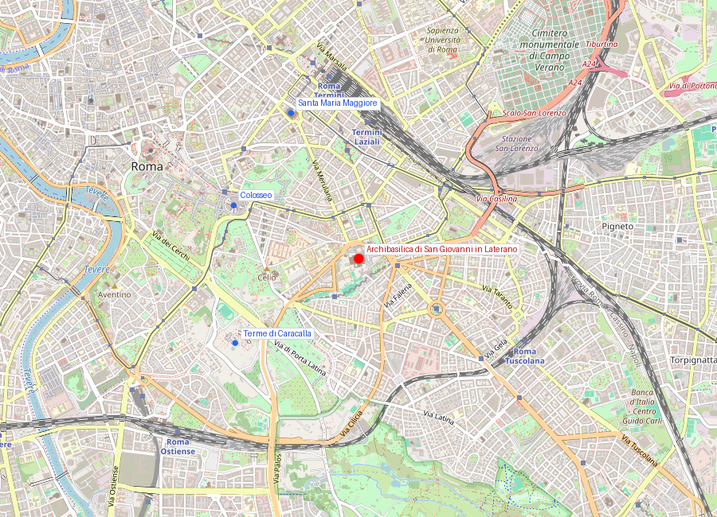
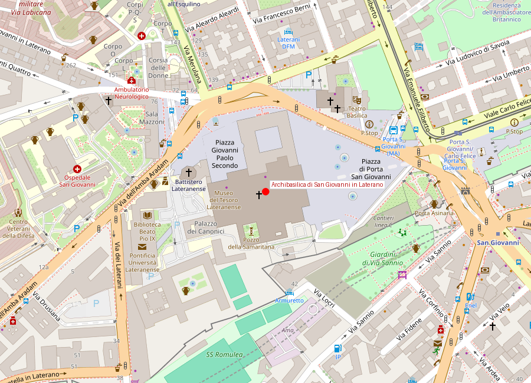
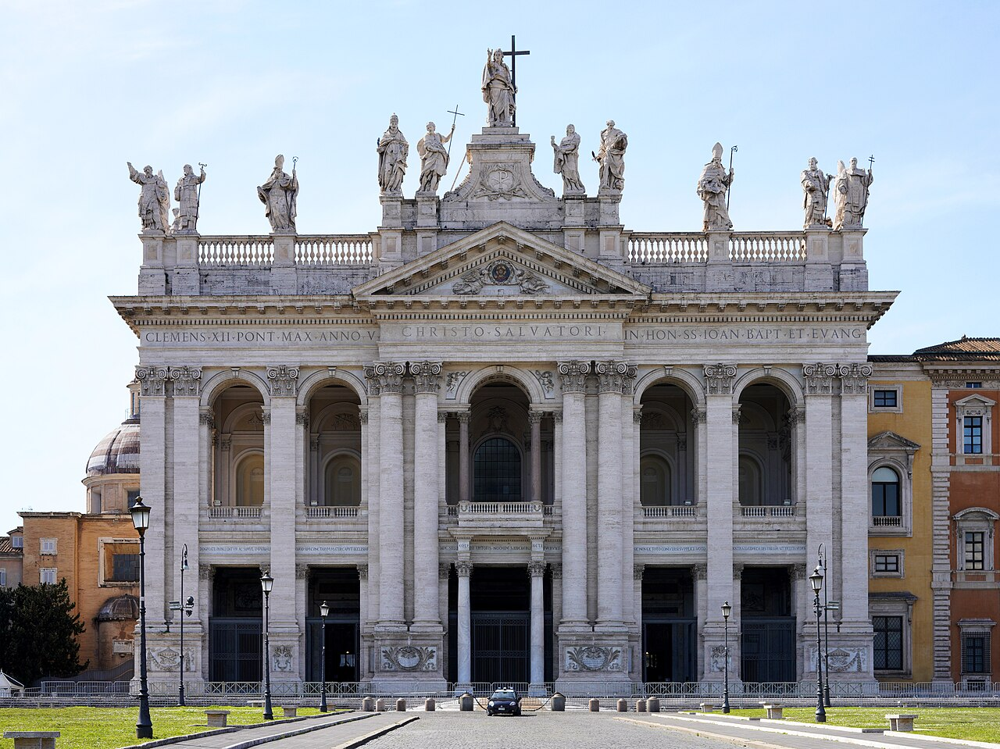

# Archibasilica di San Giovanni in Laterano

```yaml
lugar:
  nombre_original: "Archibasilica Papale di San Giovanni in Laterano"
  nombre_alternativo: "Archibasilica del Santissimo Salvatore e dei Santi Giovanni Battista ed Evangelista in Laterano"
  pais: "Italia"
  fecha_visita: "2026-03-23/2026-03-30"
```

## Mapa


## Mapa en detalle




## Qué había antes

El terreno perteneció a la familia de los Laterani, una gens aristocrática romana. El último Laterano propietario, Plauzio Laterano, fue ejecutado en 65 d.C. por conspirar contra Nerón (la conjura de Pisón). La propiedad pasó al fisco imperial y fue usada como cuartel de la guardia a caballo (*Castra Nova equitum singularium*). Constantino demolió el cuartel tras derrotar a Majencio en la batalla del Puente Milvio (312 d.C.) y donó el terreno al obispo de Roma para construir la primera basílica cristiana de la ciudad.

## Historia

### Línea de tiempo

| Fecha | Hito |
|---|---|
| 65 d.C. | Ejecución de Plauzio Laterano; la propiedad pasa al emperador |
| 312 d.C. | Constantino derrota a Majencio en el Puente Milvio |
| ~314-318 d.C. | Constantino construye la basílica original — la primera iglesia cristiana monumental de Roma |
| 324 d.C. | Dedicación de la basílica al Santísimo Salvador; es la catedral del obispo de Roma |
| Siglos V-IX | Múltiples terremotos y saqueos causan daños severos (saqueo vándalo de 455, terremoto de 896) |
| 904 | El papa Sergio III reconstruye la basílica tras otro terremoto |
| 1308 | Un incendio devastador destruye gran parte del edificio |
| 1360 | Urbano V encarga la reconstrucción; el papa regresa de Aviñón |
| 1377 | Gregorio XI traslada definitivamente la sede papal al Vaticano — el Laterano pierde su papel como residencia papal |
| 1586 | Sixto V demuele el viejo Patriarchio (palacio papal lateranense) y encarga a Domenico Fontana el nuevo Palazzo Lateranense |
| 1646-1650 | Borromini rediseña el interior por encargo de Inocencio X para el Jubileo de 1650 |
| 1732-1735 | Alessandro Galilei construye la fachada actual tras ganar un concurso |
| 1929 | Los Pactos de Letrán se firman en el Palazzo Lateranense: Italia reconoce la soberanía de la Ciudad del Vaticano |

### Narrativa

San Giovanni in Laterano no es solo la primera iglesia de Roma: es la primera iglesia cristiana monumental del mundo. Lleva el título oficial de *Omnium Urbis et Orbis Ecclesiarum Mater et Caput* — "Madre y Cabeza de todas las iglesias de la ciudad y del mundo." Ese título, inscrito en la fachada, la sitúa formalmente por encima incluso de la Basilica di San Pietro. Es la catedral del Papa en su calidad de obispo de Roma.

Constantino la fundó inmediatamente después de su victoria en el Puente Milvio, donde según la tradición vio la señal de la cruz en el cielo (*In hoc signo vinces*). La elección del lugar fue políticamente astuta: estaba en el borde de la ciudad, lejos del centro pagano del Foro y el Capitolium, evitando así confrontación directa con la élite senatorial aún mayoritariamente pagana.

La basílica original era enorme — cinco naves con columnas de mármol — y durante mil años fue la residencia principal de los papas. El complejo lateranense (basílica, baptisterio, palacio, capillas) funcionó como el centro del poder eclesiástico hasta el traslado al Vaticano tras el exilio de Aviñón (1377).

El interior que se ve hoy es mayoritariamente obra de Borromini (1646-1650), quien recibió el encargo de modernizar la nave para el Jubileo de 1650. Borromini trabajó dentro de restricciones severas: debía conservar el techo artesonado del siglo XVI y los mosaicos del ábside. Su solución fue envolver las antiguas columnas en pilastras barrocas y crear nichos con estatuas de los doce apóstoles — un compromiso entre la huella paleocristiana y la estética barroca.

## Mitología y leyendas

Según la tradición, cuando Constantino fue bautizado (históricamente ocurrió en su lecho de muerte en 337, pero la leyenda medieval lo sitúa antes, en el Laterano), fue curado milagrosamente de la lepra. La escena aparece en los frescos medievales del baptisterio y se convirtió en un argumento político poderoso: el emperador que sanó al abrazar la fe.

Una leyenda medieval cuenta que debajo del altar mayor se conservan las cabezas de San Pedro y San Pablo en relicarios de plata y oro. Los relicarios existen y son visibles en el ciborio gótico del siglo XIV sobre el altar, aunque la autenticidad de las reliquias es, naturalmente, materia de fe.

## Qué se puede ver hoy

- **La fachada** (Galilei, 1735): monumental, coronada por 15 estatuas de Cristo, San Juan Bautista, San Juan Evangelista y los doctores de la Iglesia. El balcón central es la *loggia delle benedizioni*, donde el Papa recién elegido se presentaba históricamente al pueblo (hoy se hace desde San Pietro).
- **La nave central** (Borromini, 1650): las pilastras barrocas envolviendo la estructura paleocristiana, con las doce estatuas colosales de los apóstoles en nichos.
- **El techo artesonado**: del siglo XVI, dorado, que Borromini debió conservar.
- **El mosaico del ábside**: obra de Jacopo Torriti y Jacopo da Camerino (circa 1291), con una Déesis (Cristo entre la Virgen y los santos) sobre fondo dorado. Contemporáneo al mosaico del ábside de [Santa Maria Maggiore](basilica_santa_maria_maggiore.md).
- **El ciborio gótico** (siglo XIV): sobre el altar mayor, con los relicarios que contienen, según la tradición, las cabezas de Pedro y Pablo.
- **El Chiostro Cosmatesco**: claustro del siglo XIII obra de los Vassalletto, con columnas torsas y mosaicos cosmatescos — uno de los claustros medievales más bellos de Roma.
- **El Battistero Lateranense**: contiguo a la basílica, fundado por Constantino. Es el modelo de baptisterio octogonal que se difundió por toda la cristiandad.
- **La Scala Santa**: enfrente de la basílica, contiene la escalera que, según la tradición, subió Cristo en el Pretorio de Pilatos. Los fieles la suben de rodillas.
- **El obelisco lateranense**: en la piazza, es el obelisco más alto de Roma (32 m sin la base, 45 m con ella) y el más antiguo (siglo XV a.C., de Tutmosis III). Fue traído de Karnak por Constancio II en 357 d.C.

## Cultura

San Giovanni in Laterano sigue siendo la catedral del Papa como obispo de Roma. Cada nuevo Papa toma posesión de la basílica en una ceremonia solemne. Es también sede de ordenaciones y ceremonias diocesanas. El complejo goza de extraterritorialidad: es propiedad de la Santa Sede en suelo italiano, como se estableció en los Pactos de Letrán de 1929.

Los Pactos de Letrán — firmados en el Palazzo Lateranense entre Mussolini y el cardenal Gasparri en nombre de Pío XI — resolvieron la "Cuestión Romana" que había enfrentado a Italia y el Papado desde 1870. Es uno de los actos diplomáticos más importantes del siglo XX en Italia.

## Conexiones

- Completa el cuarteto de basílicas papales mayores junto con San Pietro, [Basilica di Santa Maria Maggiore](basilica_santa_maria_maggiore.md) y San Paolo fuori le Mura.
- Los mosaicos del ábside (Torriti, ~1291) son del mismo taller y época que los del ábside de [Santa Maria Maggiore](basilica_santa_maria_maggiore.md) — pueden compararse estilísticamente.
- El obelisco lateranense conecta con la red de obeliscos egipcios de Roma, incluyendo el Flaminio de [Piazza del Popolo](piazza_del_popolo.md).
- La intervención de Borromini la vincula al Barroco romano de [Piazza Navona](piazza_navona.md) (Sant'Agnese in Agone).
- Los Pactos de Letrán conectan con la historia del [Monumento a Vittorio Emanuele II](monumento_vittorio_emanuele_ii.md) y la compleja relación entre la Italia unificada y el Papado.

## Datos interesantes

- Es la iglesia más antigua del mundo cristiano fundada por un emperador, anterior incluso a San Pietro (que Constantino construyó después, sobre la tumba del apóstol).
- El obelisco lateranense, de Tutmosis III, es el más alto y antiguo de Roma — tiene unos 3.500 años.
- La puerta de bronce central de la basílica proviene de la Curia del Foro Romano — un reciclaje material que conecta directamente la sede del Senado pagano con la catedral cristiana.
- Los Pactos de Letrán de 1929, firmados aquí, siguen vigentes y regulan las relaciones entre Italia y la Santa Sede.
- El claustro cosmatesco tiene columnas todas diferentes entre sí — torsas, lisas, acanaladas, con incrustaciones — como un muestrario del arte cosmatesco romano.

## Fotos

<!-- Placeholder para fotos de Archibasilica di San Giovanni in Laterano -->
<!--  -->
<!-- *Descripción de la foto* -->

fuente: Vicariato di Roma (diocesidiroma.it); Archibasilica Papale di San Giovanni in Laterano (vatican.va); UNESCO World Heritage Centre, ref. 91; Treccani (treccani.it); Richard Krautheimer, *Rome: Profile of a City*, Princeton University Press
