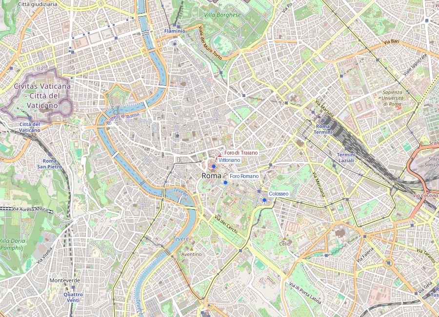
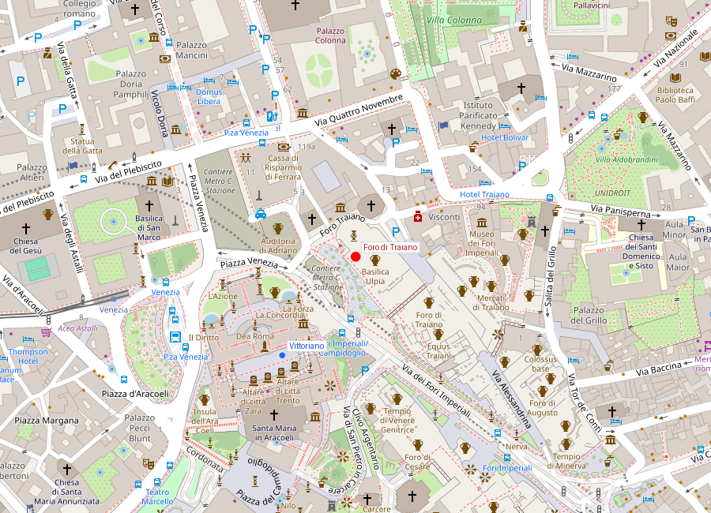
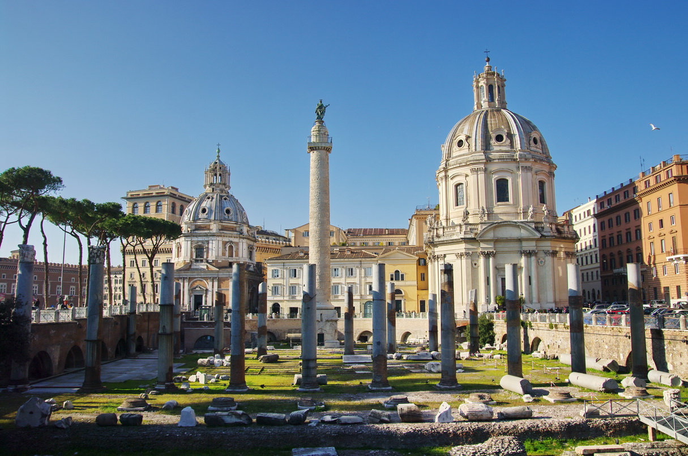
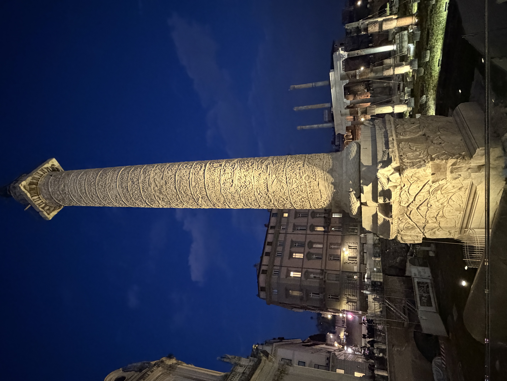

# Foro di Traiano (Mercati di Traiano)

```yaml
lugar:
  nombre_original: "Foro di Traiano"
  pais: "Italia"
  fecha_visita: "2026-03-23/2026-03-30"
```

## Mapa


## Mapa en detalle




## Qué había antes

El Foro di Traiano se construyó eliminando la silla de terreno que unía las colinas del Quirinale y el Campidoglio. Fue una obra de ingeniería colosal: se excavaron decenas de metros de roca para crear el espacio necesario. La Columna de Trajano, con sus 38 metros de altura, indica exactamente cuánta tierra se removió. Antes de la intervención, esta zona era una ladera densamente construida que conectaba las dos colinas.

## Historia

### Línea de tiempo

| Fecha | Hito |
|---|---|
| 106-107 d.C. | Trajano finaliza la conquista de Dacia; el botín financia el foro |
| 112 d.C. | Inauguración del Foro di Traiano, el más grande y suntuoso de los Foros Imperiales |
| 113 d.C. | Dedicación de la Columna Trajana |
| Siglos V-VI | Decadencia gradual; los materiales comienzan a reutilizarse |
| Siglo IX | La zona se transforma en barrio medieval construido sobre las ruinas |
| 1812-1814 | Excavaciones napoleónicas liberan parcialmente la Columna |
| 1924-1934 | Mussolini ordena la demolición del barrio medieval para exponer los Foros Imperiales, abriendo la Via dei Fori Imperiali |
| 2007 | Inauguración del Museo dei Fori Imperiali dentro de los Mercati di Traiano |

### Narrativa

El Foro di Traiano fue el último, el más grande y el más espectacular de los Foros Imperiales. Construido entre 107 y 112 d.C. por el arquitecto Apollodoro di Damasco con el botín de las guerras dácicas, representó la culminación de una tradición que habían iniciado César y continuado Augusto, Vespasiano y Nerva.

El complejo incluía una plaza porticada de unos 300 por 185 metros, la Basilica Ulpia (la más grande de Roma en aquel tiempo), dos bibliotecas (una griega y una latina) flanqueando la Columna Trajana, y el Templum Divi Traiani añadido por Adriano tras la muerte de Trajano.

Los Mercati di Traiano, el gran hemiciclo de ladrillo que se conserva parcialmente, no eran un "mercado" en el sentido moderno: funcionaban como complejo administrativo y comercial, una especie de centro multifuncional con oficinas, almacenes y espacios de distribución. Su estructura en varios niveles es considerada uno de los primeros ejemplos de arquitectura funcional a gran escala.

## La Columna Trajana

La Columna Trajana es probablemente el monumento narrativo más importante de la antigüedad. Sus 200 metros de relieve en espiral, tallados en 20 bloques de mármol de Carrara, narran las dos campañas dácicas de Trajano (101-102 y 105-106 d.C.) con más de 2.500 figuras humanas. Es una fuente documental única sobre el ejército romano, sus tácticas, su equipamiento y sus enemigos.

En la cúspide había originalmente una estatua de Trajano en bronce dorado. En 1587, el papa Sixto V la reemplazó con una estatua de San Pedro, que es la que se ve hoy. Las cenizas de Trajano se depositaron en una cámara en la base — un honor excepcional, ya que enterrar dentro del pomerium (límite sagrado de la ciudad) estaba normalmente prohibido.

## Fotos


*Vista del Foro di Traiano con los restos del complejo y los Mercati di Traiano al fondo.*

## Conexiones

- El Foro di Traiano es la extensión monumental de la serie de Foros Imperiales que comienza junto al [Foro Romano](foro_romano_palatino.md). Mientras el Foro Romano era el centro cívico original de la Roma republicana, los Foros Imperiales fueron ampliaciones de prestigio construidas por los emperadores.
- Apollodoro di Damasco, el arquitecto del foro, fue el mismo que diseñó el puente sobre el Danubio para las campañas dácicas — la mayor obra de ingeniería del mundo romano.
- La Via dei Fori Imperiali, abierta por Mussolini en 1932, conecta visualmente el [Colosseo](colosseo.md) con Piazza Venezia (el [Monumento a Vittorio Emanuele II](monumento_vittorio_emanuele_ii.md)), pero sepultó gran parte de los foros que pretendía celebrar.
- Trajano fue el primer emperador nacido fuera de Italia (en Itálica, cerca de la actual Sevilla). Su foro fue el último gesto de una edad de oro antes de que el Imperio comenzara su lento declive.

## Datos interesantes

- La Columna Trajana tiene 2.662 figuras talladas en 155 escenas, dispuestas en una espiral de 200 metros que se leería como un rollo de papiro desenrollado.
- El emperador Trajano aparece representado 59 veces en la columna.
- Los Mercati di Traiano albergan hoy el Museo dei Fori Imperiali, donde se pueden ver fragmentos arquitectónicos de todos los foros y entender la escala original de los complejos.
- La excavación del foro requirió mover un volumen de tierra equivalente al de una colina entera — un logro de ingeniería que no se repetiría en Roma hasta la era moderna.

fuente: Mercati di Traiano - Museo dei Fori Imperiali (mercatididitraiano.it); Parco archeologico del Colosseo (parcocolosseo.it); Treccani (treccani.it); James Packer, *The Forum of Trajan in Rome*, University of California Press
