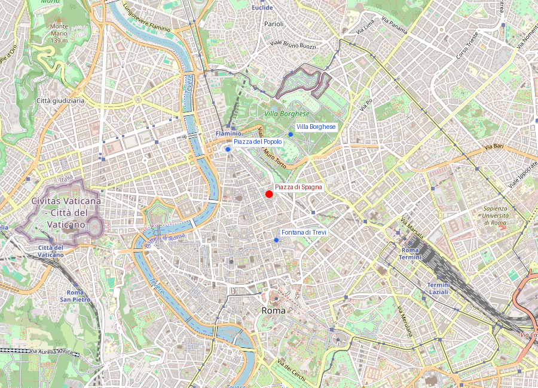
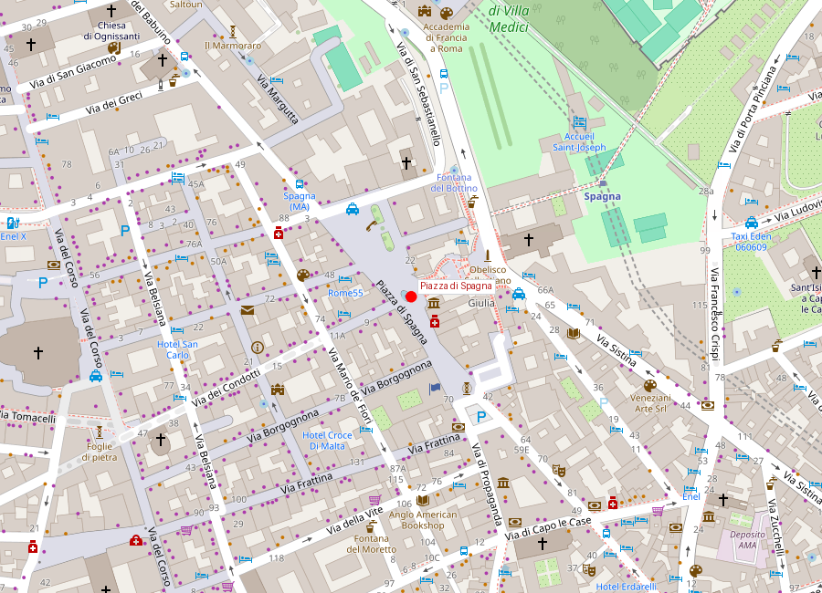
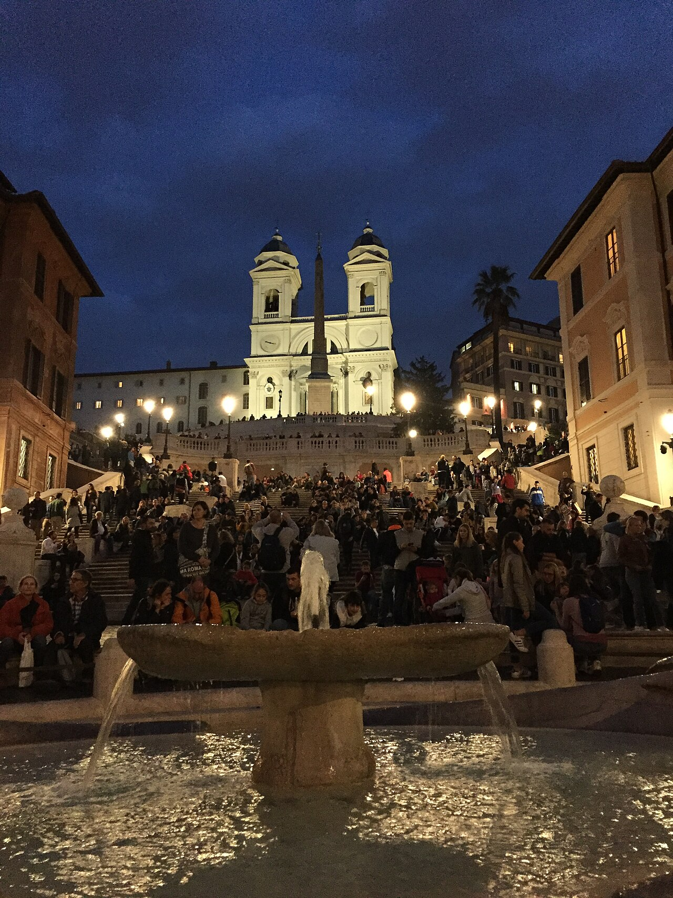

# Piazza di Spagna

```yaml
lugar:
  nombre_original: "Piazza di Spagna"
  pais: "Italia"
  fecha_visita: "2026-03-23/2026-03-30"
```

## Mapa


## Mapa en detalle




## Qué había antes

La zona de Piazza di Spagna fue durante la Antigüedad parte del Campo de Marte norte, con jardines y villas. En la Edad Media era un área poco desarrollada en la ladera del Pincio. La presencia de la Embajada de España ante la Santa Sede (instalada aquí desde el siglo XVII) dio nombre a la plaza. Durante un tiempo, el territorio alrededor de la embajada se consideraba "jurisdicción española", y los soldados españoles podían reclutar forzosamente a transeúntes (*leva*), por lo que los romanos evitaban la zona. Antes de la escalinata, el desnivel entre la plaza baja y la iglesia francesa de Trinità dei Monti en lo alto era un barranco desordenado, terroso e intransitable cuando llovía.

## Historia

### Línea de tiempo

| Fecha | Hito |
|---|---|
| 1502 | Los reyes de Francia financian la iglesia de Trinità dei Monti en la cima de la colina |
| Siglo XVII | La Embajada de España se instala en el Palazzo di Spagna, dando nombre a la plaza |
| 1627-1629 | Pietro Bernini (padre de Gian Lorenzo) diseña la Fontana della Barcaccia al pie del desnivel |
| 1660s | Comienzan los debates sobre cómo conectar la plaza baja con Trinità dei Monti; rivalidad entre Francia y España por el control simbólico del proyecto |
| 1717 | Se define el proyecto de escalinata; financiado por diplomático francés Étienne Gueffier |
| 1723-1726 | Francesco de Sanctis construye la Scalinata di Trinità dei Monti |
| 1786 | Goethe se instala en Via del Corso 18, a metros de la plaza; la describe en *Viaje a Italia* |
| 1821 | John Keats muere en la casa junto a la escalinata (hoy Keats-Shelley House) |
| 1854 | Se coloca la Colonna dell'Immacolata en Piazza Mignanelli (adyacente), con piezas de una columna romana |
| 1857 | Inauguración de la columna por Pío IX para celebrar el dogma de la Inmaculada Concepción (1854) |
| 2016 | Restauración completa de la escalinata patrocinada por Bulgari |

### Narrativa

La escalinata de Trinità dei Monti es la respuesta más elegante que Roma encontró a un problema prosaico: cómo subir una colina. Pero la historia detrás es política. Francia había financiado Trinità dei Monti en lo alto; España dominaba la plaza de abajo. Durante décadas, ambas potencias se disputaron quién pondría su sello en la conexión. Francia quería una estatua ecuestre de Luis XIV en la cima; España se oponía a cualquier símbolo que no fuera neutral. Al final, la solución fue arquitectónica: una escalinata sin monumento personal, financiada con dinero francés, diseñada por un italiano (De Sanctis), en una plaza con nombre español. Un empate diplomático convertido en obra maestra.

De Sanctis diseñó la escalinata como una coreografía del movimiento: los 135 escalones se dividen, convergen, vuelven a dividirse y convergen de nuevo, creando un ritmo de expansión y contracción que hace que subir sea una experiencia escénica, no un esfuerzo. La escalinata no es recta — es un organismo barroco que respira.

La Fontana della Barcaccia, al pie, fue el ingenio de Pietro Bernini (con posible participación de su hijo Gian Lorenzo, entonces jovencísimo). El problema era que la presión del agua del Acqua Vergine en este punto era tan baja que no permitía chorros altos. La solución fue hundir la fuente por debajo del nivel de la calle y diseñarla como un barco semi-sumergido que desborda agua — convirtiendo la limitación técnica en concepto artístico. La tradición dice que representa una barca arrastrada por la inundación del Tíber de 1598.

## Mitología y leyendas

Según la tradición, la Barcaccia representa un barco que fue arrastrado hasta este lugar por una gran crecida del Tíber en la Navidad de 1598. Cuando las aguas se retiraron, la barca quedó varada en la plaza. Pietro Bernini habría usado ese recuerdo como inspiración para la fuente.

## Qué se puede ver hoy

- **La Scalinata di Trinità dei Monti**: 135 escalones en travertino, articulados en tres tramos que se ensanchan y estrechan. En primavera (abril-mayo) se llenan de azaleas en macetas — una tradición que data de la década de 1950.
- **Trinità dei Monti**: la iglesia francesa en la cúspide, con su fachada con dos campanarios simétricos. En el interior, frescos de Daniele da Volterra (el mismo *Braghettone* que cubrió los desnudos de Michelangelo en la Sistina) y una notable *Deposición*.
- **La Fontana della Barcaccia**: hundida en el centro de la plaza. Observar cómo el agua fluye desde el interior del barco y se derrama por los bordes.
- **Keats-Shelley House**: la casa roja junto a la escalinata (derecha mirando desde abajo), donde John Keats murió de tuberculosis a los 25 años en febrero de 1821. Hoy es un museo dedicado a los poetas románticos ingleses en Roma.
- **La Colonna dell'Immacolata** (Piazza Mignanelli, adyacente): columna de cipollino verde de 12 metros, de origen romano antiguo, coronada por una estatua de bronce de la Virgen. Cada 8 de diciembre, el Papa la visita y los bomberos colocan una corona de flores en lo alto — una tradición arraigada.
- **Via Condotti**: la calle que parte de la plaza hacia el oeste, eje del comercio de lujo romano desde el siglo XVIII y sede del histórico Caffè Greco (abierto desde 1760, frecuentado por Goethe, Byron, Liszt, Stendhal).

## Cultura

Piazza di Spagna fue el corazón del Grand Tour. Desde el siglo XVIII, artistas, escritores y músicos extranjeros se congregaban aquí: Goethe, Keats, Shelley, Byron, Liszt, Berlioz, Stendhal. La zona se convirtió en una micro-colonia internacional donde el inglés, el alemán y el francés se mezclaban con el italiano. La Keats-Shelley House conserva esa memoria cultural.

El Caffè Greco (Via Condotti 86), abierto desde 1760, es el segundo café más antiguo de Italia y fue sala de estar de generaciones de artistas extranjeros. Casanova, Wagner, Baudelaire y Mark Twain pasaron por allí.

## Conexiones

- Conecta peatonalmente con [Fontana di Trevi](fontana_di_trevi.md) (10 minutos a pie, ambas alimentadas por el Acqua Vergine).
- Via del Corso la enlaza con [Piazza del Popolo](piazza_del_popolo.md) al norte y con [Monumento a Vittorio Emanuele II](monumento_vittorio_emanuele_ii.md) al sur.
- Desde la subida al Pincio se enlaza con [Villa Borghese](villa_borghese.md).
- La rivalidad Franco-española en esta plaza conecta con la historia de las potencias europeas que usaban Roma como tablero diplomático durante los siglos XVII y XVIII.
- La Barcaccia comparte acueducto (Acqua Vergine) con la [Fontana di Trevi](fontana_di_trevi.md) — la misma agua, diferente presión, diferente diseño.

## Datos interesantes

- La Fontana della Barcaccia se atribuye a Pietro Bernini y taller (con posible participación del joven Gian Lorenzo). Fue diseñada hundida porque la presión del Acqua Vergine en este punto era demasiado baja para fuentes con chorros.
- La plaza sigue siendo un termómetro de la mezcla entre turismo global y vida local romana.
- Desde 2019 está prohibido sentarse en los escalones de la escalinata; la multa puede llegar a 400 euros. La normativa fue controvertida.
- Las azaleas en los escalones durante la primavera son colocadas por los jardineros municipales desde los años 1950.
- John Keats, moribundo, pidió que no pusieran su nombre en la lápida: solo dice *"Here lies one whose name was writ in water"* ("Aquí yace uno cuyo nombre fue escrito en el agua").

fuente: Turismo Roma (turismoroma.it); Soprintendenza Speciale di Roma; Keats-Shelley House (keats-shelley-house.org); Treccani (treccani.it); Touring Club Italiano
