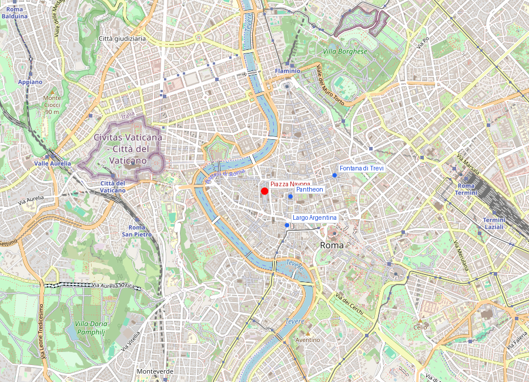
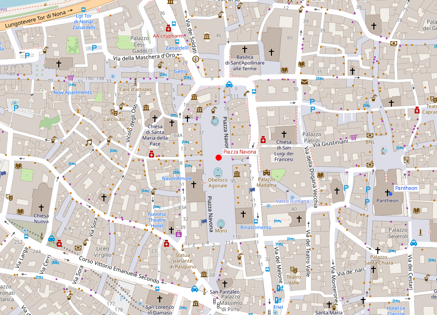
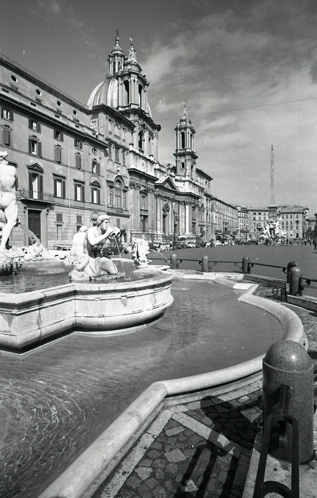

# Piazza Navona

```yaml
lugar:
  nombre_original: "Piazza Navona"
  pais: "Italia"
  fecha_visita: "2026-03-23/2026-03-30"
```

## Mapa


## Mapa en detalle




## Qué había antes

La forma alargada de Piazza Navona no es casualidad: la plaza ocupa exactamente el trazado del Stadio di Domiziano, inaugurado en 86 d.C. para competiciones atléticas al estilo griego (*agones*). El estadio medía unos 275 por 106 metros y podía albergar unos 30.000 espectadores. Era el único estadio permanente de Roma dedicado al atletismo (a diferencia de los circos, que eran para carreras de carros, y los anfiteatros, para gladiadores). Los restos del estadio son visibles bajo el nivel actual de la plaza — se puede acceder a ellos en el Area Archeologica dello Stadio di Domiziano, bajo la plaza.

El nombre "Navona" deriva probablemente del latín *in agone* ("en la competición") → *nagone* → *navone* → *Navona*.

## Historia

### Línea de tiempo

| Fecha | Hito |
|---|---|
| 86 d.C. | Domiciano inaugura el Stadio para los Certamen Capitolino, juegos atléticos al estilo griego |
| Siglo III d.C. | Alejandro Severo restaura el estadio |
| Siglo V | El estadio deja de usarse; se construyen viviendas sobre las gradas |
| Siglo XV | La plaza emerge como espacio público sobre la huella del estadio; se instala el mercado |
| 1477 | El mercado de la ciudad se traslada oficialmente aquí desde el Campidoglio |
| 1574 | Gregorio XIII instala la Fontana del Moro (rediseñada después por Bernini) |
| 1651 | Inocencio X Pamphilj encarga a Bernini la Fontana dei Quattro Fiumi, con el obelisco de Domiciano |
| 1652-1666 | Francisco Borromini (con Girolamo y Carlo Rainaldi) construye la iglesia de Sant'Agnese in Agone |
| 1653 | Se completa la Fontana del Nettuno en el extremo norte |
| Siglos XVII-XIX | La plaza se inunda deliberadamente en verano (*lago di Piazza Navona*) cerrando los desagües de las fuentes para entretenimiento popular |
| 1869 | Se traslada el mercado a Campo de' Fiori; la plaza pierde su función comercial cotidiana |

### Narrativa

Piazza Navona es el escenario donde se puede leer la Roma barroca en estado puro. Fue el papa Inocencio X Pamphilj quien la transformó en lo que es hoy: su familia tenía el palazzo principal en la plaza, y él la convirtió en su escaparate personal y dinástico.

La pieza central es la Fontana dei Quattro Fiumi de Bernini (1651), una de las obras maestras del Barroco. Cuatro gigantes de mármol — cada uno representando un río de un continente conocido — sostienen un obelisco romano que proviene originalmente del Circo de Majencio en la Via Appia. Los ríos son el Nilo (África, con la cabeza cubierta porque su fuente era desconocida), el Ganges (Asia), el Danubio (Europa) y el Río de la Plata (América). La roca central está tallada como una gruta natural, con una paloma en la cúspide del obelisco — símbolo heráldico de los Pamphilj.

Enfrente se alza Sant'Agnese in Agone, obra de Borromini (completada por otros), con su fachada cóncava que abraza la plaza. La relación visual entre la fuente de Bernini y la iglesia de Borromini es uno de los diálogos arquitectónicos más célebres de Roma.

## Mitología y leyendas

### La rivalidad Bernini-Borromini

Según la leyenda popular más difundida de Piazza Navona, la figura del Río de la Plata en la fuente de Bernini levanta la mano en un gesto de horror ante la fachada de Sant'Agnese de Borromini, y la del Nilo se cubre la cara para no verla. En realidad, la fuente se completó en 1651 y la fachada de Borromini se construyó a partir de 1653 — la cronología hace imposible la anécdota. Pero la leyenda sobrevive porque captura algo real: la feroz rivalidad profesional entre los dos genios del Barroco romano.

### Santa Agnese

La iglesia de Sant'Agnese in Agone marca, según la tradición, el lugar donde la joven mártir Inés fue expuesta desnuda en un burdel del estadio de Domiciano como castigo por negarse a renunciar a su fe. Según la leyenda, su cabello creció milagrosamente para cubrirla. El nombre *in agone* (del estadio de Domiciano) refuerza el vínculo entre el martirio y el lugar.

## Qué se puede ver hoy

- **Fontana dei Quattro Fiumi** (Bernini, 1651): la fuente central con los cuatro ríos y el obelisco de Domiciano. Los detalles de la roca — un armadillo, una palmera, un caballo saliendo del agua, un león bebiendo — recompensan una observación detenida.
- **Sant'Agnese in Agone** (Borromini/Rainaldi): la fachada cóncava con la cúpula y los dos campanarios. El interior es un espacio centralizado, más sobrio de lo que la fachada sugiere.
- **Fontana del Moro** (extremo sur): originalmente de Giacomo della Porta; Bernini añadió la figura central del moro luchando con un delfín.
- **Fontana del Nettuno** (extremo norte): completada en el siglo XIX con esculturas de Antonio della Bitta.
- **Palazzo Pamphilj**: hoy Embajada de Brasil, ocupa todo el lado oeste de la plaza. Incluye la Galleria de Pietro da Cortona con frescos de la historia de Eneas.
- **Area Archeologica dello Stadio di Domiziano**: acceso bajo el nivel de la plaza (entrada por Piazza di Tor Sanguigna) que permite ver los restos de las gradas y la estructura del estadio del siglo I d.C.

## Cultura

Piazza Navona sigue siendo una de las plazas más vivas de Roma. En Navidad alberga el tradicional mercado con puestos de artesanía y dulces (la Befana de Piazza Navona, que culmina el 6 de enero). Los pintores callejeros, los cafés al aire libre y el flujo constante de visitantes mantienen su carácter de escenario urbano — un uso que es más continuidad que ruptura respecto a los siglos pasados.

La tradición del *lago* estival (inundación deliberada de la plaza) desapareció en el siglo XIX, pero fue durante siglos una de las diversiones más populares de Roma: las familias nobles paseaban en carrozas por el agua poco profunda mientras el pueblo se refrescaba a pie.

## Conexiones

- Se vincula directamente con la [Fontana di Trevi](fontana_di_trevi.md) y el [Pantheon](pantheon.md) en el circuito del centro histórico barroco — las tres están a minutos a pie.
- La fuente de los Cuatro Ríos conecta con el tema de los obeliscos romanos, compartido con [Piazza del Popolo](piazza_del_popolo.md) y [Piazza di Spagna](piazza_di_spagna.md).
- La rivalidad Bernini-Borromini que se escenifica aquí se encuentra también en otras obras por toda Roma: Bernini en Sant'Andrea al Quirinale vs. Borromini en San Carlo alle Quattro Fontane, a pocos metros de distancia.
- El Stadio di Domiziano conecta con el conjunto de obras del emperador Domiciano, incluyendo los hipogeos del [Colosseo](colosseo.md) y la Domus Augustana en el [Palatino](foro_romano_palatino.md).

## Datos interesantes

- El obelisco de la fuente central no es egipcio: es una imitación romana de época de Domiciano, tallado en granito de Asuán pero con jeroglíficos copiados — un "falso" romano de un obelisco egipcio.
- La forma exacta del estadio de Domiciano se puede leer en la planta de la plaza actual: la curva del extremo norte corresponde a la *sphendone* (el extremo semicircular del estadio).
- Durante el Barroco, la plaza se inundaba en verano cerrando los desagües de las fuentes, creando un lago poco profundo donde la nobleza romana desfilaba en carrozas.
- Bernini consiguió el encargo de la fuente central a pesar de que Inocencio X inicialmente lo había excluido del concurso (por su asociación con los Barberini, la familia papal anterior). Según la tradición, Bernini dejó un modelo de plata de la fuente donde el papa pudiera verlo "por casualidad".

## Fotos

<!-- Placeholder para fotos de Piazza Navona -->
<!--  -->
<!-- *Descripción de la foto* -->

fuente: Sovrintendenza Capitolina ai Beni Culturali (sovraintendenzaroma.it); Stadio di Domiziano (stadiodomiziano.com); Turismo Roma (turismoroma.it); Treccani (treccani.it); Rudolf Wittkower, *Art and Architecture in Italy 1600-1750*, Penguin
