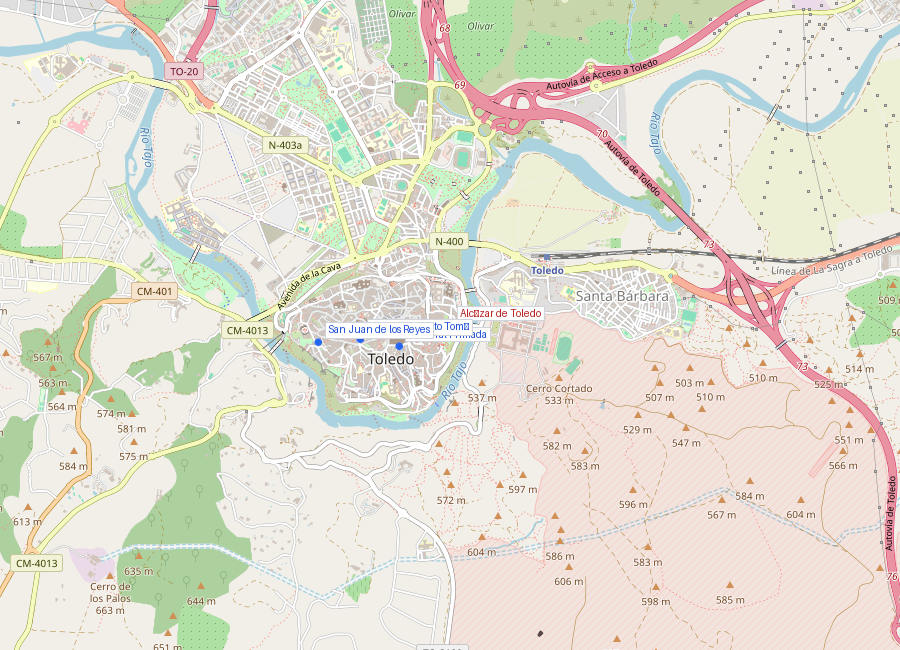
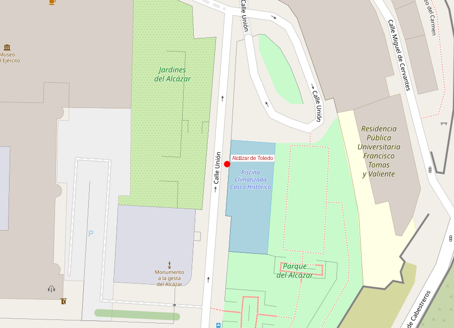
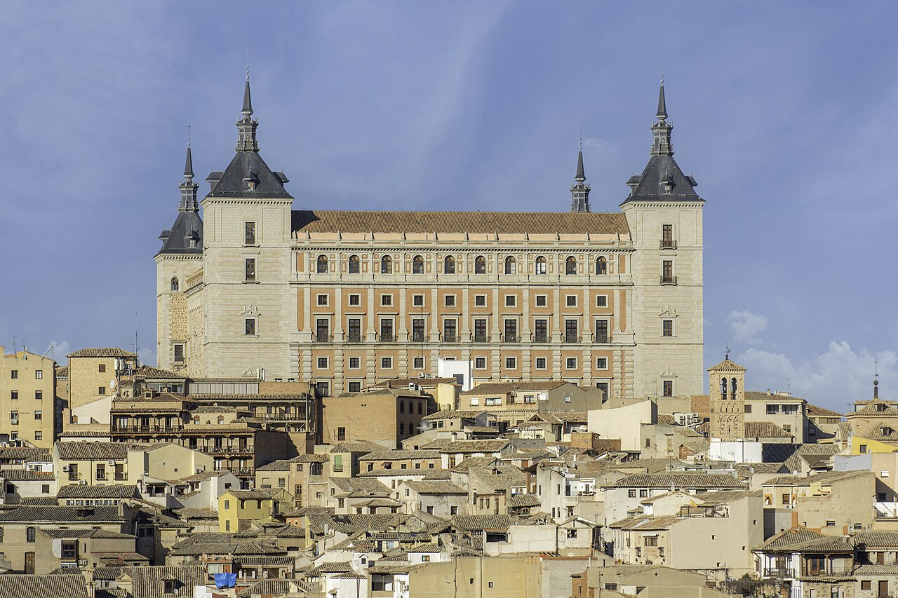

# Alcázar de Toledo

```yaml
lugar:
  nombre_original: "Alcázar de Toledo"
  pais: "España"
  region_admin: "Castilla-La Mancha, Toledo"
  coordenadas: "39.8581° N, 4.0192° W"
  fecha_visita: "[DATO PENDIENTE — confirmar fecha]"
```







---

## Qué había antes

El punto más alto del peñón de Toledo ha sido fortificado desde la Edad del Hierro. Los romanos construyeron aquí un **pretorio** (cuartel general militar); los visigodos lo convirtieron en palacio real; los árabes levantaron un **alcázar** (del árabe *al-qaṣr*, "la fortaleza"); y los cristianos, tras la reconquista, lo rehicieron sucesivamente. El edificio actual es esencialmente una reconstrucción del **siglo XX** tras la destrucción casi total en la Guerra Civil.

---

## Historia

### Del pretorio romano al alcázar árabe

La posición dominante del cerro —el punto más alto del peñón rodeado por el Tajo— hizo que fuera elegido como sede del poder militar y político en cada época. Los romanos establecieron su cuartel aquí; los visigodos lo convirtieron en residencia real cuando Toledo fue capital del reino (siglos VI–VIII); los árabes lo reconstruyeron como alcázar.

### El Alcázar de Carlos V

El edificio más monumental fue el que mandó construir **Carlos I de España (V del Sacro Imperio)** en el **siglo XVI**, encargado al arquitecto **Alonso de Covarrubias**. Carlos V quiso hacer de Toledo su capital imperial y el Alcázar su palacio, pero finalmente Felipe II trasladó la corte a Madrid en 1561, y el Alcázar perdió su función regia.

### Destrucciones y reconstrucciones

El Alcázar ha sido destruido y reconstruido múltiples veces — es quizás el edificio de España que más veces ha sido arrasado:

| Destrucción | Causa |
|-------------|-------|
| 1710 | Guerra de Sucesión (incendio) |
| 1810 | Guerra de Independencia contra Napoleón |
| 1887 | Incendio accidental |
| 1936 | Guerra Civil Española |

### El Asedio del Alcázar (1936)

El episodio más conocido y controvertido del Alcázar es el **asedio de 1936** durante la Guerra Civil Española. El coronel **José Moscardó** se atrincheró en el Alcázar con unos 1.000 militares y 600 civiles, resistiendo el asedio de las fuerzas republicanas durante **70 días** (del 21 de julio al 28 de septiembre de 1936). El edificio quedó reducido a escombros.

Según la tradición franquista, Moscardó recibió una llamada telefónica en la que los republicanos amenazaban con fusilar a su hijo si no se rendía, a lo que respondió: "Encomienda tu alma a Dios y muere como un patriota". La veracidad exacta de esta conversación es debatida por los historiadores [⚠ VERIFICAR].

El Alcázar fue reconstruido tras la guerra como símbolo del régimen y hoy alberga el Museo del Ejército.

---

## Arquitectura

El edificio actual reproduce la planta del Alcázar de Carlos V: un cuadrilátero con **cuatro torres en las esquinas** y un **patio central** con doble arcada renacentista (atribuida a Covarrubias). La fachada norte es la más monumental, con portada plateresca.

Sin embargo, es importante saber que lo que se ve es en gran parte una **reconstrucción del siglo XX** — el edificio original fue destruido casi por completo en 1936.

---

## Qué se puede ver hoy

- **Museo del Ejército** (antes en Madrid, trasladado aquí en 2010): colección de armas, uniformes, banderas y documentos desde la Edad Media hasta la actualidad
- **Patio de Carlos V**: doble arcada renacentista reconstruida
- **Restos del asedio de 1936**: se conservan deliberadamente algunas zonas con daños visibles
- **Vistas**: desde la explanada, panorámica del río Tajo y los cigarrales

---

## Datos interesantes

- El Alcázar ha sido destruido al menos cuatro veces en los últimos 300 años — es un símbolo de la historia turbulenta de España
- El Museo del Ejército que alberga es uno de los más grandes de Europa en su tipo
- La palabra "alcázar" viene del árabe *al-qaṣr*, que a su vez viene del latín *castrum* (campamento militar) — el propio nombre del edificio contiene tres capas lingüísticas

---

*fuente: Museo del Ejército — Toledo, Patrimonio Nacional, Wikipedia (datos generales verificables)*
