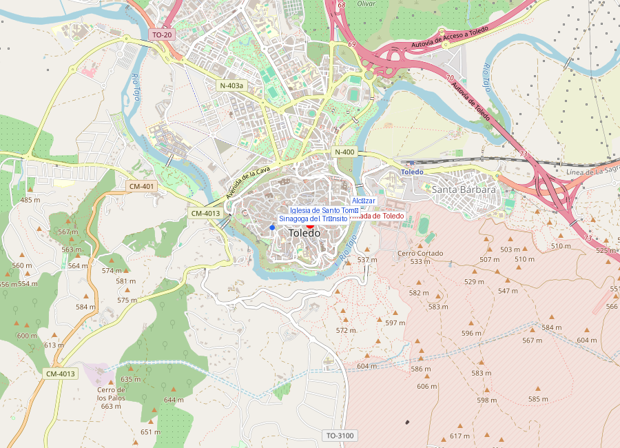
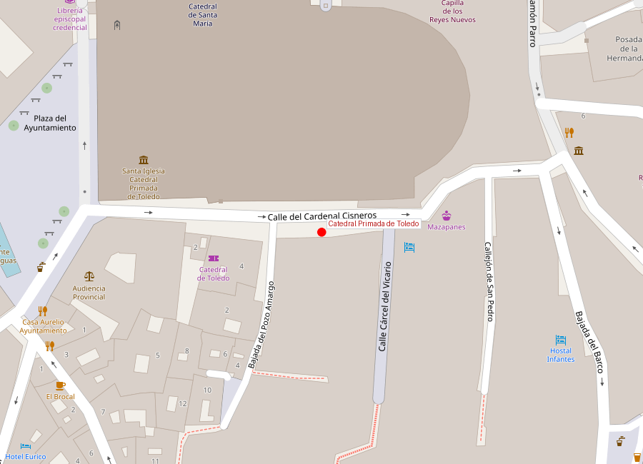

# Catedral Primada de Toledo

```yaml
lugar:
  nombre_original: "Catedral Primada de Santa María de Toledo"
  pais: "España"
  region_admin: "Castilla-La Mancha, Toledo"
  coordenadas: "39.8567° N, 4.0236° W"
  fecha_visita: "[DATO PENDIENTE — confirmar fecha]"
```





---

## Qué había antes

El solar de la catedral ha sido lugar de culto ininterrumpidamente durante al menos 1.500 años. Aquí se levantó la **iglesia visigoda** donde se celebraron los Concilios de Toledo (siglos VI–VII); tras la conquista musulmana (711), fue convertida en la **mezquita mayor de Tulaytulah**; y tras la reconquista de Alfonso VI (1085), fue consagrada de nuevo como iglesia cristiana.

---

## Historia

La catedral actual se comenzó a construir en **1226** por orden del rey **Fernando III el Santo** y del arzobispo **Rodrigo Jiménez de Rada**, sobre los cimientos de la mezquita mayor. Las obras duraron más de **250 años**: la estructura principal se completó hacia 1493, pero las adiciones continuaron durante siglos.

| Hito | Fecha |
|------|-------|
| Iglesia visigoda | Siglos VI–VII |
| Mezquita mayor | 711–1085 |
| Inicio catedral gótica | 1226 |
| Finalización estructura | ~1493 |
| Estilo | Gótico (con añadidos renacentistas y barrocos) |

### El Transparente

La intervención más espectacular del interior es el **Transparente** (1729–1732), obra del arquitecto y escultor **Narciso Tomé**. Es un retablo de mármol, bronce y pintura al fresco que ocupa toda la altura del ábside, con una abertura en la bóveda que permite que la luz natural ilumine el sagrario de forma teatral. Es una de las obras maestras del **Barroco español** y genera reacciones extremas desde su creación: algunos lo consideran genial, otros lo ven como un exceso.

### Sede Primada

La Catedral de Toledo ostenta el título de **Catedral Primada de España**, lo que significa que su arzobispo tiene precedencia honorífica sobre todos los demás obispos y arzobispos españoles. Este título refleja el papel histórico de Toledo como capital religiosa de la Hispania visigoda y luego de Castilla.

---

## Arquitectura

La catedral es de planta basilical con **cinco naves**, lo que la hace una de las más grandes de España. Elementos destacados:

- **Nave central**: 44 metros de altura [⚠ VERIFICAR], con bóvedas ojivales
- **Coro**: situado en la nave central, con dos filas de sillería tallada (siglos XV–XVI) que representan la conquista de Granada
- **Capilla Mayor**: retablo monumental con escenas de la vida de Cristo
- **El Transparente**: la obra barroca de Narciso Tomé
- **Sala Capitular**: con frescos de Juan de Borgoña
- **Sacristía**: convertida en pinacoteca con obras de **El Greco** (*El Expolio*, 1577–1579), **Goya**, **Tiziano**, **Caravaggio**, **Van Dyck** y **Rafael** [⚠ VERIFICAR obras específicas]
- **Capilla mozárabe**: donde aún se celebra el **rito hispano-mozárabe**, la liturgia cristiana pre-romana que sobrevivió en Toledo bajo dominio musulmán

---

## Qué se puede ver hoy

- Visita completa al interior (entrada de pago)
- El Transparente de Narciso Tomé
- La sacristía-pinacoteca con El Expolio de El Greco
- La Capilla Mozárabe (misas en rito mozárabe los domingos)
- Tesoro catedralicio: la **Custodia de Arfe** (1517–1524), de 3 metros de altura y plata dorada, sale en procesión por el Corpus Christi
- Torre (visitable con cita previa)

---

## Datos interesantes

- La catedral contiene obras de El Greco, Goya, Tiziano, Caravaggio y otros maestros — es una pinacoteca de primer nivel además de un templo
- El **rito hispano-mozárabe** que se celebra en la capilla mozárabe es una liturgia cristiana anterior al rito romano, que sobrevivió en Toledo porque los mozárabes (cristianos bajo dominio árabe) mantuvieron su culto durante 374 años de dominio islámico
- La **Custodia de Arfe** pesa unos 200 kg y se lleva en procesión por las calles de Toledo cada Corpus Christi [⚠ VERIFICAR peso exacto]

---

*fuente: Cabildo de la Catedral de Toledo, Arzobispado de Toledo, UNESCO, Wikipedia (datos generales verificables)*
