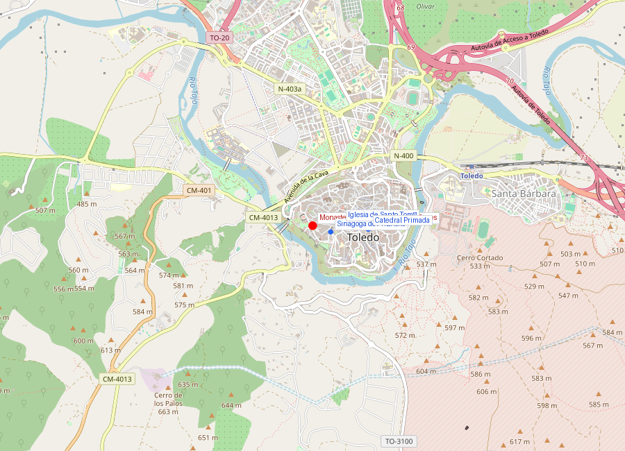
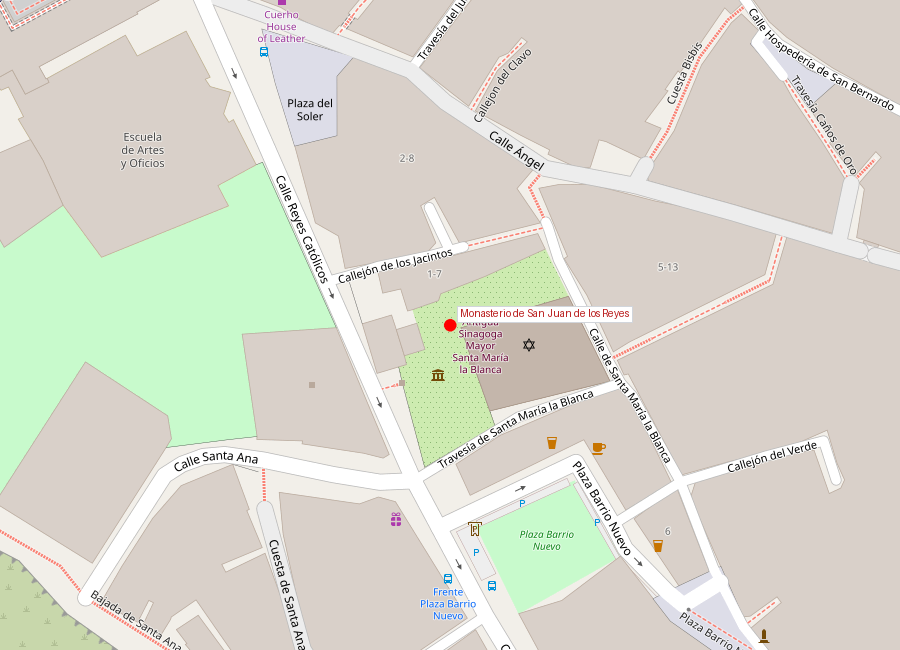

# Monasterio de San Juan de los Reyes

```yaml
lugar:
  nombre_original: "Monasterio de San Juan de los Reyes"
  pais: "España"
  region_admin: "Castilla-La Mancha, Toledo"
  coordenadas: "39.8570° N, 4.0305° W"
  fecha_visita: "[DATO PENDIENTE — confirmar fecha]"
```





---

## Historia

### Fundación: un monumento a la victoria

El monasterio fue mandado construir por los **Reyes Católicos** (Isabel I de Castilla y Fernando II de Aragón) para conmemorar su victoria en la **Batalla de Toro** (1476), que aseguró el trono de Castilla para Isabel frente a los partidarios de Juana la Beltraneja. El encargo fue al arquitecto **Juan Guas**, que creó una de las obras maestras del **gótico isabelino** (también llamado gótico flamígero español).

Originalmente, los Reyes Católicos pretendían que este monasterio fuera su **panteón real** — querían ser enterrados aquí, en Toledo, la antigua capital de Castilla. Sin embargo, tras la conquista de Granada en 1492, decidieron trasladar su lugar de enterramiento a la **Capilla Real de Granada**, donde efectivamente reposan sus restos.

| Hito | Fecha |
|------|-------|
| Batalla de Toro | 1 marzo 1476 |
| Inicio construcción | 1477 |
| Consagración | 1496 |
| Arquitecto | Juan Guas |
| Estilo | Gótico isabelino |
| Orden | Franciscanos |

---

## Arquitectura

### La iglesia

De una sola nave de gran amplitud, con crucero y capillas laterales. Lo más impactante es la **decoración escultórica** que cubre prácticamente toda la superficie interior: escudos de los Reyes Católicos, águilas de San Juan, yugos e flechas (emblemas de Fernando e Isabel), inscripciones y motivos vegetales. La profusión decorativa es la marca del gótico isabelino.

### El claustro

El claustro es una de las joyas del monasterio: dos pisos con arquerías ojivales, tracería calada de piedra y una profusión de escudos reales. El piso superior tiene un **artesonado mudéjar** que contrasta con la estructura gótica — otra muestra de la fusión de estilos propia de Toledo.

### Las cadenas

En la **fachada exterior** del monasterio cuelgan **cadenas de hierro**. Según la tradición, son las cadenas con las que los musulmanes encadenaban a los prisioneros cristianos, y que fueron recogidas como trofeo tras la conquista de ciudades durante la Reconquista. Cada grupo de cadenas representaría una ciudad liberada.

---

## Qué se puede ver hoy

- **Iglesia** de nave única con la espectacular decoración isabelina
- **Claustro de dos pisos**: arquerías góticas + artesonado mudéjar
- **Cadenas en la fachada**: símbolo de la Reconquista
- **Jardín del claustro**: naranjos y cipreses
- **Capillas laterales** con retablos y arte sacro

---

## Datos interesantes

- Los Reyes Católicos querían estar enterrados aquí, pero la conquista de Granada les hizo cambiar de opinión — eligieron Granada como símbolo de su mayor logro
- Las cadenas de la fachada son uno de los pocos testimonios físicos de los prisioneros de la Reconquista que se conservan in situ
- El arquitecto **Juan Guas** era de origen bretón (francés) pero trabajó toda su vida en Castilla y definió el estilo gótico isabelino — además de este monasterio, diseñó el **Palacio del Infantado** en Guadalajara
- El yugo y las flechas, emblemas de los Reyes Católicos que decoran el monasterio, representan las iniciales de sus nombres: Y (Ysabel) y F (Fernando)

---

## Conexiones

- Los Reyes Católicos conectan este monasterio con la **Capilla Real de Granada**, donde finalmente fueron enterrados
- La **Alhambra** de Granada pasó a manos de los Reyes Católicos en 1492, el mismo año en que se consagró este monasterio
- Las cadenas de la fachada representan la misma guerra de Reconquista que culminó en la conquista de Granada y Málaga

---

*fuente: Junta de Comunidades de Castilla-La Mancha, Orden Franciscana, Wikipedia (datos generales verificables)*
