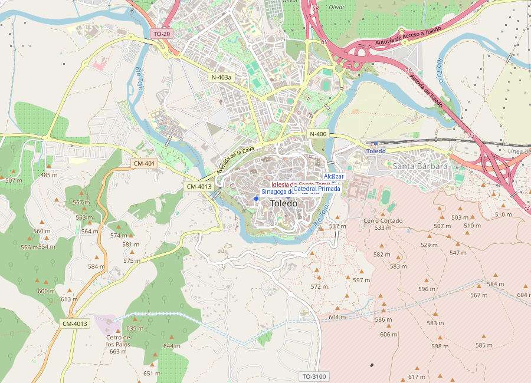
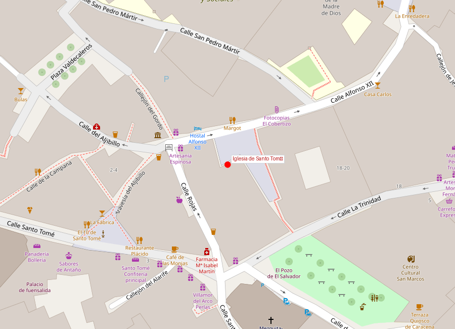

# Iglesia de Santo Tomé (El entierro del Conde de Orgaz)

```yaml
lugar:
  nombre_original: "Iglesia de Santo Tomé"
  pais: "España"
  region_admin: "Castilla-La Mancha, Toledo"
  coordenadas: "39.8572° N, 4.0269° W"
  fecha_visita: "[DATO PENDIENTE — confirmar fecha]"
```





---

## Qué es

La Iglesia de Santo Tomé es una parroquia medieval de Toledo que alberga una de las pinturas más importantes de la historia del arte: **El entierro del Conde de Orgaz** (1586–1588), de **El Greco**. La iglesia en sí es modesta; la pintura es extraordinaria. Es la obra más visitada de Toledo.

---

## Historia

### La iglesia

Santo Tomé fue construida en el **siglo XII** sobre una mezquita, como era habitual en Toledo tras la reconquista. La **torre mudéjar** (siglo XIV) es el elemento arquitectónico más notable de la iglesia: construida en ladrillo con arcos ciegos de herradura y decoración de sebka, es un ejemplo canónico de arte mudéjar toledano.

### El Conde de Orgaz

La historia que dio origen a la pintura es la siguiente: **Don Gonzalo Ruiz de Toledo**, señor de la villa de Orgaz, fue un noble piadoso del siglo XIV que financió la reconstrucción de varias iglesias toledanas, incluida Santo Tomé. Cuando murió en **1323**, cuenta la tradición que ocurrió un milagro durante su funeral: **San Agustín y San Esteban** descendieron del cielo y depositaron personalmente su cuerpo en la sepultura.

La leyenda se transmitió durante siglos. En 1586, el párroco de Santo Tomé, **Andrés Núñez de Madrid**, encargó a El Greco una pintura que inmortalizara el milagro.

### La pintura (1586–1588)

El Greco recibió el encargo y produjo una obra de **4,80 × 3,60 metros** que se instaló en la capilla donde se supone que ocurrió el milagro.

La pintura se divide en dos zonas:

**Zona inferior (terrenal):** el funeral. Los santos Agustín y Esteban, con vestiduras litúrgicas espléndidas, sostienen el cuerpo del Conde. A su alrededor, una galería de nobles y clérigos toledanos contemporáneos de El Greco — se dice que varios son retratos de personajes reales del Toledo del siglo XVI. Un niño (identificado tradicionalmente como **Jorge Manuel**, el hijo de El Greco) señala la escena y mira al espectador.

**Zona superior (celestial):** el alma del Conde, representada como un feto luminoso, asciende entre nubes hacia Cristo, la Virgen, ángeles y santos. Los cielos se abren con el dramatismo y la elongación de figuras característicos de El Greco.

La división entre las dos zonas —terrenal e irreal, retratismo preciso y misticismo visionario— es la genialidad de la obra: dos realidades coexisten en el mismo lienzo.

---

## El Greco en Toledo

**Doménikos Theotokópoulos** (1541–1614) nació en Creta, se formó en Venecia (probablemente en el taller de Tiziano) y luego en Roma. Llegó a España buscando trabajo en la corte de Felipe II en El Escorial, pero el rey rechazó su estilo. Se estableció en Toledo en **1577** y nunca se marchó.

En Toledo, El Greco encontró un ambiente que encajaba con su visión artística: una ciudad mística, intelectual, algo decadente (la corte se había ido a Madrid en 1561), llena de clérigos, teólogos e intelectuales. Produjo aquí toda su obra maestra: el Entierro del Conde de Orgaz, las Vistas de Toledo, el Laocoonte, los retratos de cardenales y la serie de apóstoles.

---

## Qué se puede ver hoy

- **El entierro del Conde de Orgaz**: la pintura se visita en una capilla lateral de la iglesia (entrada de pago, separada de la iglesia)
- **Torre mudéjar**: visible desde fuera, uno de los iconos de Toledo
- **Interior de la iglesia**: modesto pero con otros cuadros y el ambiente de una parroquia medieval

---

## Datos interesantes

- El niño que señala la escena y mira al espectador tiene un pañuelo en el bolsillo donde se lee la fecha "1578" — la fecha de nacimiento de Jorge Manuel, hijo de El Greco
- El Greco se autorretrató en la pintura: es el personaje que mira directamente al espectador desde la fila de nobles, justo encima de la mano de San Esteban [⚠ VERIFICAR identificación exacta]
- La pintura nunca ha salido de Santo Tomé — lleva en el mismo lugar desde 1588
- El Greco cobró 1.200 ducados por la obra, una cifra considerable pero que aun así generó un pleito con el párroco, que intentó pagar menos [⚠ VERIFICAR cifra exacta]

---

## Conexiones

- El Greco vivió y trabajó en Toledo hasta su muerte en 1614 — su casa-museo (reconstrucción) está a pocos metros de Santo Tomé, en la judería
- Los cielos tormentosos y las figuras elongadas de El Greco dialogan con el paisaje real de Toledo: las tormentas sobre el Tajo, las siluetas de torres y campanarios
- La **Catedral Primada** contiene otra obra maestra de El Greco: *El Expolio* (1577–1579)

---

*fuente: Parroquia de Santo Tomé — Toledo, Museo del Greco, Wikipedia (datos generales verificables)*
