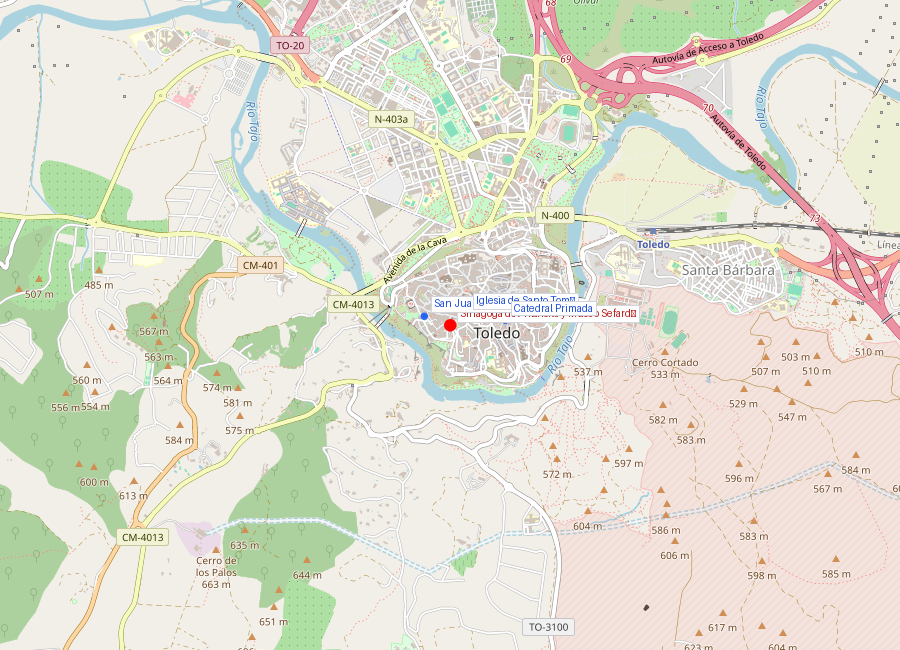
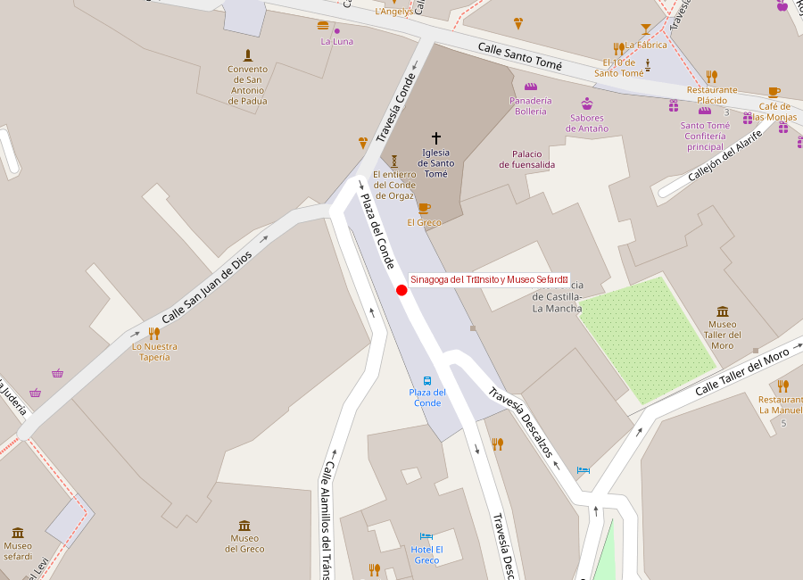
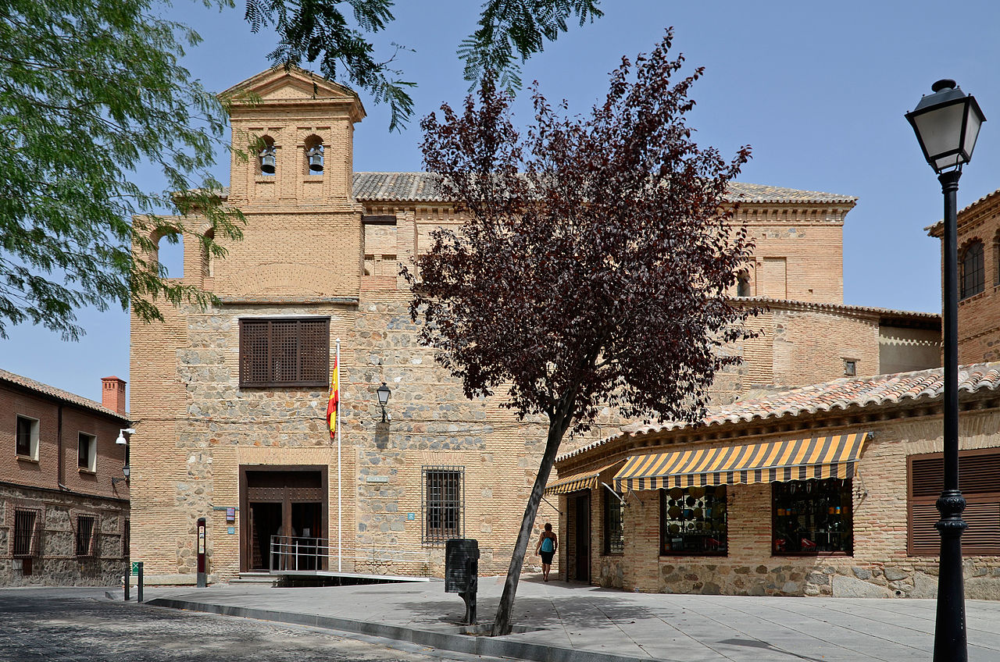

# Sinagoga del Tránsito y Museo Sefardí

```yaml
lugar:
  nombre_original: "Sinagoga del Tránsito"
  pais: "España"
  region_admin: "Castilla-La Mancha, Toledo"
  coordenadas: "39.8564° N, 4.0283° W"
  fecha_visita: "[DATO PENDIENTE — confirmar fecha]"
```







---

## Qué había antes

La sinagoga se construyó en el corazón de la **judería de Toledo**, uno de los barrios judíos más grandes e importantes de la Europa medieval. La judería ocupaba la zona suroeste del casco histórico, entre la actual calle de los Reyes Católicos y el río Tajo, y llegó a albergar una comunidad de varios miles de personas.

---

## Historia

### La construcción (1355–1357)

La sinagoga fue construida entre **1355 y 1357** por orden de **Samuel ha-Leví Abulafia**, tesorero del rey **Pedro I de Castilla** (Pedro el Cruel/Pedro el Justo, según quién cuente la historia). Samuel ha-Leví era el hombre más rico y poderoso de la comunidad judía castellana: como tesorero real, controlaba las finanzas del reino.

La sinagoga fue su proyecto personal: un espacio de oración privado que al mismo tiempo sirviera como declaración de poder y estatus. La decoración interior, de una riqueza extraordinaria, combina elementos islámicos (ataurique, lacería, mocárabes) con inscripciones hebreas — el resultado es una de las expresiones más puras del **arte mudéjar** en España.

### Caída de Samuel ha-Leví

En **1360**, apenas tres años después de terminar la sinagoga, Pedro I hizo arrestar a Samuel ha-Leví. El tesorero fue torturado y murió en prisión en **1361**. Se dice que Pedro buscaba hacerse con la enorme fortuna que ha-Leví había acumulado. La sinagoga pasó a la comunidad judía de Toledo.

### Expulsión y transformación (1492)

Tras el **Decreto de Expulsión de los judíos** firmado por los Reyes Católicos en **1492**, la sinagoga fue confiscada y convertida en iglesia católica bajo la advocación del **Tránsito de Nuestra Señora** (de ahí su nombre actual). Posteriormente fue utilizada como hospital de caballeros de Calatrava, cuartel militar y almacén.

| Hito | Fecha |
|------|-------|
| Construcción | 1355–1357 |
| Constructor | Samuel ha-Leví Abulafia |
| Expulsión de los judíos | 1492 |
| Declaración Monumento Nacional | 1877 |
| Apertura como Museo Sefardí | 1964 |

### El Museo Sefardí

En **1964** se inauguró el **Museo Sefardí** en el edificio, dedicado a la historia y cultura de los judíos en la península ibérica (Sefarad). Es el único museo de España dedicado íntegramente a la herencia judía.

---

## Arquitectura

Desde fuera, la sinagoga es un edificio austero de ladrillo sin decoración — una modestia obligada, ya que las leyes medievales castellanas prohibían que las sinagogas tuvieran apariencia ostentosa en el exterior.

El interior es otra cosa:

- **Gran Sala de Oración**: rectangular, de una sola nave, con techo de armadura de madera mudéjar policromada
- **Paredes**: cubiertas de yesería tallada con motivos de ataurique (decoración vegetal estilizada), lacería geométrica y mocárabes — técnicas islámicas al servicio de un espacio judío
- **Inscripciones**: frisos con textos en hebreo que incluyen salmos, alabanzas al rey Pedro I y al propio Samuel ha-Leví, y decoración con los escudos de armas de Castilla y León
- **Galería de mujeres**: en la parte superior, según la tradición de separación por sexos en las sinagogas

La mezcla de arte islámico con función judía bajo protección de un rey cristiano es el ejemplo más elocuente de la **convivencia** (o al menos coexistencia) de las tres culturas en Toledo.

---

## Qué se puede ver hoy

- **Gran Sala**: la yesería mudéjar original, restaurada
- **Museo Sefardí**: colección de objetos litúrgicos judíos, documentos, lápidas con inscripciones hebreas, vestimentas y objetos de la vida cotidiana sefardí
- **Jardín**: pequeño jardín con vistas al río Tajo
- **Exposiciones temporales** sobre historia judía

---

## Datos interesantes

- La sinagoga la mandó construir un judío, con técnicas artísticas islámicas, bajo el patronazgo de un rey cristiano: es la síntesis perfecta de las "tres culturas" de Toledo
- Samuel ha-Leví fue uno de los hombres más poderosos de Castilla y terminó torturado por su propio rey — un recordatorio de la precariedad del poder, incluso en la cima
- El nombre "Tránsito" no tiene nada que ver con el judaísmo: es el nombre católico que recibió al ser convertida en iglesia en 1492
- La palabra **Sefarad** es el nombre hebreo de la península ibérica, y "sefardí" designa a los judíos de origen hispano-portugués y sus descendientes, dispersos tras la expulsión de 1492

---

## Conexiones

- A pocos metros se encuentra la **Sinagoga de Santa María la Blanca** (siglo XII), la otra gran sinagoga medieval de Toledo, con un estilo almohade diferente
- La expulsión de 1492 conecta con **Granada**: el Decreto de Expulsión se firmó el 31 de marzo de 1492, apenas tres meses después de la caída de Granada

---

*fuente: Museo Sefardí (web oficial), Ministerio de Cultura de España, UNESCO, Wikipedia (datos generales verificables)*
